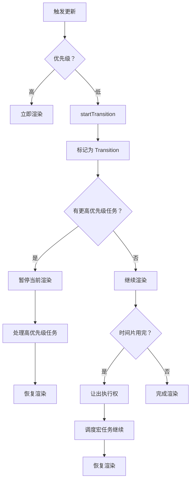

# Concurrent Features 架构

Concurrent Features 是 React 18 引入的核心特性，允许 React 同时准备多个 UI 版本，支持可中断渲染和优先级调度。

## 🎯 核心概念

### 什么是并发？

并发不是并行（同时执行多个任务），而是**能够同时处理多个任务，可以暂停和恢复**。

```
同步渲染（React 17 及之前）
┌─────────────────────────────────┐
│  渲染 A → 渲染 B → 渲染 C       │  不可中断
│  ═════════════════════════>    │  阻塞主线程
└─────────────────────────────────┘

并发渲染（React 18+）
┌─────────────────────────────────┐
│  渲染 A → B → 暂停 → C → A      │  可中断
│  ═══>      ═══>    ═══>         │  响应输入
└─────────────────────────────────┘
```

## 📦 主要特性

### 1. startTransition

将更新标记为**非紧急**，可被打断：

```jsx
import { useState, useTransition } from 'react';

function TabContainer() {
  const [count, setCount] = useState(0);
  const [tab, setTab] = useState('home');
  const [isPending, startTransition] = useTransition();
  
  function handleTabChange(newTab) {
    // 标记为过渡更新（低优先级）
    startTransition(() => {
      setTab(newTab);
    });
  }
  
  // 紧急更新立即执行
  function handleIncrement() {
    setCount(c => c + 1);
  }
  
  return (
    <>
      <button onClick={handleIncrement}>
        计数：{count}
      </button>
      
      <nav>
        {['home', 'posts', 'settings'].map(t => (
          <button
            key={t}
            onClick={() => handleTabChange(t)}
            className={tab === t ? 'active' : ''}
          >
            {t}
          </button>
        ))}
      </nav>
      
      {isPending && <Spinner />}
      <TabContent tab={tab} />
    </>
  );
}
```

### 2. useDeferredValue

延迟更新某个值，保持 UI 响应：

```jsx
import { useState, useDeferredValue } from 'react';

function SearchResults({ query }) {
  const [results, setResults] = useState([]);
  
  // 延迟 query 的更新
  const deferredQuery = useDeferredValue(query);
  
  useEffect(() => {
    // 只在 deferredQuery 变化时搜索
    fetchResults(deferredQuery).then(setResults);
  }, [deferredQuery]);
  
  return (
    <div>
      <input 
        value={query} 
        onChange={e => setQuery(e.target.value)}
      />
      {deferredQuery !== query && <Loading />}
      <ResultList results={results} />
    </div>
  );
}
```

### 3. Suspense

允许组件"等待"数据：

```jsx
<Suspense fallback={<Spinner />}>
  <AsyncComponent />
</Suspense>
```

## 🔍 优先级模型

### Lane 优先级

```javascript
// packages/react-reconciler/src/ReactLanePriority.js

// 同步优先级（最高）
const SyncLane = 0b0000000000000000000000000000001;

// 输入离散事件
const InputDiscreteLane = 0b0000000000000000000000000000100;

// 连续事件
const ContinuousLane = 0b0000000000000000000000000001000;

// 默认优先级
const DefaultLane = 0b0000000000000000000000000010000;

// 过渡更新（低优先级）
const TransitionLanes = 0b0000000001111111111111111100000;

// 空闲优先级（最低）
const IdleLanes = 0b1111111110000000000000000000000;
```

### 优先级比较

```javascript
// 判断优先级高低
function includesHigherPriority(lanes, comparedLane) {
  // 位运算比较
  return (lanes & comparedLane) !== NoLanes;
}

// 调度更新
function scheduleUpdateOnFiber(fiber, lanes) {
  // 更新当前 Fiber 的优先级
  fiber.lanes = mergeLanes(fiber.lanes, lanes);
  
  // 调度
  ensureRootIsScheduled(root, lanes);
}
```

## 🔄 并发渲染流程



## 📊 实现原理

### 1. 可中断的工作循环

```javascript
// packages/react-reconciler/src/ReactFiberWorkLoop.js
function workLoopConcurrent() {
  while (workInProgress !== null && !shouldYield()) {
    performUnitOfWork(workInProgress);
  }
}

function shouldYield() {
  // 检查时间片是否用完（默认 5ms）
  const currentTime = getCurrentTime();
  return currentTime >= deadline;
}

function performUnitOfWork(unit) {
  // beginWork - 向下遍历
  const next = beginWork(current, unit, renderLanes);
  
  if (next === null) {
    // 没有子节点，向上回溯
    completeUnitOfWork(unit);
  } else {
    // 有子节点，继续向下
    workInProgress = next;
  }
}
```

### 2. 双缓冲树

```javascript
// 维护两棵 Fiber 树
root.current              // Current Tree（显示中）
root.alternate           // WorkInProgress Tree（构建中）

function cloneFiber(current) {
  const workInProgress = createFiber(
    current.tag,
    current.pendingProps,
    current.type,
    current.mode
  );
  
  // 复制属性
  workInProgress.stateNode = current.stateNode;
  workInProgress.memoizedProps = current.memoizedProps;
  
  // 链接到双缓冲
  workInProgress.alternate = current;
  current.alternate = workInProgress;
  
  return workInProgress;
}
```

### 3. 提交阶段同步

```javascript
// commit 阶段不可中断
function commitRoot(root) {
  const finishedWork = root.finishedWork;
  
  // before mutation
  commitBeforeMutationEffects(root, finishedWork);
  
  // mutation（DOM 操作）
  commitMutationEffects(root, finishedWork);
  
  // layout（useLayoutEffect）
  commitLayoutEffects(finishedWork, root);
  
  // 切换树指针
  root.current = finishedWork;
}
```

## 💡 使用场景

### 1. 大型列表过滤

```jsx
function SearchResults({ items, filterText }) {
  const deferredFilter = useDeferredValue(filterText);
  
  const filteredItems = useMemo(() => {
    return items.filter(item => 
      item.name.includes(deferredFilter)
    );
  }, [items, deferredFilter]);
  
  return (
    <>
      <input 
        value={filterText}
        onChange={e => setFilterText(e.target.value)}
      />
      {filterText !== deferredFilterText && (
        <div className="loading">过滤中...</div>
      )}
      <List items={filteredItems} />
    </>
  );
}
```

### 2. 多标签切换

```jsx
function Tabs({ tabs }) {
  const [activeTab, setActiveTab] = useState(tabs[0].id);
  const [isPending, startTransition] = useTransition();
  
  function handleTabChange(tabId) {
    startTransition(() => {
      setActiveTab(tabId);
    });
  }
  
  return (
    <>
      <TabList>
        {tabs.map(tab => (
          <Tab
            key={tab.id}
            active={activeTab === tab.id}
            onClick={() => handleTabChange(tab.id)}
          >
            {tab.title}
          </Tab>
        ))}
      </TabList>
      
      {isPending && <Spinner />}
      
      <TabContent>
        {tabs.filter(t => t.id === activeTab).map(tab => (
          <TabPanel key={tab.id} tab={tab} />
        ))}
      </TabContent>
    </>
  );
}
```

### 3. 图表缩放

```jsx
function Chart({ data }) {
  const [scale, setScale] = useState(1);
  const [isPending, startTransition] = useTransition();
  
  function handleZoom(newScale) {
    startTransition(() => {
      setScale(newScale);
    });
  }
  
  const scaledData = useMemo(() => {
    return data.map(d => ({ ...d, value: d.value * scale }));
  }, [data, scale]);
  
  return (
    <>
      <Slider 
        onChange={e => handleZoom(Number(e.target.value))}
        value={scale}
      />
      {isPending && <Loading />}
      <ChartCanvas data={scaledData} />
    </>
  );
}
```

## ⚠️ 注意事项

### 1. 不要滥用 Transition

```jsx
// ❌ 不好的做法 - 所有更新都用 transition
useTransition();
startTransition(() => setCount(c => c + 1));

// ✅ 好的做法 - 仅对低优先级更新使用
function handleUrgentClick() {
  setCount(c => c + 1); // 立即响应
}

function handleNonUrgentClick() {
  startTransition(() => {
    setTab('settings'); // 可延迟
  });
}
```

### 2. 避免饥饿

```jsx
// 长时间任务应该分段
function LargeListComponent({ items }) {
  const [page, setPage] = useState(0);
  const PAGE_SIZE = 100;
  
  // 分批渲染
  const currentPage = useTransitionPage(
    items,
    page,
    PAGE_SIZE
  );
  
  return (
    <>
      <List items={currentPage} />
      {page < Math.ceil(items.length / PAGE_SIZE) && (
        <button onClick={() => setPage(p => p + 1)}>
          加载更多
        </button>
      )}
    </>
  );
}
```

### 3. useDeferredValue 的初始值

```jsx
// 提供更好的用户体验
function Search({ query }) {
  const deferredQuery = useDeferredValue(
    query,
    { initialValue: '' }  // React 19 新增
  );
  
  // 首次渲染时使用空字符串，避免 montré 空白
}
```

## 🔬 调试技巧

### 观察渲染优先级

```javascript
// 开发工具中查看
React.__SECRET_INTERNALS_DO_NOT_USE_OR_YOU_WILL_BE_FIRED
  .ReactCurrentOwner.current;

// 查看当前渲染的优先级
console.log(
  React.startTransition.toString()
);
```

### Performance API

```javascript
// 使用 Performance API 观察
performance.mark('transition-start');
startTransition(() => {
  setState(newValue);
});
performance.mark('transition-end');
performance.measure(
  'transition',
  'transition-start',
  'transition-end'
);
```

---

## 📖 下一步

- [Suspense 架构](./suspense) - 深入了解 Suspense
- [实现篇：useTransition](../implementation/transition)