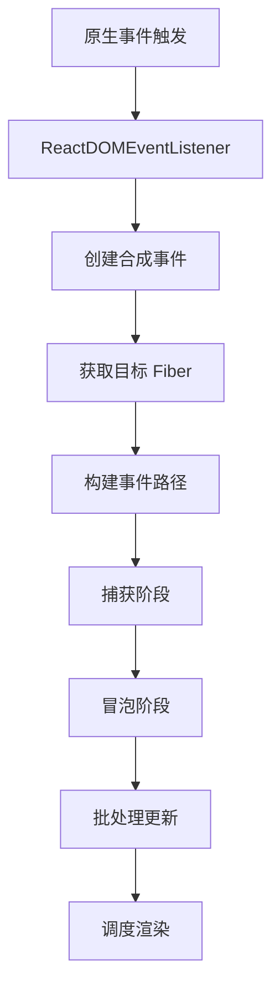

# 事件系统架构

React 18 的事件系统经过重新设计，支持并发渲染和优先级调度。

## 📦 模块位置

```
packages/react-dom-bindings/src/events/
├── ReactDOMEventListener.js      # 事件监听入口
├── DOMEventProperties.js         # 事件映射表
├── DOMEventNames.js              # 事件名称
├── EventSystemFlags.js           # 事件系统标志
├── SyntheticEvent.js             # 合成事件
└── plugins/
    ├── SimpleEventPlugin.js      # 简单事件
    ├── EnterLeaveEventPlugin.js  # enter/leave
    └── ChangeEventPlugin.js      # change 事件
```

## 🎯 核心设计

### 事件委托

React 不在每个节点上绑定事件，而是在 **root** 上委托：

```javascript
// 旧版本：每个节点绑定
element.addEventListener('click', handler);

// 新版本：root 委托
rootElement.addEventListener('click', dispatchEvent);
```

**优势**：
- 减少内存占用
- 统一事件处理
- 支持事件优先级

### 事件分类

```javascript
// packages/react-dom-bindings/src/events/EventSystemFlags.js

// 离散事件（高优先级）
const DISCRETE_EVENT = 1;
// 示例：click,keydown, change

// 连续事件（中优先级）
const CONTINUOUS_EVENT = 2;
// 示例：mousemove, scroll

// 默认事件（低优先级）
const DEFAULT_EVENT = 0;
// 示例：mouseout, mouseover
```

## 🔍 事件处理流程



## 📊 合成事件

### SyntheticEvent 结构

```javascript
// packages/react-dom-bindings/src/events/SyntheticEvent.js
function SyntheticBaseEvent(
  type,
  dispatchConfig,
  targetInst,
  nativeEvent,
  nativeEventTarget
) {
  this.type = type;
  this.target = nativeEventTarget;
  this.currentTarget = null;
  
  // 事件阶段
  this.eventPhase = NATIVE_PHASE;
  
  // 阻止默认行为
  this.isDefaultPrevented = false;
  // 阻止冒泡
  this.isPropagationStopped = false;
  
  // 复制原生事件属性
  this.nativeEvent = nativeEvent;
}
```

### 事件池（React 17 前）

```javascript
// React 17 前使用事件池优化性能
function getPooledEvent(eventType, targetInst, nativeEvent) {
  const EventConstructor = SyntheticEvent;
  if (eventPool.length) {
    const instance = eventPool.pop();
    EventConstructor.call(instance, ...);
    return instance;
  }
  return new EventConstructor(...);
}

// 使用后回收到池中
function releaseEvent(event) {
  eventPool.push(event);
}
```

### React 18+ 移除事件池

React 18 移除了事件池，简化实现：

```javascript
// React 18+ 直接创建新事件
function createEvent(type, targetInst, nativeEvent) {
  return new SyntheticBaseEvent(type, ...);
}
```

## 🚀 事件优先级

### 优先级映射

```javascript
// packages/react-dom-bindings/src/events/ReactDOMEventPriority.js
function getEventPriority(domEventName) {
  switch (domEventName) {
    // 离散事件 - 最高优先级
    case 'click':
    case 'keydown':
    case 'keyup':
    case 'change':
      return DiscreteEventPriority; // 同步执行
    
    // 连续事件 - 中优先级
    case 'mousemove':
    case 'scroll':
      return ContinuousEventPriority;
    
    // 默认事件 - 低优先级
    default:
      return DefaultEventPriority;
  }
}
```

### 优先级调度

```javascript
// packages/react-dom-bindings/src/events/ReactDOMEventListener.js
function dispatchEvent(domEventName, eventSystemFlags, targetContainer, nativeEvent) {
  // 1. 获取事件优先级
  const priority = getEventPriority(domEventName);
  
  // 2. 根据优先级调度
  switch (priority) {
    case DiscreteEventPriority:
      // 同步执行
      return runWithPriority(ImmediatePriority, () => {
        dispatchEventForPlugin(...);
      });
    
    case ContinuousEventPriority:
      // 批处理
      return runWithPriority(UserBlockingPriority, () => {
        batchedUpdates(() => dispatchEventForPlugin(...));
      });
    
    default:
      // 默认调度
      return dispatchEventForPlugin(...);
  }
}
```

## 🔧 插件系统

### SimpleEventPlugin

处理大部分原生事件：

```javascript
// packages/react-dom-bindings/src/events/plugins/SimpleEventPlugin.js
export const SimpleEventPlugin = {
  extractEvents(
    topLevelType,
    targetInst,
    nativeEvent,
    nativeEventTarget
  ) {
    const dispatchConfig = topLevelEventsToDispatchConfig.get(topLevelType);
    if (!dispatchConfig) {
      return null;
    }
    
    // 创建合成事件
    const event = new SyntheticEvent(
      dispatchConfig,
      targetInst,
      nativeEvent,
      nativeEventTarget
    );
    
    return event;
  },
};
```

### EnterLeaveEventPlugin

处理 mouseenter/mouseleave：

```javascript
// packages/react-dom-bindings/src/events/plugins/EnterLeaveEventPlugin.js
export const EnterLeaveEventPlugin = {
  extractEvents(topLevelType, targetInst, nativeEvent) {
    if (topLevelType === 'mouseover') {
      return createEnterLeaveEvents(
        targetInst,
        nativeEvent,
        'onMouseEnter',
        'onMouseLeave'
      );
    }
    return null;
  },
};
```

### ChangeEventPlugin

处理 change 事件（兼容性问题）：

```javascript
// packages/react-dom-bindings/src/events/plugins/ChangeEventPlugin.js
export const ChangeEventPlugin = {
  extractEvents(topLevelType, targetInst, nativeEvent) {
    // 处理 input、select、textarea 的 change 事件
    // 兼容 IE9 等特殊场景
  },
};
```

## 🌲 事件传播

### 构建传播路径

```javascript
// packages/react-dom-bindings/src/events/accumulateEnterLeaveTwoPhase.js
function accumulateTwoPhaseInstances(target, accumulate) {
  const path = [];
  let instance = target;
  
  // 向上遍历到 root
  while (instance) {
    path.push(instance);
    instance = instance.return;
  }
  
  // 捕获阶段（从 root 到 target）
  for (let i = path.length - 1; i >= 0; i--) {
    accumulate(path[i], CAPTURE_PHASE);
  }
  
  // 冒泡阶段（从 target 到 root）
  for (let i = 0; i < path.length; i++) {
    accumulate(path[i], BUBBLE_PHASE);
  }
}
```

### 事件执行

```javascript
// packages/react-dom-bindings/src/events/extractEvents.js
function extractEvents(
  topLevelType,
  targetInst,
  targetContainer,
  nativeEvent
) {
  let events = null;
  
  // 遍历所有插件
  for (const plugin of eventPlugins) {
    const extracted = plugin.extractEvents(
      topLevelType,
      targetInst,
      nativeEvent,
      targetContainer
    );
    if (extracted) {
      events = accumulate(events, extracted);
    }
  }
  
  return events;
}
```

## 🔒 事件去重

### 防止重复触发

```javascript
// packages/react-dom-bindings/src/events/checkPassiveEvents.js
let passiveBrowserEventsSupported = false;

try {
  addEventListener('test', () => {}, {
    get passive() {
      passiveBrowserEventsSupported = true;
    },
  });
} catch (e) {}
```

### 事件屏蔽

```javascript
// 在特定情况下屏蔽原生事件
function shouldPreventMouseEvent(name, type, props) {
  switch (name) {
    case 'onClick':
    case 'onClickCapture':
    case 'onDoubleClick':
      // 防止点击_disabled_元素
      return !!props.disabled;
  }
  return false;
}
```

## 🎯 React 18 事件系统改进

### 1. 自动批处理

```jsx
// React 17
function handleClick() {
  setCount(c => c + 1);  // 立即渲染
}

// React 18 - 事件内自动批处理
function handleClick() {
  setCount(c => c + 1);
  setFlag(f => !f);  // 合并为一次渲染
}
```

### 2. 过渡事件

```jsx
// 标记为非紧急事件
import { useTransition } from 'react';

function TabContainer() {
  const [isPending, startTransition] = useTransition();
  
  function handleTabClick(tab) {
    startTransition(() => {
      setTab(tab);  // 低优先级更新
    });
  }
  
  return (
    <>
      {isPending && <Spinner />}
      <button onClick={() => handleTabClick(1)}>Tab 1</button>
    </>
  );
}
```

### 3. flushSync

```jsx
// 强制同步执行（逃离批处理）
import { flushSync } from 'react-dom';

function handleClick() {
  flushSync(() => {
    setCount(c => c + 1);  // 立即渲染
    // DOM 已更新
  });
  
  // 可以继续操作 DOM
}
```

## 🐛 常见问题

### Q: 为什么 React 使用事件委托？

**A**:
- 减少事件监听器数量
- 统一事件处理逻辑
- 支持事件优先级和批处理

### Q: 事件如何找到对应的 Fiber？

```javascript
// 通过 DOM 节点上的标记
function precacheFiberNode(hostInst, node) {
  node[internalInstanceKey] = hostInst;
}

// 获取 Fiber
function getClosestInstanceFromNode(targetNode) {
  let targetInst = targetNode[internalInstanceKey];
  
  // 如果没有，向上查找父节点
  while (!targetInst && targetNode.parentNode) {
    targetNode = targetNode.parentNode;
    targetInst = targetNode[internalInstanceKey];
  }
  
  return targetInst;
}
```

---

## 📖 下一步

- [Hook 系统架构](./hooks)
- [Suspense 架构](./suspense)