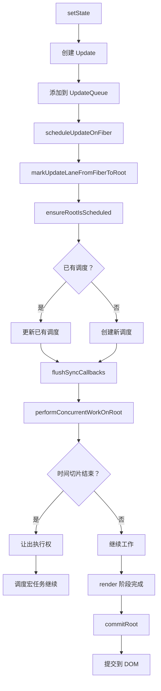

# React 18 整体架构图解

## 🏗️ 三层架构

React 18 的架构可以分为三层：

```
┌─────────────────────────────────────────────────────────┐
│                    React 18 架构                          │
├─────────────────────────────────────────────────────────┤
│  ┌─────────────┐  ┌─────────────┐  ┌─────────────┐     │
│  │  Scheduler  │  │ Reconciler  │  │  Renderer   │     │
│  │   调度器     │  │   协调器     │  │   渲染器     │     │
│  │             │  │             │  │             │     │
│  │ • 优先级调度 │  │ • beginWork │  │ • ReactDOM  │     │
│  │ • 时间切片  │  │ • Fiber     │  │ • ReactNative│    │
│  │ • 任务队列  │  │ • Diff      │  │ • ReactThree│     │
│  └─────────────┘  └─────────────┘  └─────────────┘     │
├─────────────────────────────────────────────────────────┤
│                    Fiber 数据结构                         │
├─────────────────────────────────────────────────────────┤
│  ┌─────────────────────────────────────────────────┐   │
│  │              ReactElement (JSX)                  │   │
│  │              Lane 优先级模型                      │   │
│  │              Hook 链表                           │   │
│  └─────────────────────────────────────────────────┘   │
└─────────────────────────────────────────────────────────┘
```

## 📦 核心模块职责

### 1. Scheduler（调度器）

**位置**: `packages/scheduler/`

**职责**:
- 管理任务优先级
- 实现时间切片
- 调度任务执行

**关键 API**:
```javascript
import {
  unstable_runWithPriority,
  unstable_scheduleCallback,
  unstable_cancelCallback,
  unstable_shouldYield,
} from 'scheduler';
```

**优先级等级**:
```javascript
const ImmediatePriority = 1;      // 立即执行
const UserBlockingPriority = 2;   // 用户阻塞
const NormalPriority = 3;         // 普通
const LowPriority = 4;            // 低
const IdlePriority = 5;           // 空闲
```

### 2. Reconciler（协调器）

**位置**: `packages/react-reconciler/`

**职责**:
- 计算差异（Diff）
- 创建/更新/删除 Fiber 节点
- 管理 Fiber 树

**核心流程**:
```
render 阶段（可中断）    commit 阶段（不可中断）
     ↓                      ↓
  beginWork            before mutation
     ↓                      ↓
  completeWork           mutation
     ↓                      ↓
  collectEffects         layout
```

### 3. Renderer（渲染器）

**位置**: 
- `packages/react-dom/` - DOM 渲染
- `packages/react-native-renderer/` - Native 渲染
- `packages/react-three-renderer/` - Three.js 渲染

**职责**:
- 将 Fiber 渲染到具体平台
- 操作真实 DOM/原生组件
- 触发宿主环境更新

## 🔄 数据流

```
┌──────────┐     ┌──────────┐     ┌──────────┐
│   App    │ ──▶ │ Scheduler│ ──▶ │Reconciler│
│  (JSX)   │     │          │     │          │
└──────────┘     └──────────┘     └──────────┘
                                            │
                                            ▼
                                     ┌──────────┐
                                     │ Renderer │
                                     │          │
                                     └──────────┘
                                            │
                                            ▼
                                     ┌──────────┐
                                     │   DOM    │
                                     └──────────┘
```

## 🎯 Concurrent 架构

React 18 的 Concurrent 架构核心：

```
┌─────────────────────────────────────────────────────────┐
│                   Concurrent Features                    │
├─────────────────────────────────────────────────────────┤
│                                                          │
│  ┌─────────────┐      ┌─────────────┐                  │
│  │ startTransi │      │ useDeferred │                  │
│  │   tion()    │      │   Value()   │                  │
│  └──────┬──────┘      └──────┬──────┘                  │
│         │                    │                           │
│         └────────┬───────────┘                          │
│                  │                                      │
│                  ▼                                      │
│         ┌─────────────────┐                            │
│         │  Lane 优先级模型 │                            │
│         │                 │                            │
│         │ • SyncLane      │  同步                       │
│         │ • InputDiscrete │  用户输入                   │
│         │ • DefaultLane   │  普通更新                   │
│         │ • Transition    │  过渡更新                   │
│         │ • Idle          │  空闲更新                   │
│         └─────────────────┘                            │
│                  │                                      │
│                  ▼                                      │
│         ┌─────────────────┐                            │
│         │  可中断的渲染    │                            │
│         │  Time Slicing   │                            │
│         └─────────────────┘                            │
│                                                          │
└─────────────────────────────────────────────────────────┘
```

## 🌊 Fiber 数据结构

```javascript
function FiberNode(tag, pendingProps, key, mode) {
  // 实例属性
  this.tag = tag;                    // Fiber 类型
  this.key = key;                    // key
  this.type = null;                  // 组件类型
  
  // Fiber 树结构
  this.return = null;                // 父 Fiber
  this.child = null;                 // 子 Fiber
  this.sibling = null;               // 兄弟 Fiber
  
  // 属性
  this.pendingProps = pendingProps;  // 新 props
  this.memoizedProps = null;         // 旧 props
  this.stateNode = null;             // 真实 DOM/实例
  
  // 状态
  this.memoizedState = null;         // 当前 state
  this.baseState = null;             // 基础 state
  
  // 更新队列
  this.updateQueue = null;
  
  // 副作用
  this.flags = NoFlags;              // 副作用标记
  this.subtreeFlags = NoFlags;       // 子树副作用
  
  // 优先级
  this.lanes = NoLanes;              // 本次更新的优先级
  this.childLanes = NoLanes;         // 子树优先级
  
  // 交替树
  this.alternate = null;             // 指向另一棵树的 Fiber
}
```

## 📈 更新流程



## 🔑 关键概念

### 双缓冲树（Double Buffering）

React 维护两棵 Fiber 树：

```
Current Tree (当前显示)    WorkInProgress Tree (内存中构建)
┌─────────────┐          ┌─────────────┐
│     Root    │          │     Root    │
│      │      │          │      │      │
│   ┌──┴──┐   │          │   ┌──┴──┐   │
│   A     B   │          │   A'    B'  │
│   │     │   │          │   │     │   │
│   C     D   │          │   C'    D'  │
└─────────────┘          └─────────────┘
       │                        │
       └─────────┬──────────────┘
                 │
         commit 阶段切换
```

### Lane 优先级模型

```javascript
// packages/react-reconciler/src/ReactFiberLane.js
export const NoLanes: Lanes = /*                        */ 0b0000000000000000000000000000000;
export const NoLane: Lane = /*                          */ 0b0000000000000000000000000000000;

export const SyncHydrationLane: Lane = /*               */ 0b0000000000000000000000000000001;
export const SyncLane: Lane = /*                        */ 0b0000000000000000000000000000010;
export const SyncLaneIndex: number = 1;

export const InputContinuousHydrationLane: Lane = /*    */ 0b0000000000000000000000000000100;
export const InputContinuousLane: Lane = /*             */ 0b0000000000000000000000000001000;

export const DefaultHydrationLane: Lane = /*            */ 0b0000000000000000000000000010000;
export const DefaultLane: Lane = /*                     */ 0b0000000000000000000000000100000;

export const GestureLane: Lane = /*                     */ 0b0000000000000000000000001000000;

const TransitionHydrationLane: Lane = /*                */ 0b0000000000000000000000010000000;
const TransitionLanes: Lanes = /*                       */ 0b0000000001111111111111100000000;
const TransitionLane1: Lane = /*                        */ 0b0000000000000000000000100000000;
const TransitionLane2: Lane = /*                        */ 0b0000000000000000000001000000000;
// ... 更多 Transition lanes

const RetryLanes: Lanes = /*                            */ 0b0000011110000000000000000000000;

export const SelectiveHydrationLane: Lane = /*          */ 0b0000100000000000000000000000000;

export const IdleHydrationLane: Lane = /*               */ 0b0001000000000000000000000000000;
export const IdleLane: Lane = /*                        */ 0b0010000000000000000000000000000;

export const OffscreenLane: Lane = /*                   */ 0b0100000000000000000000000000000;
export const DeferredLane: Lane = /*                    */ 0b1000000000000000000000000000000;
```

---

## 📖 下一步

- [Scheduler - 调度器核心](./scheduler) - 深入调度器实现
- [Reconciler - 协调器](./reconciler) - 深入协调器实现