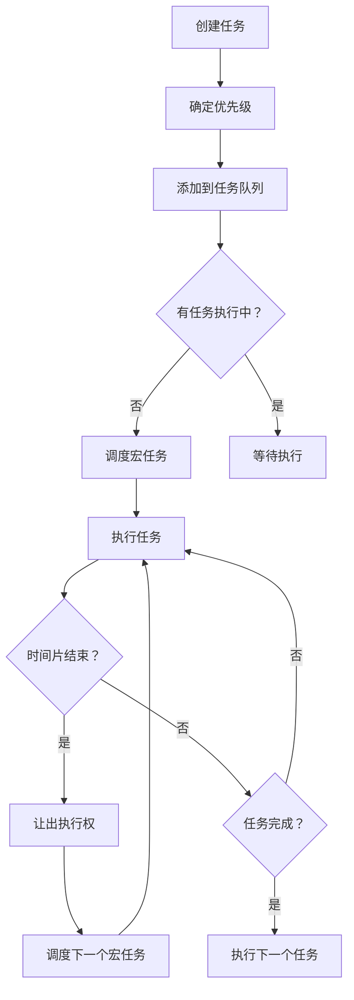

# Scheduler - 调度器核心

Scheduler 是 React Concurrent 模式的心脏，负责管理任务优先级和时间切片。

## 📦 模块位置

```
packages/scheduler/
├── src/
│   ├── Scheduler.js              # 主逻辑
│   ├── SchedulerPriorityLevels.js # 优先级定义
│   ├── SchedulerMinHeap.js       # 最小堆实现
│   └── SchedulerHostConfig.js    # 宿主环境配置（浏览器/Node）
```

## 🎯 核心职责

1. **优先级调度**：根据任务优先级决定执行顺序
2. **时间切片**：将长任务拆分为小片段
3. **任务队列管理**：维护待执行的任务队列

## 🔢 优先级等级

```javascript
// packages/scheduler/src/SchedulerPriorities.js
export type PriorityLevel = 0 | 1 | 2 | 3 | 4 | 5;

export const NoPriority = 0;
export const ImmediatePriority = 1;
export const UserBlockingPriority = 2;
export const NormalPriority = 3;
export const LowPriority = 4;
export const IdlePriority = 5;
```

## 📊 调度流程图



## 🔍 核心 API

### unstable_scheduleCallback

调度回调函数：

```javascript
import { unstable_scheduleCallback as scheduleCallback } from 'scheduler';

// 调度一个普通优先级的任务
scheduleCallback(NormalPriority, () => {
  console.log('任务执行');
});

// 带超时时间
scheduleCallback(NormalPriority, () => {
  console.log('任务执行');
}, {
  timeout: 5000  // 5 秒超时，超时后优先级提升
});
```

### unstable_runWithPriority

以特定优先级执行：

```javascript
import { unstable_runWithPriority as runWithPriority } from 'scheduler';

runWithPriority(ImmediatePriority, () => {
  // 以最高优先级执行
  setState(newValue);
});
```

### unstable_shouldYield

检查是否应该让出执行权：

```javascript
function workLoop() {
  while (taskQueue.length > 0) {
    if (shouldYield()) {
      // 时间片用完，让出执行权
      break;
    }
    // 执行任务
    performTask(currentTask);
  }
}
```

## ⚙️ 工作原理

### 1. 任务入队

```javascript
function scheduleCallback(priorityLevel, callback, options) {
  const currentTime = getCurrentTime();
  let startTime = currentTime;
  
  if (options && typeof options.delay === 'number') {
    startTime += options.delay;
  }
  
  let timeout;
  switch (priorityLevel) {
    case ImmediatePriority:
      timeout = IMMEDIATE_PRIORITY_TIMEOUT;
      break;
    case UserBlockingPriority:
      timeout = USER_BLOCKING_PRIORITY_TIMEOUT;
      break;
    case IdlePriority:
      timeout = IDLE_PRIORITY_TIMEOUT;
      break;
    case LowPriority:
      timeout = LOW_PRIORITY_TIMEOUT;
      break;
    case NormalPriority:
    default:
      timeout = NORMAL_PRIORITY_TIMEOUT;
      break;
  }
  
  const expirationTime = startTime + timeout;
  
  // 创建新任务
  const newTask = {
    id: taskIdCounter++,
    callback,
    priorityLevel,
    startTime,
    expirationTime,
    sortedIndex: -1,
  };
  
  // 添加到任务队列
  taskQueue.push(newTask);
  
  // 确保有调度正在运行
  ensureHostHasScheduled();
  
  return newTask;
}
```

### 2. 时间切片实现

```javascript
function workLoop(hasTimeRemaining, initialTime) {
  let currentTime = initialTime;
  advanceTimers(currentTime);
  currentTask = peek(taskQueue);
  
  while (currentTask !== null) {
    // 检查是否应该让出执行权
    if (
      currentTask.expirationTime > currentTime &&
      (!hasTimeRemaining || shouldYieldToHost())
    ) {
      break; // 让出执行权
    }
    
    const callback = currentTask.callback;
    if (typeof callback === 'function') {
      currentTask.callback = null;
      
      // 执行任务
      const continuationCallback = callback();
      
      // 如果返回 continuation，继续调度
      if (typeof continuationCallback === 'function') {
        currentTask.callback = continuationCallback;
      } else {
        // 任务完成
        if (currentTask === peek(taskQueue)) {
          pop(taskQueue);
        }
      }
    } else {
      pop(taskQueue);
    }
    
    currentTime = getCurrentTime();
    advanceTimers(currentTime);
    currentTask = peek(taskQueue);
  }
}
```

### 3. 让出执行权（Yield）

```javascript
// packages/scheduler/src/SchedulerHostConfig.js
const channel = new MessageChannel();
const port = channel.port2;

channel.port1.onmessage = function() {
  if (isHostCallbackScheduled) {
    performWorkUntilDeadline();
  }
};

function requestHostCallback(callback) {
  isMessagePending = true;
  port.postMessage(null);  // 触发下一个宏任务
}
```

使用 `MessageChannel` 实现宏任务，将工作拆分到多个宏任务中执行。

## 🔬 优先级升降级

### 饥饿问题

低优先级任务可能永远得不到执行：

```javascript
// 始终有高优先级任务插入
scheduleCallback(UserBlockingPriority, highPriorityTask);
scheduleCallback(UserBlockingPriority, highPriorityTask);
// ... 低优先级任务永远执行不到
```

### 解决方案：超时升级

```javascript
function updateExpirationTime(task, currentTime) {
  const startTime = task.startTime;
  const expirationTime = task.expirationTime;
  
  // 如果任务等待时间超过阈值，提升优先级
  if (expirationTime <= currentTime) {
    task.priorityLevel = ImmediatePriority;
  }
}
```

## 🎯 与 React 的集成

### React 中的使用

```javascript
// packages/react-reconciler/src/ReactFiberWorkLoop.js
import {
  scheduleCallback,
  NormalPriority,
  ImmediatePriority,
} from 'scheduler';

function ensureRootIsScheduled() {
  const SchedulerPriority = getCurrentSchedulerPriority();
  
  // 调度渲染任务
  scheduleCallback(
    SchedulerPriority,
    () => performConcurrentWorkOnRoot(root),
    { timeout: calculateTimeout(lanes) }
  );
}
```

### Lane 到 Scheduler Priority 的映射

```javascript
function getCurrentSchedulerPriority() {
  switch (lanesToEventPriority(nextLanes)) {
    case DiscreteEventPriority:
      return ImmediatePriority;
    case ContinuousEventPriority:
      return UserBlockingPriority;
    case DefaultEventPriority:
      return NormalPriority;
    case IdleEventPriority:
      return IdlePriority;
    default:
      return NormalPriority;
  }
}
```

## 📈 性能优化

### 1. 最小堆优化

任务队列使用最小堆，快速找到最早过期的任务：

```javascript
// packages/scheduler/src/SchedulerMinHeap.js
function push(heap, node) {
  const index = heap.length;
  heap.push(node);
  siftUp(heap, node, index);
}

function peek(heap) {
  return heap.length > 0 ? heap[0] : null;
}

function pop(heap) {
  if (heap.length === 0) return null;
  const first = heap[0];
  const last = heap.pop();
  if (last !== first) {
    heap[0] = last;
    siftDown(heap, last, 0);
  }
  return first;
}
```

### 2. 避免不必要的调度

```javascript
function ensureHostHasScheduled() {
  if (isHostCallbackScheduled) {
    return;  // 已有调度，避免重复
  }
  
  if (isHostProcessing) {
    return;  // 正在处理中
  }
  
  isHostCallbackScheduled = true;
  requestHostCallback();
}
```

## 🐛 常见问题

### Q: 为什么 React 不直接使用 setTimeout?

**A**: `setTimeout` 的精度不够，且有最小延迟限制（4ms）。`MessageChannel` 延迟更低，适合时间切片。

### Q: 时间片多长？

**A**: 默认 5ms，通过 `yieldInterval` 配置。

### Q: 如何观察调度过程？

**A**: 在浏览器控制台使用 Performance API：

```javascript
performance.mark('task-start');
// 任务执行
performance.mark('task-end');
performance.measure('task', 'task-start', 'task-end');
```

---

## 📖 下一步

- [Reconciler - 协调器](./reconciler) - 深入协调器实现
- [优先级模型：Lane 深度解析](../philosophy/lane)