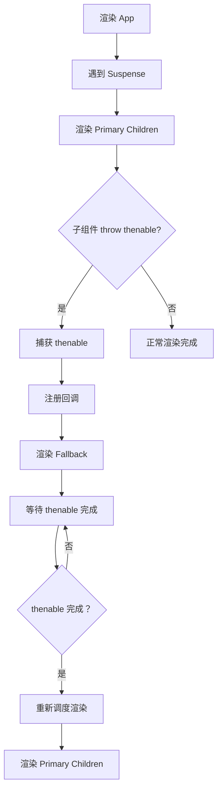

# Suspense 架构

Suspense 是 React 处理异步加载的核心机制，允许组件"等待"某些数据准备好后再渲染。

## 📦 模块位置

```
packages/react-reconciler/src/
├── ReactFiberSuspenseComponent.js   # Suspense 组件
├── ReactFiberThrow.js               # throw 处理
├── ReactFiberThenable.js            # thenable 处理
└── ReactSuspenseComplete.js         # Suspense 完成逻辑

packages/react-dom/src/
├── ReactDOMLazyComponent.js         # lazy 实现
└── ReactDOMSuspenseList.js          # SuspenseList
```

## 🎯 核心概念

### Thenable

Suspense 基于 **Thenable** 对象（类似 Promise）：

```javascript
// Thenable 接口
type Thenable<R> = {
  then(resolve: (R) => void, reject: (error) => void): void,
  status?: 'pending' | 'fulfilled' | 'rejected',
  value?: R,
  reason?: any,
};
```

### Suspense 边界

```jsx
<Suspense fallback={<Loading />}>
  <AsyncComponent />
</Suspense>
```

## 🔄 工作原理

### 1. 渲染阶段

```javascript
// packages/react-reconciler/src/ReactFiberThrow.js
function throwException(
  root,
  returnFiber,
  sourceFiber,
  value
) {
  // 1. 检查是否是 thenable
  if (
    value !== null &&
    typeof value === 'object' &&
    typeof value.then === 'function'
  ) {
    // 2. 标记 Suspense boundary
    const suspenseBoundary = getParentSuspenseBoundary(returnFiber);
    
    if (suspenseBoundary) {
      // 3. 挂载 then 回调
      value.then(
        // 成功回调
        () => {
          // 数据准备好了，重试渲染
          retryTimedOutBoundary(suspenseBoundary);
        },
        // 失败回调
        (error) => {
          // 抛出错误
          markSuspenseBoundaryShouldCapture(suspenseBoundary);
        }
      );
      
      // 4. 标记 boundary 为 suspended
      markSuspenseBoundaryAsDehydrated(suspenseBoundary);
      return;
    }
  }
  
  // 不是 thenable，继续向上抛出
  throw value;
}
```

### 2. 列表结构

```
Suspense Boundary
   │
   ├── Primary Children (正常内容)
   │    └── [需要异步数据]
   │         └── throw Promise
   │
   └── Fallback Children (Loading)
        └── 显示 ✓
```

## 🔍 SuspenseComponent 结构

```javascript
// packages/react-reconciler/src/ReactFiberSuspenseComponent.js
type SuspenseState = {
  dehydrated: boolean,           // 是否 SSR hydrate
  retryLane: Lane,               // 重试优先级
  boundary: OffscreenScreenType, // Offscreen 边界
  fallbackChildSet: Fiber[],     // fallback 子节点
};

function createSuspenseState() {
  return {
    dehydrated: false,
    retryLane: NoLanes,
    fallbackChildSet: null,
  };
}
```

### Fiber 标志

```javascript
// Suspense 组件的特殊标志
const SuspenseComponent = 13;

// 子树的标志位
type SuspenseFlags = 
  | DidCapture      // 捕获到错误/thenable
  | Incomplete      // 未完成
  | ShouldCapture;  // 需要捕获
```

## 🚀 beginWork 中的 Suspense

### updateSuspenseComponent

```javascript
function updateSuspenseComponent(
  current,
  workInProgress,
  renderLanes
) {
  const nextProps = workInProgress.pendingProps;
  
  // 1. 检查是否需要重新显示 fallback
  const didSuspend = (workInProgress.flags & DidCapture) !== NoFlags;
  
  if (didSuspend) {
    // 2. 已经被捕获，显示 fallback
    return updateSuspenseComponent_fallback(
      current,
      workInProgress,
      renderLanes
    );
  }
  
  // 3. 正常渲染 primary children
  const nextPrimaryChildren = nextProps.children;
  const nextFallbackChildren = nextProps.fallback;
  
  if (nextFallbackChildren !== undefined) {
    // 有 fallback，隐藏 primary，显示 fallback
    workInProgress.memoizedState = createSuspenseState();
  }
  
  // 4. 协调子节点
  reconcileChildren(current, workInProgress, nextPrimaryChildren);
  
  return workInProgress.child;
}
```

### 捕获 thenable

```javascript
function broadcastSuspenseState(
  root,
  boundary,
  thenable
) {
  // 标记 boundary 需要重试
  boundary.lanes = retryLane;
  
  // 调度更新
  scheduleUpdateOnFiber(root, boundary, retryLane);
}
```

## 🎯 完整流程

### 1. 首次渲染



### 2. 重试渲染

```javascript
// packages/react-reconciler/src/ReactFiberSuspenseComplete.js
function retryTimedOutBoundary(boundaryFiber) {
  // 1. 创建 update
  const update = createUpdate(eventTime, lane);
  
  // 2. 标记重试
  update.tag = Retry;
  update.payload = {
    boundary: boundaryFiber,
  };
  
  // 3. 调度更新
  scheduleUpdateOnFiber(
    boundaryFiber,
    update,
    lane
  );
}
```

## 📊 并发渲染

### 优先级调度

```javascript
// Suspense 使用特定优先级
function getSuspenseRetryLane() {
  // 重试使用 Normal 优先级
  return NormalPriority;
}

// 高优先级更新可以打断
function shouldRetrySuspense() {
  // 检查是否有更高优先级任务
  const highestLane = getNextLanes(root, NoLanes);
  
  if (includesBlockingLane(highestLane)) {
    // 有高优先级任务，等待
    return false;
  }
  
  return true;
}
```

### Offscreen 组件

React 18 引入 Offscreen 支持 Suspense 缓存：

```javascript
// Offscreen 组件内部
function updateOffscreenComponent(current, workInProgress) {
  const nextProps = workInProgress.pendingProps;
  const Offscreen = 23; // Offscreen tag
  
  // 根据 invisible 标志决定是否隐藏
  if (nextProps.mode === 'invisible') {
    // 隐藏但保持状态
    // 不渲染子节点，但保留 Fiber 树
  } else {
    // 正常渲染
    reconcileChildren(current, workInProgress, nextProps.children);
  }
  
  return workInProgress.child;
}
```

## 🔍 使用场景

### 1. 组件懒加载

```jsx
// lazy 返回一个 Thenable
const AsyncComponent = lazy(() => import('./AsyncComponent'));

function App() {
  return (
    <Suspense fallback={<Spinner />}>
      <AsyncComponent />
    </Suspense>
  );
}
```

### 2. 数据获取

```jsx
// 自定义数据 Hook
function useData(resource) {
  const data = resource.read(); // 可能 throw Promise
  return data;
}

function DataComponent() {
  const data = useData(fetchData());
  return <div>{data}</div>;
}

function App() {
  return (
    <Suspense fallback={<Loading />}>
      <DataComponent />
    </Suspense>
  );
}
```

### 3. 图片预加载

```jsx
function Image({ src }) {
  // 预加载图片
  preloadImage(src);
  
  return ;
}

// 配合 Suspense
<Suspense fallback={<Placeholder />}>
  <Image src="large.jpg" />
</Suspense>
```

### 4. 服务端流式渲染

```jsx
// React 18 SSR
import { renderToPipeableStream } from 'react-dom/server';

renderToPipeableStream(<App />, {
  onShellReady() {
    // 初始 shell 准备好
    console.log('Shell ready');
  },
  onAllReady() {
    // 所有内容准备好
    console.log('All ready');
  },
});
```

## ⚛️ SuspenseList

协调多个 Suspense 边界的显示顺序：

```jsx
<SuspenseList revealOrder="forwards">
  <Suspense fallback={<Loading />}>
    <Profile />
  </Suspense>
  <Suspense fallback={<Loading />}>
    <Posts />
  </Suspense>
  <Suspense fallback={<Loading />}>
    <Comments />
  </Suspense>
</SuspenseList>
```

### 配置

| revealOrder | 说明 |
|-------------|------|
| `forwards` | 按子节点顺序显示 |
| `backwards` | 逆序显示 |
| `together` | 全部准备好后一起显示 |

## 🐛 常见问题

### Q: Suspense 能用于数据获取吗？

**A**: React 18 不推荐直接在组件内 fetch。推荐使用：
- use() Hook (React 19)
- RSC (React Server Components)
- 第三方库（SWR、React Query）

### Q: 如何避免 fallback 闪烁？

```jsx
// 延迟显示 fallback
<Suspense fallback={<Loading />} unstable_expectedLoadTime={300}>
  <AsyncComponent />
</Suspense>
```

### Q: 错误如何处理？

```jsx
<ErrorBoundary fallback={<Error />}>
  <Suspense fallback={<Loading />}>
    <AsyncComponent />
  </Suspense>
</ErrorBoundary>
```

## 🔬 调试技巧

### 观察 Suspense 状态

```javascript
// 在浏览器控制台
const fiber = document.querySelector('[data-reactroot]')._reactRootContainer._internalRoot.current;

function findSuspense(fiber) {
  if (fiber.tag === 13) { // Suspense tag
    console.log('Suspense found:', {
      state: fiber.memoizedState,
      flags: fiber.flags,
    });
  }
  if (fiber.child) findSuspense(fiber.child);
  if (fiber.sibling) findSuspense(fiber.sibling);
}

findSuspense(fiber);
```

---

## 📖 下一步

- [Concurrent Features 架构](./concurrent)
- [Suspense 实现篇](../implementation/suspense)