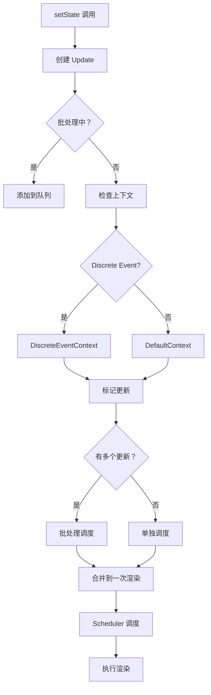

# Automatic Batching 实现

Automatic Batching（自动批处理）是 React 18 的重要特性，自动将多个 state 更新合并为一次渲染。

## 📦 模块位置

```
packages/react-reconciler/src/
├── ReactFiberWorkLoop.js    # 批处理核心逻辑
└── ReactFiberLane.js        // Lane 优先级
```

## 🔍 什么是批处理

### React 17 及之前

```jsx
// ❌ React 17：只有事件处理中才批处理
button.onclick = () => {
  setCount(c => c + 1);  // 批处理 ✅
  setFlag(f => !f);      // 批处理 ✅
  // 只渲染一次
};

// ❌ 异步回调中不批处理
setTimeout(() => {
  setCount(c => c + 1);  // 渲染一次 ❌
  setFlag(f => !f);      // 渲染一次 ❌
  // 总共渲染两次
}, 1000);

// ❌ Promise 中不批处理
fetch().then(() => {
  setCount(c => c + 1);  // 渲染一次 ❌
  setFlag(f => !f);      // 渲染一次 ❌
});
```

### React 18+

```jsx
// ✅ React 18：所有情况都自动批处理
button.onclick = () => {
  setCount(c => c + 1);
  setFlag(f => !f);
  // 只渲染一次 ✅
};

setTimeout(() => {
  setCount(c => c + 1);
  setFlag(f => !f);
  // 只渲染一次 ✅
}, 1000);

fetch().then(() => {
  setCount(c => c + 1);
  setFlag(f => !f);
  // 只渲染一次 ✅
});
```

## 🔬 核心实现

### 批处理机制

```javascript
// packages/react-reconciler/src/ReactFiberWorkLoop.js

// 批处理标识
let isBatchingUpdates = false;
let executionContext = NoContext;

// 事件系统触发的批处理
function discreteUpdates(fn, a, b, c) {
  const prevExecutionContext = executionContext;
  executionContext |= DiscreteEventContext;
  
  try {
    return fn(a, b, c);
  } finally {
    executionContext = prevExecutionContext;
    
    // 如果没有其他任务，立即刷新
    if (executionContext === NoContext) {
      flushSync();
    }
  }
}
```

### scheduleUpdateOnFiber

```javascript
function scheduleUpdateOnFiber(
  fiber: Fiber,
  lane: Lane,
): FiberRoot | null {
  // 1. 标记待处理的更新
  markUpdateLaneFromFiberToRoot(fiber, lane);
  
  // 2. 检查是否需要批处理
  if (isBatchingUpdates) {
    // 批处理中，只标记，不立即调度
    return null;
  }
  
  // 3. 同步调度
  return ensureRootIsScheduled(root);
}
```

### React 18 的改进

```javascript
// packages/react-dom/src/events/ReactDOMUpdateBatching.js

// React 18：所有更新都默认批处理
function batchedUpdates(fn, a) {
  const prevExecutionContext = executionContext;
  executionContext |= BatchedContext;
  
  try {
    return fn(a);
  } finally {
    executionContext = prevExecutionContext;
    // 不再立即 flushSync，让调度器决定时机
  }
}

// React 17 的行为
function legacyBatchedUpdates(fn, a) {
  const prevExecutionContext = executionContext;
  executionContext |= BatchedContext;
  
  try {
    return fn(a);
  } finally {
    executionContext = prevExecutionContext;
    // 立即刷新
    if (executionContext === NoContext) {
      flushSync();
    }
  }
}
```

## 🔄 完整流程



## 💡 实战技巧

### 1. 连续 setState

```jsx
function Counter() {
  const [count, setCount] = useState(0);
  const [flag, setFlag] = useState(false);
  
  const handleClick = () => {
    // React 18：自动批处理
    setCount(c => c + 1);
    setFlag(f => !f);
    console.log('Only one render!');
  };
  
  return <button onClick={handleClick}>{count}</button>;
}
```

### 2. 异步更新

```jsx
function AsyncComponent() {
  const [data, setData] = useState(null);
  const [loading, setLoading] = useState(false);
  
  const fetchData = async () => {
    setLoading(true);
    
    // React 18：异步回调中也批处理
    const result = await api.fetch();
    setData(result);
    setLoading(false);
    // 只触发一次渲染
  };
  
  return <div>{data}</div>;
}
```

### 3. 事件监听器

```jsx
function ListenComponent() {
  const [x, setX] = useState(0);
  const [y, setY] = useState(0);
  
  useEffect(() => {
    const handleMove = (e) => {
      // React 18：原生事件监听器中也批处理
      setX(e.clientX);
      setY(e.clientY);
      // 只触发一次渲染
    };
    
    window.addEventListener('mousemove', handleMove);
    return () => window.removeEventListener('mousemove', handleMove);
  }, []);
  
  return <div>Position: {x}, {y}</div>;
}
```

### 4. 第三方库回调

```jsx
function ThirdPartyComponent() {
  const [value, setValue] = useState('');
  const [error, setError] = useState(null);
  
  useEffect(() => {
    // Redux、Zustand 等库的回调
    const unsubscribe = store.subscribe(() => {
      const state = store.getState();
      // React 18：批处理
      setValue(state.value);
      setError(state.error);
    });
    
    return unsubscribe;
  }, []);
  
  return <div>{value}</div>;
}
```

### 5. 禁用批处理

```jsx
// 需要立即更新时使用 flushSync
import { flushSync } from 'react-dom';

function handleClick() {
  // 立即渲染（不推荐，除非必要）
  flushSync(() => {
    setCount(c => c + 1);
  });
  
  // 可以读取到最新的 DOM
  console.log(ref.current.offsetHeight);
  
  // 继续批处理
  setFlag(f => !f);
}
```

## ⚠️ 注意事项

### 1. flushSync 的代价

```jsx
// ❌ 不推荐：频繁使用 flushSync
function BadComponent() {
  const handleClick = () => {
    flushSync(() => setCount(c => c + 1));  // 立即渲染
    flushSync(() => setFlag(f => !f));      // 立即渲染
    flushSync(() => setData(d => d + 1));   // 立即渲染
    // 渲染三次！
  };
}

// ✅ 推荐：让 React 自动批处理
function GoodComponent() {
  const handleClick = () => {
    setCount(c => c + 1);
    setFlag(f => !f);
    setData(d => d + 1);
    // 只渲染一次
  };
}
```

### 2. 批处理的边界

```
批处理边界：

✅ 批处理范围内：
- React 事件处理
- setTimeout / setInterval
- Promise.then / async-await
- 原生事件监听器
- 第三方库回调

❌ 批处理范围外（需要 flushSync）：
- 读取 DOM 尺寸后立即使用
- 某些第三方库要求同步更新
```

### 3. 批处理与闭包

```jsx
// ❌ 可能的闭包陷阱
function Component() {
  const [count, setCount] = useState(0);
  
  const handleClick = () => {
    setCount(count + 1);  // 可能拿到旧值
    setCount(count + 1);  // 还是旧值
    // count 增加 1，不是 2
  };
}

// ✅ 使用函数更新
function Component() {
  const [count, setCount] = useState(0);
  
  const handleClick = () => {
    setCount(c => c + 1);  // 基于最新值
    setCount(c => c + 1);  // 基于最新值
    // count 增加 2
  };
}
```

### 4. 批处理优先级

```
React 18 的优先级系统：

SyncLane（最高）
  └── flushSync

InputContinuousLane
  └── 用户输入、点击

DefaultLane
  └── 普通更新

TransitionLanes
  └── startTransition / useDeferredValue

IdleLane（最低）
  └── 后台任务
```

## 🔬 内部机制

### 执行上下文

```javascript
// packages/react-reconciler/src/ReactFiberWorkLoop.js

const NoContext = 0b000;
const BatchedContext = 0b001;
const DiscreteEventContext = 0b010;
const LegacyContext = 0b100;

let executionContext = NoContext;

// 进入批处理上下文
function enterBatchedContext() {
  executionContext |= BatchedContext;
}

// 退出批处理上下文
function exitBatchedContext() {
  executionContext &= ~BatchedContext;
  
  // 如果没有其他任务，刷新
  if (executionContext === NoContext) {
    flushRenderPhaseScheduledUpdates();
  }
}
```

### 更新队列处理

```javascript
// 批处理时收集更新

function processUpdateQueue(
  workInProgress,
  props,
  updateQueue,
  renderLanes,
) {
  let didSkip = false;
  
  // 遍历所有待处理的更新
  while (updateQueue.first !== null) {
    const update = updateQueue.first;
    
    // 检查优先级
    const updateLane = update.lane;
    
    if (!isSubsetOfLanes(renderLanes, updateLane)) {
      // 优先级不够，跳过（稍后处理）
      didSkip = true;
      break;
    }
    
    // 应用更新
    applyUpdate(workInProgress, update);
    
    // 移除已处理的更新
    updateQueue.first = update.next;
  }
  
  // 如果有跳过的更新，标记需要重新渲染
  if (didSkip) {
    markSkippedUpdateLanes(updateQueue.lanes);
  }
}
```

## 🔬 调试技巧

### 追踪批处理

```javascript
// 开发模式下添加日志
const originalScheduleUpdate = scheduleUpdateOnFiber;
scheduleUpdateOnFiber = function(fiber, lane) {
  console.group('scheduleUpdateOnFiber');
  console.log('Component:', fiber.type?.name);
  console.log('Lane:', lane);
  console.log('Batching:', executionContext & BatchedContext ? 'Yes' : 'No');
  
  const result = originalScheduleUpdate(fiber, lane);
  
  console.groupEnd();
  return result;
};
```

### 测量渲染次数

```jsx
function RenderCounter({ children }) {
  const renderCount = useRef(0);
  renderCount.current += 1;
  
  useEffect(() => {
    console.log('Render count:', renderCount.current);
    renderCount.current = 0;
  });
  
  return children;
}

// 使用
<RenderCounter>
  <MyComponent />
</RenderCounter>
```

## 🐛 常见问题

### Q: React 18 批处理有什么性能影响？

**A**: 通常是性能提升，因为减少了渲染次数。极少数需要 DOM 同步读取的场景可能需要 flushSync。

### Q: 如何知道批处理是否生效？

**A**: 使用 React DevTools Profiler 或添加渲染日志观察。

### Q: flushSync 有什么副作用？

**A**: 强制同步渲染，失去批处理的优势。应尽量避免使用。

### Q: 批处理会影响状态更新的顺序吗？

**A**: 不会。更新按调用顺序应用，只是渲染时机被批处理优化。

---

## 📖 下一步

- [优先级调度算法](./priority)
- [任务调度与时间切片](./scheduling)