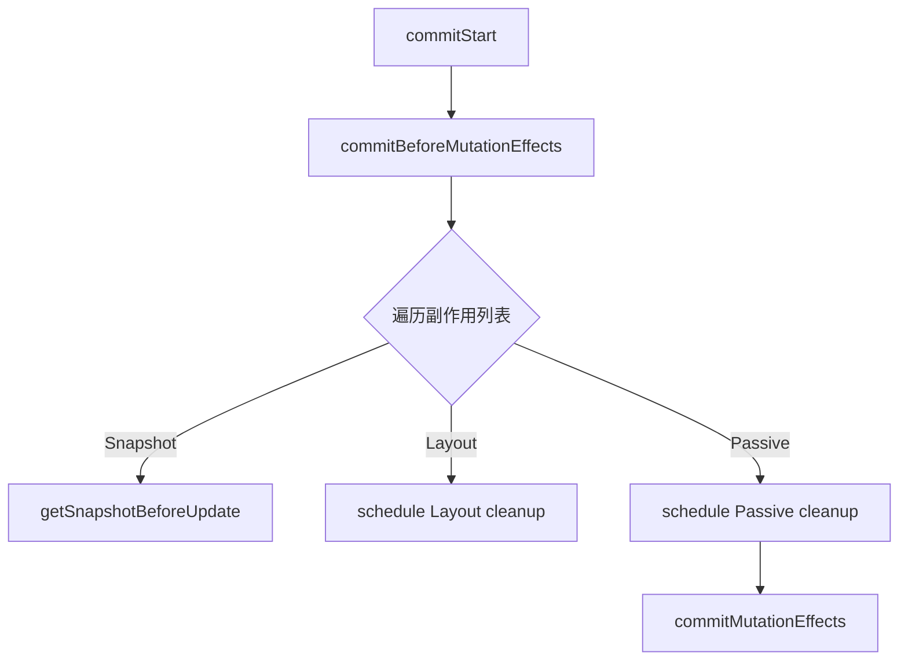

# commit Before Mutation 阶段

commit 阶段是 render 阶段之后的同步阶段，分为三个子阶段：Before Mutation、Mutation、Layout。

## 📦 模块位置

```
packages/react-reconciler/src/
└── ReactFiberCommitWork.js    # commit 阶段核心实现
```

## 🎯 commit 阶段总览

```
commit 阶段（不可中断，同步执行）

┌─────────────────────────────────────────┐
│  Before Mutation                        │
│  - 调用 getSnapshotBeforeUpdate         │
│  - 处理 useEffect 的 destroy            │
│  - 计算 DOM 变换前的快照                │
├─────────────────────────────────────────┤
│  Mutation                               │
│  - 执行 DOM 操作（增删改）               │
│  - 更新属性、事件监听器                 │
├─────────────────────────────────────────┤
│  Layout                                 │
│  - 调用 useLayoutEffect                 │
│  - 调用 componentDidMount/Update        │
│  - 更新 ref                             │
└─────────────────────────────────────────┤
│  完成                                   │
│  - 切换 current 指针                    │
│  - 清理旧 Fiber                         │
└─────────────────────────────────────────┘
```

## 🔍 Before Mutation 阶段

### 1. commitBeforeMutationEffects

```javascript
// packages/react-reconciler/src/ReactFiberCommitWork.js

function commitBeforeMutationEffects(
  root,
  firstChild,
) {
  const committedLanes = root.finishedLanes;
  
  // 遍历副作用列表
  forEachEffect(effect => {
    const fiber = effect;
    const flags = fiber.flags;
    
    // 1. Snapshot - getSnapshotBeforeUpdate
    if (flags & Snapshot) {
      commitBeforeMutationEffectOnFiber(current, fiber);
    }
    
    // 2. Layout Effects cleanup
    if (flags & Layout) {
      commitBeforeMutationEffectsOnFiber(fiber);
    }
    
    // 3. Passive Effects cleanup (useEffect)
    if (flags & Passive) {
      scheduleCallback(NormalPriority, () => {
        flushPassiveEffects();
      });
    }
  });
  
  // 重置副作用标志
  root.finishedLanes = NoLanes;
}
```

### 2. getSnapshotBeforeUpdate

```javascript
function commitBeforeMutationEffectOnFiber(current, finishedWork) {
  const instance = finishedWork.stateNode;
  
  switch (finishedWork.tag) {
    case ClassComponent: {
      // Class 组件的 getSnapshotBeforeUpdate
      const previousProps = finishedWork.memoizedProps;
      const previousState = finishedWork.memoizedState;
      
      if (typeof instance.getSnapshotBeforeUpdate === 'function') {
        const snapshot = instance.getSnapshotBeforeUpdate(
          previousProps,
          previousState
        );
        
        // 保存快照供 componentDidUpdate 使用
        instance.__reactInternalSnapshotBeforeUpdate = snapshot;
      }
      break;
    }
    
    case HostComponent: {
      // DOM 组件的快照
      // 主要用于表单元素等
      break;
    }
  }
}
```

### 3. useEffect 清理

```javascript
// 在 commitBeforeMutation 阶段调度 useEffect 清理

function schedulePassiveEffects(finishedSubtreeFlags, finishedRoot) {
  const updateQueue = finishedRoot.updateQueue;
  
  if (updateQueue !== null && updateQueue.lastEffect !== null) {
    // 将 passive effects 加入调度队列
    scheduleCallback(NormalPriority, () => {
      flushPassiveEffects();
    });
  }
}

function flushPassiveEffects() {
  // 执行 useEffect 的 destroy 函数
  forEachEffect(effect => {
    const destroy = effect.destroy;
    if (destroy !== null) {
      destroy();
    }
  });
  
  // 清空队列
  passiveEffectHasError = false;
}
```

## 🔄 遍历流程



## 📊 副作用处理

```javascript
// 不同 Component 的 Before Mutation 处理

// === Class Component ===
case ClassComponent: {
  if (flags & Snapshot) {
    const snapshot = instance.getSnapshotBeforeUpdate(prevProps, prevState);
    // 保存快照
  }
  
  // 调度 useEffect 清理
  if (flags & Passive) {
    schedulePassiveEffects();
  }
  
  break;
}

// === Host Component ===
case HostComponent: {
  // 处理 input/textarea 等特殊 DOM 的快照
  if (flags & Update) {
    // DOM 更新前的准备工作
  }
  break;
}

// === Function Component ===
case FunctionComponent: {
  // 调度 useEffect 清理
  if (flags & Passive) {
    schedulePassiveEffects();
  }
  break;
}
```

## ⚠️ 注意事项

### 1. 不修改 DOM

```javascript
// ❌ 错误：在 Before Mutation 修改 DOM
useLayoutEffect(() => {
  // 这里会修改 DOM（太早了）
  element.innerHTML = 'modified';
});

// ✅ 正确：在 Layout 阶段修改 DOM
useLayoutEffect(() => {
  // 这是正确的时机
  element.innerHTML = 'modified';
}, []);
```

### 2. getSnapshotBeforeUpdate 返回

```jsx
class ScrollingList extends React.Component {
  constructor(props) {
    super(props);
    this.listRef = React.createRef();
  }
  
  getSnapshotBeforeUpdate(prevProps, prevState) {
    // 在 DOM 更新前计算滚动位置
    if (prevProps.list.length < this.props.list.length) {
      const list = this.listRef.current;
      return {
        offsetTop: list.scrollTop,
        scrollHeight: list.scrollHeight,
      };
    }
    return null;
  }
  
  componentDidUpdate(prevProps, prevState, snapshot) {
    // 使用快照恢复滚动位置
    if (snapshot !== null) {
      const list = this.listRef.current;
      list.scrollTop = snapshot.offsetTop;
    }
  }
  
  render() {
    return <div ref={this.listRef}>{/* ... */}</div>;
  }
}
```

### 3. useEffect 清理时机

```jsx
// useEffect 的清理在 Before Mutation 调度，在 Mutation 执行

function Component({ userId }) {
  const [data, setData] = useState(null);
  
  useEffect(() => {
    // 订阅
    const subscription = subscribe(userId);
    subscription.on('data', setData);
    
    // 清理函数在组件卸载或 userId 变化前执行
    return () => {
      subscription.off('data', setData);
      subscription.cancel();
    };
  }, [userId]);
  
  return <div>{data}</div>;
}

// 执行顺序:
// 1. Before Mutation: 调度销毁函数
// 2. Mutation: 执行销毁函数
// 3. 更新 props/children
// 4. Layout: 执行新的 useEffect
```

## 🔬 源码深度

### Fiber Flags

```javascript
// 在 Before Mutation 阶段处理的 flags

// Snapshot - getSnapshotBeforeUpdate
const Snapshot = 0b000000000000000000001000000000;

// Layout - useLayoutEffect
const Layout = 0b000000000000000001000000000000;

// Passive - useEffect
const Passive = 0b000000000000000100000000000000;

// Ref - 更新 ref
const Ref = 0b000000000000000010000000000000;
```

### forEachEffect

```javascript
// 遍历副作用列表

function forEachEffect(cb) {
  let effects = pendingPassiveEffects;
  
  if (effects === null) {
    return;
  }
  
  // 清空队列
  pendingPassiveEffects = null;
  
  for (let i = 0; i < effects.length; i++) {
    cb(effects[i]);
  }
}
```

## 🔬 调试技巧

### 追踪 Before Mutation

```javascript
// 开发模式下添加日志
const originalCommitBeforeMutation = commitBeforeMutationEffects;
commitBeforeMutationEffects = function(root, firstChild) {
  console.group('commitBeforeMutationEffects');
  console.log('Root:', root);
  console.log('Finished Work:', root.finishedWork);
  
  const result = originalCommitBeforeMutation(root, firstChild);
  
  console.log('Effects processed');
  console.groupEnd();
  
  return result;
};
```

### 观察 getSnapshotBeforeUpdate

```jsx
// React DevTools 中观察
class TestComponent extends React.Component {
  getSnapshotBeforeUpdate(prevProps, prevState) {
    console.log('getSnapshotBeforeUpdate called:', {
      prevProps,
      prevState,
      currentProps: this.props,
      currentState: this.state,
    });
    return { height: window.innerHeight };
  }
  
  render() {
    return <div>Test</div>;
  }
}
```

## 🐛 常见问题

### Q: Before Mutation 阶段可以做什么？

**A**: 
- ✅ 读取当前 DOM 状态
- ✅ 计算快照
- ✅ 调度清理函数
- ❌ 修改 DOM（会闪烁）

### Q: useEffect 清理什么时候执行？

**A**: 在 Before Mutation 调度，在 Mutation 阶段执行。

### Q: 为什么要把清理放在 Before Mutation 而不是 Mutation？

**A**: 确保清理发生在 DOM 更新之前，以便：
1. 取消订阅
2. 清理资源
3. 避免内存泄漏

---

## 📖 下一步

- [commit Mutation 阶段](./commit-mutation) - DOM 增删改操作
- [commit Layout 阶段](./commit-layout) - useLayoutEffect 和 ref