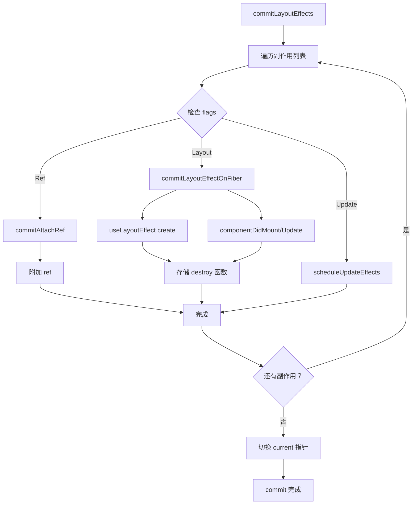

# commit Layout 阶段

Layout 阶段是 commit 阶段的最后一个子阶段，负责执行 useLayoutEffect、componentDidMount/Update 以及 ref 的附加。

## 📦 模块位置

```
packages/react-reconciler/src/
└── ReactFiberCommitWork.js    # commitLayoutEffects 实现
```

## 🔍 核心函数

### commitLayoutEffects

```javascript
// packages/react-reconciler/src/ReactFiberCommitWork.js

function commitLayoutEffects(finishedWork, root) {
  const committedLanes = root.finishedLanes;
  
  // 遍历副作用列表
  forEachEffect(effect => {
    const fiber = effect;
    const flags = fiber.flags;
    
    // 1. Update - useEffect cleanup scheduling
    if (flags & Update) {
      scheduleUpdateEffects(fiber);
    }
    
    // 2. Layout - useLayoutEffect / componentDidMount
    if (flags & Layout) {
      const current = fiber.alternate;
      commitLayoutEffectOnFiber(root, fiber, current);
    }
    
    // 3. Ref - 附加 ref
    if (flags & Ref) {
      commitAttachRef(fiber);
    }
  });
  
  // 完成 commit
  root.current = finishedWork;
}
```

## 💡 useLayoutEffect 执行

### commitLayoutEffectOnFiber

```javascript
function commitLayoutEffectOnFiber(root, fiber, current) {
  switch (fiber.tag) {
    case FunctionComponent:
    case ForwardRef:
    case SimpleMemoComponent: {
      // 执行 useLayoutEffect 的 create 函数
      commitHookEffectListMount(
        fiber.updateQueue.lastEffect,
        fiber,
      );
      break;
    }
    
    case ClassComponent: {
      const instance = fiber.stateNode;
      
      if (typeof instance.componentDidMount === 'function') {
        // 调用 componentDidMount
        const updateQueue = fiber.updateQueue;
        if (updateQueue !== null) {
          const previouslyCapturedUpdate = 
            getInstanceFromNode(fiber.stateNode);
          
          if (previouslyCapturedUpdate !== null) {
            instance.componentDidMount();
          }
        }
      }
      break;
    }
  }
}
```

### commitHookEffectListMount

```javascript
// 执行 useLayoutEffect 的 create 函数

function commitHookEffectListMount(
  lastEffect: lastEffect,
  finishedWork: Fiber,
) {
  const effectRing = lastEffect;
  
  if (effectRing === null) {
    return;
  }
  
  let effect = effectRing.next;
  
  do {
    // 检查是否是 Layout Effect
    if ((effect.tag & Layout) !== NoFlags) {
      // 执行 create 函数
      const create = effect.create;
      effect.destroy = create();
    }
    
    effect = effect.next;
  } while (effect !== effectRing);
}
```

## 🔄 Class 组件生命周期

### componentDidMount

```javascript
// Class 组件的 componentDidMount

function safelyCallComponentDidMount(root, fiber, instance) {
  try {
    // 调用 componentDidMount
    instance.componentDidMount();
  } catch (error) {
    // 错误处理
    captureCommitPhaseError(fiber, error);
  }
}

// 完整流程
case ClassComponent: {
  const instance = fiber.stateNode;
  const updateQueue = fiber.updateQueue;
  
  if (updateQueue !== null) {
    // 获取 captured update
    const previouslyCapturedUpdate = getInstanceFromNode(instance);
    
    if (previouslyCapturedUpdate !== null) {
      // 调用 componentDidMount
      instance.componentDidMount();
      
      // 处理 updateQueue 中的回调
      const callbacks = updateQueue.callbacks;
      if (callbacks !== null) {
        updateQueue.callbacks = null;
        
        for (let i = 0; i < callbacks.length; i++) {
          const callback = callbacks[i];
          callback.call(instance);
        }
      }
    }
  }
  break;
}
```

### componentDidUpdate

```javascript
// Class 组件的 componentDidUpdate

function safelyCallComponentDidUpdate(root, fiber, instance, prevProps, prevState) {
  try {
    // 调用 componentDidUpdate
    instance.componentDidUpdate(prevProps, prevState, fiber.__reactInternalSnapshotBeforeUpdate);
  } catch (error) {
    captureCommitPhaseError(fiber, error);
  }
}
```

## 🔗 Ref 附加

### commitAttachRef

```javascript
// 附加 ref（在 Layout 阶段）

function commitAttachRef(finishedWork) {
  const ref = finishedWork.ref;
  
  if (ref !== null) {
    const instance = finishedWork.stateNode;
    
    // 根据组件类型获取实例
    let instanceToUse;
    switch (finishedWork.tag) {
      case HostComponent:
        instanceToUse = instance;  // DOM 节点
        break;
      case ClassComponent:
        instanceToUse = instance;  // 组件实例
        break;
      default:
        instanceToUse = instance;
    }
    
    // 设置 ref
    if (typeof ref === 'function') {
      // 回调 ref
      ref(instanceToUse);
      
      // 存储清理函数（供卸载时使用）
      finishedWork.refCleanup = () => {
        ref(null);
      };
    } else {
      // ref 对象
      ref.current = instanceToUse;
      
      // 存储清理函数
      finishedWork.refCleanup = () => {
        ref.current = null;
      };
    }
  }
}
```

### refCleanup

```javascript
// ref 清理（在卸载时）

function safelyDetachRef(finishedWork) {
  const ref = finishedWork.ref;
  const refCleanup = finishedWork.refCleanup;
  
  if (refCleanup !== null) {
    refCleanup();
  }
}
```

## 🔄 完整流程



## 📊 useLayoutEffect vs useEffect

```
执行时机对比：

commit 阶段
┌─────────────────────────────────────────────┐
│  Before Mutation                            │
│  - schedule useEffect cleanup               │
├─────────────────────────────────────────────┤
│  Mutation                                   │
│  - 执行 useEffect cleanup                   │
│  - DOM 操作                                 │
├─────────────────────────────────────────────┤
│  Layout ⭐                                  │
│  - 执行 useLayoutEffect create              │
│  - 执行 componentDidMount/Update            │
│  - 附加 ref                                 │
└─────────────────────────────────────────────┤
│  异步（宏任务）                             │
│  - 执行 useEffect create (下一个宏任务)     │
└─────────────────────────────────────────────┘
```

### 区别

| 特性 | useLayoutEffect | useEffect |
|------|-----------------|-----------|
| 执行时机 | commit 阶段（同步） | commit 后（异步） |
| 阻塞渲染 | ✅ 是 | ❌ 否 |
| DOM 测量 | ✅ 可以 | ❌ 可能闪烁 |
| 优先级 | 同步 | 可调度 |

## 💡 实战示例

### useLayoutEffect 测量 DOM

```jsx
function Tooltip({ target, children }) {
  const [position, setPosition] = useState({ x: 0, y: 0 });
  const tooltipRef = useRef(null);
  
  useLayoutEffect(() => {
    // 同步测量，避免闪烁
    if (tooltipRef.current && target) {
      const rect = target.getBoundingClientRect();
      const tooltipRect = tooltipRef.current.getBoundingClientRect();
      
      setPosition({
        x: rect.left + rect.width / 2 - tooltipRect.width / 2,
        y: rect.top - tooltipRect.height - 10,
      });
    }
  }, [target]);
  
  return (
    <div
      ref={tooltipRef}
      style={{
        position: 'absolute',
        left: position.x,
        top: position.y,
      }}
    >
      {children}
    </div>
  );
}
```

### componentDidMount 数据获取

```jsx
class DataFetcher extends React.Component {
  constructor(props) {
    super(props);
    this.state = { data: null, loading: true };
  }
  
  componentDidMount() {
    // 在组件挂载后获取数据
    fetchData(this.props.url)
      .then(data => {
        this.setState({ data, loading: false });
      })
      .catch(error => {
        this.setState({ loading: false, error });
      });
  }
  
  render() {
    if (this.state.loading) {
      return <Loading />;
    }
    return <Data data={this.state.data} />;
  }
}
```

### 回调 ref 的使用

```jsx
function Chart() {
  const [chart, setChart] = useState(null);
  
  function handleRef(ref) {
    if (ref) {
      // 初始化图表
      const instance = new ChartJS(ref);
      setChart(instance);
    } else {
      // 清理
      chart?.destroy();
    }
  }
  
  return <canvas ref={handleRef} />;
}
```

## ⚠️ 注意事项

### 1. 避免在 useLayoutEffect 中触发新更新

```jsx
// ❌ 不好的做法
useLayoutEffect(() => {
  setData(newData);  // 触发新的同步更新，可能导致死循环
}, []);

// ✅ 好的做法
useLayoutEffect(() => {
  // 只做同步操作，不触发更新
  measureDOM();
}, []);

useEffect(() => {
  // 更新放在 useEffect 中（异步）
  setData(newData);
}, []);
```

### 2. ref 回调的清理

```jsx
// ✅ 正确的 ref 清理
function Component() {
  const handleRef = useCallback((element) => {
    if (element) {
      // 初始化
      const observer = new ResizeObserver(handleResize);
      observer.observe(element);
    } else {
      // 清理
      observer?.disconnect();
    }
  }, []);
  
  return <div ref={handleRef} />;
}
```

### 3. 避免在渲染中读取 ref

```jsx
// ❌ 错误的做法
function Component() {
  const ref = useRef(null);
  const width = ref.current?.offsetWidth;  // 渲染时为 null
  return <div ref={ref} style={{ width }} />;
}

// ✅ 正确的做法
function Component() {
  const ref = useRef(null);
  const [width, setWidth] = useState(0);
  
  useLayoutEffect(() => {
    setWidth(ref.current.offsetWidth);
  }, []);
  
  return <div ref={ref} style={{ width }} />;
}
```

## 🔬 调试技巧

### 追踪 Layout Effects

```javascript
// 开发模式下添加日志
const originalCommitLayout = commitLayoutEffects;
commitLayoutEffects = function(finishedWork, root) {
  console.group('commitLayoutEffects');
  
  forEachEffect(effect => {
    console.log('Layout Effect:', {
      tag: effect.tag,
      flags: effect.flags,
      type: effect.type,
    });
  });
  
  const result = originalCommitLayout(finishedWork, root);
  
  console.groupEnd();
  return result;
};
```

### 观察生命周期调用

```jsx
class DebugComponent extends React.Component {
  componentDidMount() {
    console.log('componentDidMount called');
    console.trace('Call stack');
  }
  
  componentDidUpdate(prevProps, prevState) {
    console.log('componentDidUpdate called', {
      prevProps,
      prevState,
      newProps: this.props,
      newState: this.state,
    });
  }
  
  render() {
    return <div>Debug</div>;
  }
}
```

## 🐛 常见问题

### Q: useLayoutEffect 和 useEffect 有什么区别？

**A**:
- useLayoutEffect：同步执行，阻塞浏览器绘制
- useEffect：异步执行，不阻塞绘制

### Q: 什么时候应该使用 useLayoutEffect？

**A**: 当需要：
- 测量 DOM 尺寸
- 修改 DOM 避免闪烁
- 同步副作用

### Q: ref 回调什么时候被调用？

**A**:
- 第一次：组件挂载完成后（ref 指向 DOM/实例）
- 第二次：组件卸载前（ref 为 null）

---

## 📖 后续

恭喜！你已经完成了 commit 阶段的完整学习。

**接下来可以实现篇的其他章节**：
- Diff 算法
- Hooks 实现
- Suspense 实现