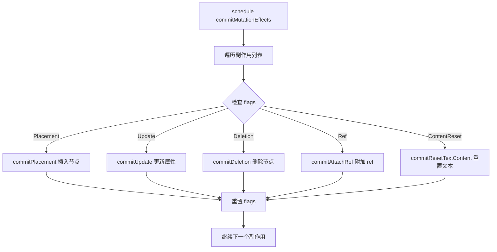

# commit Mutation 阶段

Mutation 阶段是 commit 阶段的核心，负责执行所有 DOM 操作（增、删、改）。

## 📦 模块位置

```
packages/react-reconciler/src/
└── ReactFiberCommitWork.js    # commitMutationEffects 实现
```

## 🔍 核心函数

### commitMutationEffects

```javascript
// packages/react-reconciler/src/ReactFiberCommitWork.js

function commitMutationEffects(root, firstChild) {
  const committedLanes = root.finishedLanes;
  
  // 遍历副作用列表
  forEachEffect(effect => {
    const flags = effect.flags;
    
    // 根据 flag 执行不同操作
    if (flags & ContentReset) {
      commitResetTextContent(effect);
    }
    
    if (flags & Ref) {
      const current = effect.alternate;
      commitAttachRef(effect, current);
    }
    
    if (flags & Placement) {
      commitPlacement(effect);
    }
    
    if (flags & Update) {
      commitUpdate(effect);
    }
    
    if (flags & Deletion) {
      commitDeletion(root, effect);
    }
    
    // 重置 flag
    effect.flags &= ~(Placement | Update | Deletion | Ref);
  });
  
  // 重置全局状态
  nextEffect = firstChild;
}
```

## 🏠 DOM 操作

### 1. Placement（插入节点）

```javascript
function commitPlacement(finishedWork) {
  const parentFiber = getHostParentFiber(finishedWork);
  
  // 获取父 DOM 节点
  const parent = getHostParentNode(parentFiber);
  
  // 获取兄弟节点作为锚点
  const before = getHostSibling(finishedWork);
  
  // 插入节点
  if (parentFiber.tag === HostComponent) {
    commitInsertOrUpdateChildren(parent, before, finishedWork);
  } else if (parentFiber.tag === HostRoot) {
    const container = parentFiber.stateNode.containerInfo;
    insertOrAppendPlaceholderNode(container, before, finishedWork);
  }
}

function commitInsertOrUpdateChildren(parentNode, before, child) {
  const nodes = getHostSibling(child);
  
  for (let i = 0; i < nodes.length; i++) {
    const node = nodes[i];
    if (before === null) {
      parentNode.appendChild(node);
    } else {
      parentNode.insertBefore(node, before);
    }
  }
}
```

### 2. Update（更新属性）

```javascript
function commitUpdate(finishedWork) {
  const type = finishedWork.type;
  const workInProgress = finishedWork;
  const updatePayload = workInProgress.updateQueue;
  
  // 清除更新队列
  workInProgress.updateQueue = null;
  
  // 应用属性更新
  const {
    // 标记
    updatePayload: properties,
    // 新 props
    memoizedProps: newProps,
    // 旧 props
    memoizedProps: oldProps,
  } = workInProgress;
  
  // 更新 DOM 属性
  const instance = finishedWork.stateNode;
  updateProperties(instance, type, oldProps, newProps);
}

function updateProperties(domElement, type, oldProps, newProps) {
  // 1. 移除已删除的属性
  for (const key in oldProps) {
    if (newProps.hasOwnProperty(key)) {
      continue;
    }
    
    if (key === 'children') {
      continue;
    } else if (key === 'style') {
      domElement.removeAttribute(key);
    } else if (registrationNameModules.hasOwnProperty(key)) {
      // 移除事件监听器
      deleteListener(domElement, key);
    } else {
      domElement.removeAttribute(key);
    }
  }
  
  // 2. 更新变化的属性
  for (const key in newProps) {
    const nextProp = newProps[key];
    const prevProp = oldProps != null ? oldProps[key] : undefined;
    
    if (nextProp === prevProp) {
      continue;
    }
    
    if (key === 'children') {
      if (typeof nextProp === 'string' || typeof nextProp === 'number') {
        setTextContent(domElement, '' + nextProp);
      }
    } else if (key === 'style') {
      setValueForStyles(domElement, nextProp, prevProp);
    } else if (registrationNameModules.hasOwnProperty(key)) {
      // 事件监听器
      if (nextProp != null) {
        addEventBubbleListener(domElement, key, nextProp);
      }
    } else {
      setValueForProperty(domElement, key, nextProp, type);
    }
  }
}
```

### 3. Deletion（删除节点）

```javascript
function commitDeletion(root, finishedWork) {
  // 递归删除子节点
  
  // 1. 卸载子组件
  unmountHostComponents(root, finishedWork);
  
  // 2. 清理副作用
  finishedWork.return = null;
  finishedWork.child = null;
  
  // 3. 如果是 Class 组件，调用 componentWillUnmount
  if (finishedWork.tag === ClassComponent) {
    const instance = finishedWork.stateNode;
    if (typeof instance.componentWillUnmount === 'function') {
      safelyCallComponentWillUnmount(root, finishedWork, instance);
    }
  }
  
  // 4. 从 DOM 移除
  const dom = finishedWork.stateNode;
  if (dom !== null) {
    const parent = dom.parentNode;
    if (parent !== null) {
      parent.removeChild(dom);
    }
  }
}

function unmountHostComponents(root, returnFiber) {
  let node = returnFiber.child;
  
  while (node !== null) {
    // 递归卸载
    commitDeletion(root, node);
    node = node.sibling;
  }
}
```

### 4. Ref 附加

```javascript
function commitAttachRef(finishedWork) {
  const ref = finishedWork.ref;
  
  if (ref !== null) {
    const instance = finishedWork.stateNode;
    let instanceToUse;
    
    switch (finishedWork.tag) {
      case HostComponent:
        instanceToUse = instance;  // DOM 节点
        break;
      default:
        instanceToUse = instance;  // 组件实例
    }
    
    // 设置 ref
    if (typeof ref === 'function') {
      ref(instanceToUse);
    } else {
      // ref 对象
      ref.current = instanceToUse;
    }
  }
}
```

## 🔄 完整流程



## 📊 操作顺序

```
Mutation 阶段执行顺序:

1. Text Content Reset (重置文本)
   ↓
2. Ref Detach (卸载旧 ref)
   ↓
3. Effects (副作用处理)
   ↓
4. Placement (插入节点)
   ↓
5. Update (更新属性)
   ↓
6. Deletion (删除节点)
   ↓
7. Ref Attach (附加新 ref)
```

### 为什么需要这个顺序？

```javascript
// 示例：移动节点

// DOM 状态:
<div id="parent">
  <div id="a">A</div>
  <div id="b">B</div>
  <div id="c">C</div>
</div>

// React 更新：
<div id="parent">
  <div id="c">C</div>  {/* 移动到最前面 */}
  <div id="a">A</div>
  <div id="b">B</div>
</div>

// Mutation 执行：
// 1. 先删除 c: parent.removeChild(c)
// 2. 重新插入：parent.insertBefore(c, a)

// 如果不按顺序，会导致 DOM 节点丢失
```

## 🔬 源码深度

### ContentReset

```javascript
function commitResetTextContent(finishedWork) {
  const newText = finishedWork.memoizedProps;
  
  if (finishedWork.stateNode !== null) {
    // 重置文本节点
    setTextContent(finishedWork.stateNode, newText);
  }
}
```

### commitHostText

```javascript
function commitHostText(finishedWork) {
  if (finishedWork.stateNode === null) {
    // 创建文本节点
    finishedWork.stateNode = createHostTextInstance(
      finishedWork.memoizedProps,
    );
  } else {
    // 更新文本节点
    setTextContent(
      finishedWork.stateNode,
      finishedWork.memoizedProps,
    );
  }
}
```

### commitHydratedContainer

```javascript
// SSR hydration 的 commit

function commitHydratedContainer(container) {
  const retryRootDehydration = onHydrated.bind(null, container);
  
  const hidratableNodes = getAllAttributeHydratableNodes(
    container,
    null,
  );
  
  hydrateInstanceIntoIterator(
    hidratableNodes,
    container,
    retryRootDehydration,
  );
}
```

## ⚠️ 注意事项

### 1. 批量操作

```javascript
// React 会批量执行 DOM 操作以减少重排

// ✅ 推荐：批量更新
function update() {
  setState(newState);  // 多次 setState 会合并为一次 commit
}

// ❌ 避免：多次 commit
function update() {
  setState(state1);
  // 触发一次 commit
  
  setState(state2);
  // 又触发一次 commit
}
```

### 2. DOM 操作优化

```javascript
// React 内部优化

// 1. DocumentFragment 批量插入
const fragment = document.createDocumentFragment();
nodes.forEach(node => fragment.appendChild(node));
parent.appendChild(fragment);  // 一次重排

// 2. 使用 insertBefore 而不是 appendChild
// 避免不必要的重排
```

## 🔬 调试技巧

### 追踪 Mutation 操作

```javascript
// 开发模式下添加日志
const originalCommitMutation = commitMutationEffects;
commitMutationEffects = function(root, firstChild) {
  console.group('commitMutationEffects');
  console.log('Finished work:', root.finishedWork);
  
  // 记录副作用
  forEachEffect(effect => {
    console.log('Effect:', {
      tag: effect.tag,
      flags: effect.flags,
      type: effect.type,
    });
  });
  
  const result = originalCommitMutation(root, firstChild);
  
  console.groupEnd();
  return result;
};
```

### 观察 DOM 操作

```javascript
// 拦截 DOM 操作
const originalAppendChild = Node.prototype.appendChild;
Node.prototype.appendChild = function(child) {
  console.group('appendChild');
  console.log('Parent:', this);
  console.log('Child:', child);
  console.trace('Call stack');
  console.groupEnd();
  return originalAppendChild.call(this, child);
};
```

## 🐛 常见问题

### Q: 为什么 Mutation 阶段不能中断？

**A**: DOM 操作必须是同步的，否则用户会看到不一致的 UI 状态。

### Q: 如何避免不必要的 DOM 操作？

```jsx
// ✅ 使用 shouldComponentUpdate 或 React.memo
class Component extends React.Component {
  shouldComponentUpdate(nextProps) {
    return nextProps.value !== this.props.value;
  }
}

// 或
const MemoComponent = React.memo(({ value }) => {
  return <div>{value}</div>;
});
```

### Q: Key 的作用是什么？

**A**: Key 帮助 React 识别哪些节点可以复用，哪些需要移动或删除。

```jsx
// ❌ 不好的做法：使用 index 作为 key
{items.map((item, index) => (
  <Item key={index} item={item} />
))}

// ✅ 好的做法：使用唯一 ID
{items.map(item => (
  <Item key={item.id} item={item} />
))}
```

---

## 📖 下一步

- [commit Layout 阶段](./commit-layout) - useLayoutEffect 和 componentDidMount