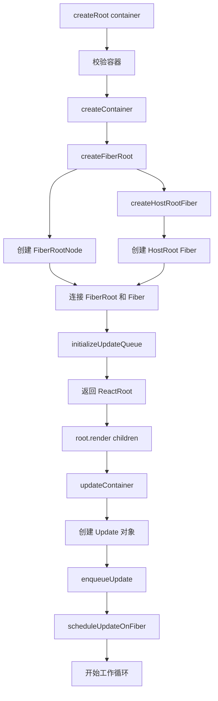

# createRoot 源码解析

实现篇从这里开始，我们将深入 React 源码，逐行分析核心功能的实现。

## 📦 模块位置

```
packages/react-dom/src/client/
├── ReactDOMRoot.js              # createRoot 入口
├── ReactDOMHydrationRoot.js     # hydrateRoot

packages/react-reconciler/src/
├── ReactFiberRoot.js            # Fiber Root 创建
└── ReactFiberWorkLoop.js        # 工作循环
```

## 🔍 源码解析

### 1. createRoot 入口

```javascript
// packages/react-dom/src/client/ReactDOMRoot.js

export function createRoot(
  container: Container,
  options?: CreateRootOptions,
): RootType {
  // 1. 校验容器有效性
  if (!isValidContainer(container)) {
    throw new Error(
      'createRoot(...): Target container is not a DOM element.'
    );
  }
  
  // 2. 检查是否已被其他 React 实例使用
  warnIfReactDOMContainerInDEV(container);
  
  // 3. 创建 Fiber Root
  const root = createContainer(
    container,
    ConcurrentRoot,           // 并发模式
    null,
    false,
    null,
    'react-root',
    false
  );
  
  // 4. 标记为并发根节点
  markContainerAsRoot(root.current, container);
  
  // 5. 创建 ReactRoot 实例
  const reactRoot = {
    render: (children: ReactNodeList): void => {
      updateContainer(children, root, null, null);
    },
    unmount: (): void => {
      updateContainer(null, root, null, null);
    },
    _internalRoot: root,
  };
  
  return reactRoot;
}
```

### 2. createContainer 创建 Fiber Root

```javascript
// packages/react-reconciler/src/ReactFiberRoot.js

export function createContainer(
  containerInfo: Container,
  tag: RootTag,
  hydrationCallbacks: null | SuspenseHydrationCallbacks,
  isStrictMode: boolean,
  concurrentUpdatesByDefaultOverride: null | boolean,
  identifierPrefix: string,
  onRecoverableError: null | ((error: mixed) => void),
): OpaqueRoot {
  // 1. 创建 Fiber Root Node
  const root = createFiberRoot(
    containerInfo,
    tag,
    hydrationCallbacks,
    isStrictMode,
    concurrentUpdatesByDefaultOverride,
    identifierPrefix,
    onRecoverableError
  );
  
  // 2. 初始化根组件
  const rootComponent = root.current;
  rootComponent.stateNode = root;
  
  // 3. 初始化更新队列
  initializeUpdateQueue(rootComponent);
  
  return root;
}
```

### 3. createFiberRoot 创建根 Fiber

```javascript
// packages/react-reconciler/src/ReactFiberRoot.js

function createFiberRoot(
  containerInfo: any,
  tag: RootTag,
  hydrationCallbacks: null | SuspenseHydrationCallbacks,
  isStrictMode: boolean,
  concurrentUpdatesByDefaultOverride: null | boolean,
  identifierPrefix: string,
  onRecoverableError: null | ((error: mixed) => void),
): FiberRoot {
  // 1. 创建 FiberRootNode
  const root: FiberRootNode = new FiberRootNode(
    containerInfo,
    tag,
    hydrationCallbacks
  );
  
  // 2. 创建 Host Root Fiber
  const uninitializedFiber = createHostRootFiber(
    tag,
    isStrictMode,
    concurrentUpdatesByDefaultOverride
  );
  
  // 3. 连接 FiberRoot 和 Host Root
  root.current = uninitializedFiber;
  uninitializedFiber.stateNode = root;
  
  // 4. 初始化更新队列
  initializeUpdateQueue(uninitializedFiber);
  
  return root;
}
```

### 4. createHostRootFiber 创建根组件 Fiber

```javascript
// packages/react-reconciler/src/ReactFiberRoot.js

export function createHostRootFiber(
  tag: RootTag,
  isStrictMode: boolean,
  concurrentUpdatesByDefaultOverride: null | boolean,
): Fiber {
  // 1. 确定 Fiber 模式
  let mode = NoMode;
  
  if (tag === ConcurrentRoot) {
    mode |= ConcurrentMode;
    
    // 严格模式
    if (isStrictMode === true) {
      mode |= StrictLegacyMode | StrictEffectsMode;
    }
  } else {
    mode = NoMode;
  }
  
  // 2. 创建 Fiber Node
  return createFiber(
    HostRoot,           // tag: 根节点类型
    null,               // pendingProps
    null,               // children
    mode                // 模式
  );
}
```

### 5. updateContainer 更新根节点

```javascript
// packages/react-reconciler/src/ReactFiberRoot.js

export function updateContainer(
  element: ReactNodeList,
  root: OpaqueRoot,
  parentComponent: ?React$Component<any, any>,
  callback: ?Function,
): Lane {
  // 1. 获取当前 Fiber
  const current = getCurrentFiber();
  const containerInfo = root.containerInfo;
  
  // 2. 获取当前优先级
  const eventTime = requestEventTime();
  const lane = requestUpdateLane(root);
  
  // 3. 创建 Update 对象
  const update = createUpdate(eventTime, lane);
  update.payload = { element };
  
  // 4. 处理回调
  if (callback !== undefined) {
    update.callback = callback;
  }
  
  // 5. 添加到更新队列
  enqueueUpdate(current, update, lane);
  
  // 6. 调度更新
  const rootSize = scheduleUpdateOnFiber(
    current,
    lane,
    eventTime
  );
  
  return lane;
}
```

## 🔄 完整流程图



## 📊 核心数据结构

### FiberRootNode

```javascript
// packages/react-reconciler/src/ReactFiberRoot.js

function FiberRootNode(
  containerInfo,
  tag,
  hydratedCallbacks,
) {
  this.tag = tag;                    // RootTag
  this.containerInfo = containerInfo; // DOM 容器
  this.pendingChildren = null;       // 待处理的子节点
  this.current = null;               // 当前 Fiber
  this.pingCache = null;             // Ping 缓存
  this.pendingJam = null;            // 阻塞队列
  this.finishedWork = null;          // 已完成的工作
  this.timeoutHandle = noTimeout;    // 超时句柄
  this.cancelPendingCommit = null;   // 取消提交
  this.context = null;               // Context
  this.pendingContext = null;        // 待更新的 Context
  this.callbackNode = null;          // 调度回调节点
  this.callbackPriority = NoLane;    // 回调优先级
  this.expirationTimes = createLaneMap(NoLanes);
  this.pendingLanes = NoLanes;       // 待处理的 Lanes
  this.suspendedLanes = NoLanes;     // 已挂起的 Lanes
  this.pingedLanes = NoLanes;        // 已 Ping 的 Lanes
  this.expiredLanes = NoLanes;       // 已过期的 Lanes
  this.finishedLanes = NoLanes;      // 已完成的 Lanes
  this.discardPendingTransitions = false;
  this.entangledLanes = NoLanes;
  this.entanglements = createLaneMap(NoLanes);
  this.identifierPrefix = '';
  this.onRecoverableError = null;
}
```

### Fiber Node

```javascript
// packages/react-reconciler/src/ReactFiber.js

function FiberNode(
  tag: WorkTag,
  pendingProps: mixed,
  key: null | string,
  mode: TypeOfMode,
) {
  // 实例属性
  this.tag = tag;                    // Fiber 类型
  this.key = key;                    // key
  this.type = null;                  // 组件类型
  
  // Fiber 树结构
  this.return = null;                // 父 Fiber
  this.child = null;                 // 子 Fiber
  this.sibling = null;               // 兄弟 Fiber
  this.index = 0;                    // 索引
  
  // 引用
  this.ref = null;                   // Ref
  this.refCleanup = null;            // Ref 清理函数
  
  // 属性
  this.pendingProps = pendingProps;  // 新的 props
  this.memoizedProps = null;         // 上次渲染的 props
  this.updateQueue = null;           // 更新队列
  this.type = null;                  // 组件类型
  
  // 状态
  this.stateNode = null;             // DOM 实例/组件实例
  this.memoizedState = null;         // 当前 state
  
  // 副作用
  this.flags = NoFlags;              // 副作用标记
  this.subtreeFlags = NoFlags;       // 子树副作用
  this.deletions = null;             // 删除的子节点
  
  // 优先级
  this.lanes = NoLanes;              // 本次更新的优先级
  this.childLanes = NoLanes;         // 子树优先级
  
  // 交替树
  this.alternate = null;             // 双缓冲指针
}
```

## 💡 使用示例

### 基础用法

```jsx
// React 18+
import { createRoot } from 'react-dom/client';

const container = document.getElementById('root');
const root = createRoot(container);

root.render(<App />);
```

### 带选项

```jsx
const root = createRoot(container, {
  unstable_strictMode: true,
  identifierPrefix: 'react-',
  onRecoverableError: (error) => {
    console.error('可恢复的错误:', error);
  },
});
```

### unmount

```jsx
// 卸载应用
function cleanup() {
  root.unmount();
}
```

## 🔬 调试技巧

### 查看 Fiber Root

```javascript
// 浏览器控制台
const rootElement = document.querySelector('#root');
const fiberRoot = rootElement._reactRootContainer._internalRoot;

console.log({
  current: fiberRoot.current,           // HostRoot Fiber
  pendingLanes: fiberRoot.pendingLanes, // 待处理的 Lanes
  callbackNode: fiberRoot.callbackNode, // 调度节点
});
```

### 追踪更新

```javascript
// 在 updateContainer 中添加日志
const originalUpdateContainer = updateContainer;
updateContainer = function(element, root, parent, callback) {
  console.log('updateContainer called:', {
    element,
    root: root.containerInfo,
    lane: requestUpdateLane(root),
  });
  return originalUpdateContainer(element, root, parent, callback);
};
```

## 🐛 常见问题

### Q: createRoot 和 render 有什么区别？

```javascript
// React 17
ReactDOM.render(<App />, container);

// React 18
const root = ReactDOM.createRoot(container);
root.render(<App />);

// 差异：
// 1. createRoot 创建并发根节点
// 2. 支持批量更新
// 3. 支持 Suspense SSR
```

### Q: 为什么需要 _internalRoot？

**A**: _internalRoot 是 React 内部的 Fiber Root，包含所有调度信息和状态。

### Q: 多个 React 应用怎么办？

```jsx
// 可以在不同容器创建多个根
const root1 = createRoot(document.getElementById('root1'));
const root2 = createRoot(document.getElementById('root2'));

root1.render(<App1 />);
root2.render(<App2 />);
```

---

## 📖 下一步

- [beginWork 详解](./begin-work) - render 阶段向下遍历
- [completeWork 详解](./complete-work) - render 阶段向上回溯