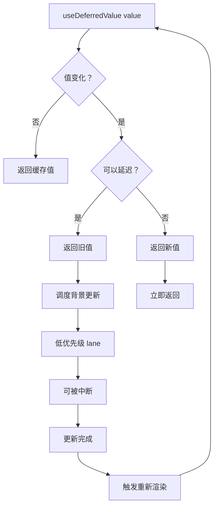

# useDeferredValue 实现

useDeferredValue 是 React 18 新增的 Hook，用于延迟更新某个值，配合并发渲染实现流畅的 UI 体验。

## 📦 模块位置

```
packages/react-reconciler/src/
└── ReactFiberHooks.js    # useDeferredValue Hook 实现
```

## 🔍 Hook 签名

```typescript
function useDeferredValue<T>(
  value: T,
  initialValue?: T,
): T;
```

### 参数说明

| 参数 | 类型 | 说明 |
|------|------|------|
| value | T | 当前值 |
| initialValue | T | 初始值（可选，用于 SSR 优化） |

### 返回值

返回延迟后的值，在背景中异步更新。

## 🔬 核心实现

### useDeferredValue Hook

```javascript
// packages/react-reconciler/src/ReactFiberHooks.js

function useDeferredValue<T>(
  value: T,
  initialValue?: T,
): T {
  // 1. 获取当前 Fiber
  const currentlyRenderingFiber = resolveCurrentlyRenderingFiber();
  
  // 2. 创建/获取 Hook
  const hook = mountWorkInProgressHook();
  
  // 3. 检查是否有之前的 deferred value
  const prevDeferredValue = hook.memoizedState;
  
  // 4. 检查值是否变化
  if (Object.is(value, prevDeferredValue)) {
    // 值相同，直接返回
    return value;
  }
  
  // 5. 值变化了，检查是否可以延迟
  if (shouldDeferValue()) {
    // 6. 可以延迟，返回旧值
    return prevDeferredValue;
  }
  
  // 7. 不能延迟，立即返回新值
  hook.memoizedState = value;
  return value;
}
```

### shouldDeferValue

```javascript
function shouldDeferValue(): boolean {
  // 1. 检查当前是否有待处理的 transition
  const hasPendingTransition = checkForUnsafeDesync();
  
  if (hasPendingTransition) {
    // 有 transition 在进行，可以延迟
    return true;
  }
  
  // 2. 检查是否在并发渲染中
  const isConcurrent = (currentlyRenderingFiber.mode & ConcurrentMode) !== NoMode;
  
  if (isConcurrent) {
    // 并发模式下可以延迟
    return true;
  }
  
  // 3. 其他情况不延迟
  return false;
}
```

### 调度延迟更新

```javascript
// packages/react-reconciler/src/ReactFiberWorkLoop.js

function scheduleDeferredValueUpdate(
  fiber: Fiber,
  value: any,
) {
  // 1. 创建更新
  const update = {
    eventTime: requestEventTime(),
    lane: requestUpdateLane(fiber),
    action: value,
    hasEagerState: false,
    eagerState: null,
    next: null,
  };
  
  // 2. 使用低优先级 lane
  update.lane = TransitionLane;
  
  // 3. 调度更新
  scheduleUpdateOnFiber(fiber, update.lane);
}
```

## 🔄 完整流程



## 💡 实战技巧

### 1. 基本使用

```jsx
function SearchResults({ query }) {
  // query 立即更新
  // deferredQuery 延迟更新
  const deferredQuery = useDeferredValue(query);
  
  // 指示是否显示加载状态
  const isStale = query !== deferredQuery;
  
  return (
    <>
      {isStale && <LoadingSpinner />}
      <ResultsList query={deferredQuery} />
    </>
  );
}
```

### 2. 配合列表渲染

```jsx
function ProductSearch({ products, searchQuery }) {
  // 延迟过滤结果
  const deferredQuery = useDeferredValue(searchQuery);
  
  // 过滤操作（可能很耗时）
  const filteredProducts = useMemo(() => {
    return products.filter(product =>
      product.name.toLowerCase().includes(deferredQuery.toLowerCase())
    );
  }, [products, deferredQuery]);
  
  const isStale = searchQuery !== deferredQuery;
  
  return (
    <div>
      <input 
        value={searchQuery} 
        onChange={e => setSearchQuery(e.target.value)}
      />
      
      {isStale && <p>Searching...</p>}
      
      <ProductList products={filteredProducts} />
    </div>
  );
}
```

### 3. 配合 useTransition

```jsx
function SearchPage() {
  const [query, setQuery] = useState('');
  const [isPending, startTransition] = useTransition();
  
  // 选项 1：使用 useTransition
  function handleChange(e) {
    const nextQuery = e.target.value;
    startTransition(() => {
      setQuery(nextQuery);
    });
  }
  
  // 选项 2：使用 useDeferredValue
  const deferredQuery = useDeferredValue(query);
  
  return (
    <>
      <input value={query} onChange={handleChange} />
      <Results query={deferredQuery} />
    </>
  );
}
```

### 4. 列表虚拟化配合

```jsx
function VirtualizedList({ items }) {
  const deferredItems = useDeferredValue(items);
  const isStale = items !== deferredItems;
  
  return (
    <>
      {isStale && <SkeletonLoader />}
      <VirtualList items={deferredItems} />
    </>
  );
}
```

### 5. 图表渲染优化

```jsx
function Chart({ data }) {
  const deferredData = useDeferredValue(data);
  const isStale = data !== deferredData;
  
  return (
    <>
      {isStale && <ChartSkeleton />}
      <ExpensiveChart data={deferredData} />
    </>
  );
}
```

## ⚠️ 与 useTransition 对比

### useTransition

```jsx
// 控制 setState 的优先级
function Component() {
  const [query, setQuery] = useState('');
  const [isPending, startTransition] = useTransition();
  
  function handleChange(e) {
    const nextQuery = e.target.value;
    setQuery(nextQuery);  // 紧急：输入框立即更新
    
    startTransition(() => {
      setFilter(nextQuery);  // 非紧急：列表过滤延迟
    });
  }
  
  return (
    <>
      <input value={query} onChange={handleChange} />
      {isPending && <Loading />}
      <List filter={filter} />
    </>
  );
}
```

### useDeferredValue

```jsx
// 延迟已存在的值
function Component({ filter }) {
  const deferredFilter = useDeferredValue(filter);
  const isStale = filter !== deferredFilter;
  
  return (
    <>
      {isStale && <Loading />}
      <List filter={deferredFilter} />
    </>
  );
}
```

### 对比表

| 特性 | useTransition | useDeferredValue |
|------|--------------|------------------|
| 使用场景 | 控制 setState | 延迟已有值 |
| 返回值 | [start, isPending] | deferredValue |
| 需要 setState | ✅ 是 | ❌ 否 |
| 派生值 | 主动触发 | 被动延迟 |
| 适用场景 | 用户输入 → 状态更新 | Props → 派生值 |

## 🔬 内部机制

### Deferred Value State

```javascript
// Hook 中存储的状态
type DeferredState = {
  baseValue: any,      // 基础值（最新）
  deferredValue: any,   // 延迟值（可能滞后）
  isStale: boolean,     // 是否过时
};
```

### 更新调度

```javascript
// 当有新值时的处理

function updateDeferredValue(hook, newValue) {
  const currentState = hook.memoizedState;
  
  // 1. 检查是否可以延迟
  if (shouldDeferValue()) {
    // 2. 保持旧值
    return currentState.deferredValue;
  }
  
  // 3. 不能延迟，立即更新
  hook.memoizedState = {
    baseValue: newValue,
    deferredValue: newValue,
    isStale: false,
  };
  
  return newValue;
}
```

### 背景更新

```javascript
// 在低优先级 lane 上调度更新

function scheduleDeferredUpdate(fiber, newValue) {
  // 使用 TransitionLane（低优先级）
  const updateLane = TransitionLane;
  
  // 创建更新
  const update = {
    eventTime: requestEventTime(),
    lane: updateLane,
    action: newValue,
  };
  
  // 调度
  scheduleUpdateOnFiber(fiber, updateLane);
}
```

## 🐛 常见问题

### Q: useDeferredValue 和 useMemo 有什么区别？

**A**:
- useMemo：缓存计算结果，避免重复计算
- useDeferredValue：延迟值更新，保持 UI 响应

```jsx
// useMemo - 缓存计算
const filtered = useMemo(() => 
  items.filter(filter), 
  [items, filter]
);

// useDeferredValue - 延迟更新
const deferredFilter = useDeferredValue(filter);
const filtered = items.filter(deferredFilter);
```

### Q: 什么时候应该使用 useDeferredValue？

**A**: 当：
- 渲染很耗时
- 输入需要立即响应
- 可以接受短暂显示旧数据

### Q: useDeferredValue 会导致额外的渲染吗？

**A**: 是的，会触发两次渲染：
1. 第一次：使用旧值（立即）
2. 第二次：使用新值（背景更新后）

## 🔬 调试技巧

### 追踪延迟值

```javascript
// 开发模式下添加日志
const originalUseDeferredValue = useDeferredValue;
useDeferredValue = function(value) {
  const deferred = originalUseDeferredValue(value);
  
  console.log('useDeferredValue', {
    value,
    deferred,
    isStale: value !== deferred,
  });
  
  return deferred;
};
```

### 测量延迟时间

```jsx
function MeasureDeferred({ value }) {
  const deferred = useDeferredValue(value);
  const [delay, setDelay] = useState(0);
  
  useEffect(() => {
    if (value !== deferred) {
      const start = performance.now();
      const check = () => {
        if (value === deferred) {
          setDelay(performance.now() - start);
        } else {
          requestAnimationFrame(check);
        }
      };
      check();
    }
  }, [value, deferred]);
  
  return <span>Delay: {delay.toFixed(0)}ms</span>;
}
```

---

## 📖 下一步

- [Automatic Batching](./batching)
- [优先级调度](./priority)