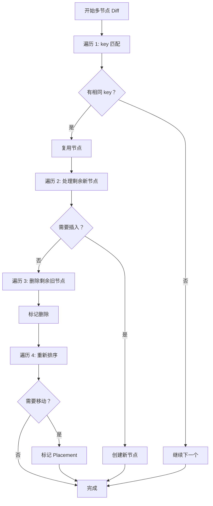

# Diff 算法（多节点）

多节点 Diff 是 React Diff 算法的核心，处理列表/数组类型子节点的比对。

## 📦 模块位置

```
packages/react-reconciler/src/
└── ReactChildFiber.js    # reconcileChildFibers 实现
```

## 🔍 核心算法

### reconcileChildFibers

```javascript
// packages/react-reconciler/src/ReactChildFiber.js

function reconcileChildFibers(
  returnFiber: Fiber,
  currentFirstChild: Fiber | null,
  newChild: any,
  lanes: Lanes,
): Fiber | null {
  // 1. Fragment 或数组
  if (isArray(newChild)) {
    return reconcileChildrenArray(returnFiber, currentFirstChild, newChild, lanes);
  }
  
  // 2. 可迭代对象
  if (getIteratorFn(newChild)) {
    return reconcileChildrenIterator(returnFiber, currentFirstChild, newChild, lanes);
  }
  
  // 3. 单节点
  if (newChild.type === REACT_FRAGMENT_TYPE && newChild.key === null) {
    newChild = newChild.props.children;
  }
  
  // 4. 其他情况作为单节点处理
  return reconcileSingleElement(
    returnFiber,
    currentFirstChild,
    newChild,
    lanes
  );
}
```

## 📊 四次遍历策略

```
多节点 Diff 采用四次遍历策略：

遍历 1: key 相同的节点 → 复用
遍历 2: 新节点插入      → 创建
遍历 3: 旧节点删除      → 标记删除
遍历 4: 重新排序        → 移动节点
```

### 流程图



## 🔬 源码深度

### 遍历 1：Key 匹配

```javascript
// packages/react-reconciler/src/ReactChildFiber.js

function reconcileChildrenArray(
  returnFiber: Fiber,
  currentFirstChild: Fiber | null,
  newChildren: Array<any>,
  lanes: Lanes,
): Fiber | null {
  let resultingFirstChild = null;
  let previousNewFiber = null;
  
  // 第一次遍历：key 匹配的节点
  let oldFiber = currentFirstChild;
  let lastPlacedIndex = 0;
  let newIdx = 0;
  let nextOldFiber = null;
  
  for (; oldFiber !== null && newIdx < newChildren.length; newIdx++) {
    // 检查 key 是否匹配
    if (oldFiber.index > lastPlacedIndex) {
      // key 不匹配，跳出第一次遍历
      break;
    }
    
    // 获取下一个旧 Fiber
    nextOldFiber = oldFiber.sibling;
    
    // 检查 key
    if (oldFiber.key === newChildren[newIdx].key) {
      // key 匹配，复用或更新
      if (oldFiber.elementType === newChildren[newIdx].type) {
        // 类型匹配，复用
        const existing = useFiber(oldFiber, newChildren[newIdx].props, lanes);
        existing.return = returnFiber;
        
        // 连接链表
        if (previousNewFiber === null) {
          resultingFirstChild = existing;
        } else {
          previousNewFiber.sibling = existing;
        }
        previousNewFiber = existing;
        lastPlacedIndex = existing.index;
        
        // 继续处理旧 Fiber
        oldFiber = nextOldFiber;
      } else {
        // 类型不匹配，断开连接
        oldFiber = null;
      }
    } else {
      // key 不匹配，断开连接
      oldFiber = null;
    }
  }
  
  // ... 继续后续遍历
}
```

### 遍历 2：处理剩余新节点

```javascript
// 第二次遍历：处理新增节点或复用节点

if (newIdx === newChildren.length) {
  // 所有新节点已处理完，删除剩余旧节点
  deleteRemainingChildren(returnFiber, oldFiber);
  return resultingFirstChild;
}

if (oldFiber === null) {
  // 没有旧节点了，创建所有剩余新节点
  for (; newIdx < newChildren.length; newIdx++) {
    const created = createChild(returnFiber, newChildren[newIdx], lanes);
    
    if (previousNewFiber === null) {
      resultingFirstChild = created;
    } else {
      previousNewFiber.sibling = created;
    }
    previousNewFiber = created;
  }
  
  return resultingFirstChild;
}
```

### 遍历 3：收集旧节点到 Map

```javascript
// 第三次遍历：将剩余旧节点放入 Map

// 创建 key 到 Fiber 的映射
const existingChildren = mapRemainingChildren(returnFiber, oldFiber);

// ... 处理剩余新节点
for (; newIdx < newChildren.length; newIdx++) {
  const newFiber = updateFromMap(
    existingChildren,
    returnFiber,
    newIdx,
    newChildren[newIdx],
    lanes
  );
  
  if (newFiber !== null) {
    // 从 Map 中删除已复用的节点
    if (newFiber.key !== null) {
      existingChildren.delete(newFiber.key);
    } else {
      existingChildren.delete(newFiber.index);
    }
    
    // 连接链表
    if (previousNewFiber === null) {
      resultingFirstChild = newFiber;
    } else {
      previousNewFiber.sibling = newFiber;
    }
    previousNewFiber = newFiber;
  }
}
```

### mapRemainingChildren

```javascript
// 将剩余旧节点放入 Map

function mapRemainingChildren(
  returnFiber: Fiber,
  currentFirstChild: Fiber | null,
): Map<string | number, Fiber> {
  const existingChildren: Map<string | number, Fiber> = new Map();
  
  let child = currentFirstChild;
  while (child !== null) {
    // 使用 key 或 index 作为 Map 的 key
    if (child.key !== null) {
      existingChildren.set(child.key, child);
    } else {
      existingChildren.set(child.index, child);
    }
    
    child = child.sibling;
  }
  
  return existingChildren;
}
```

### 遍历 4：删除剩余旧节点

```javascript
// 第四次遍历：删除 Map 中剩余的旧节点

existingChildren.forEach(child => {
  deleteChild(returnFiber, child);
});
```

## 📝 三种场景

### 1. 节点复用（key 相同）

```jsx
// Before
[
  <Item key="a" value={1} />,
  <Item key="b" value={2} />,
  <Item key="c" value={3} />,
]

// After
[
  <Item key="a" value={10} />,  // 复用，更新 props
  <Item key="b" value={20} />,  // 复用，更新 props
  <Item key="c" value={30} />,  // 复用，更新 props
]

// Diff 结果：复用所有节点，标记 Update
```

### 2. 节点移动（顺序变化）

```jsx
// Before
[
  <Item key="a" />,
  <Item key="b" />,
  <Item key="c" />,
]

// After
[
  <Item key="b" />,  // 移动到前面
  <Item key="a" />,
  <Item key="c" />,
]

// Diff 结果：复用节点，标记 Placement
```

### 3. 新增/删除节点

```jsx
// Before
[
  <Item key="a" />,
  <Item key="b" />,
]

// After
[
  <Item key="a" />,
  <Item key="c" />,  // 新增
]

// Diff 结果：
// - a 复用
// - b 删除
// - c 新增
```

## 🔬 性能优化

### 1. 提前退出

```javascript
// 如果新数组先遍历完，直接删除剩余旧节点
if (newIdx === newChildren.length) {
  deleteRemainingChildren(returnFiber, oldFiber);
  return resultingFirstChild;
}

// 如果旧数组先遍历完，直接创建剩余新节点
if (oldFiber === null) {
  for (; newIdx < newChildren.length; newIdx++) {
    const created = createChild(returnFiber, newChildren[newIdx], lanes);
    // ...
  }
  return resultingFirstChild;
}
```

### 2. Map 快速查找

```javascript
// 使用 Map 实现 O(1) 查找
const existingChildren = mapRemainingChildren(returnFiber, oldFiber);

// O(1) 获取匹配的旧节点
const existing = existingChildren.get(newChild.key || newIdx);
```

### 3. 移动优化

```javascript
// 判断节点是否需要移动
function shouldPlace(fiber) {
  const flags = fiber.flags;
  return (flags & Placement) !== NoFlags;
}

// 计算最后放置位置
if (newFiber.index < lastPlacedIndex) {
  // 需要移动
  newFiber.flags |= Placement;
} else {
  // 不需要移动
  lastPlacedIndex = newFiber.index;
  newFiber.flags |= (newFiber.flags & ~Placement);
}
```

## 🔄 移动算法详解

### lastPlacedIndex 算法

```javascript
// 核心思想：记录已处理节点的最大位置

let lastPlacedIndex = 0;  // 最后放置位置

for (let newIdx = 0; newIdx < newChildren.length; newIdx++) {
  const newFiber = /* 获取新 Fiber */;
  
  if (newFiber.index < lastPlacedIndex) {
    // 当前位置小于最大位置，需要移动
    newFiber.flags |= Placement;
  } else {
    // 当前位置大于等于最大位置，不需要移动
    lastPlacedIndex = newFiber.index;
  }
}
```

### 示例

```
Before: [A(0), B(1), C(2)]
After:  [B, A, C]

处理 B:
- B oldIndex = 1
- lastPlacedIndex = 0
- 1 >= 0，不需要移动
- lastPlacedIndex = 1

处理 A:
- A oldIndex = 0
- lastPlacedIndex = 1
- 0 < 1，需要移动 ✓
- lastPlacedIndex 不变

处理 C:
- C oldIndex = 2
- lastPlacedIndex = 1
- 2 >= 1，不需要移动
- lastPlacedIndex = 2

结果：只有 A 需要移动
```

## ⚠️ 常见问题

### Q: 为什么 Diff 算法只比较同层级？

**A**: 跨层级比较复杂度太高（O(n³)），同层级比较已经是 O(n)。

### Q: key 应该放在哪里？

```jsx
// ✅ 正确：在数组的直接子元素上
{items.map(item => (
  <Item key={item.id} data={item} />
))}

// ❌ 错误：key 放在组件内部
function Item({ item, key }) {  // key 不会传递到组件内部
  return <div>{item.name}</div>;
}

// ❌ 错误：key 放在 Fragment 上但结构不对
{items.map(item => (
  <>
    <div key={item.id}>{item.name}</div>  {/* key 位置不对 */}
  </>
))}
```

### Q: 如何优化长列表渲染？

```jsx
// ✅ 使用虚拟列表
import { FixedSizeList } from 'react-window';

<FixedSizeList
  height={400}
  itemCount={items.length}
  itemSize={50}
  width="100%"
>
  {({ index, style }) => (
    <div style={style} key={items[index].id}>
      {items[index].name}
    </div>
  )}
</FixedSizeList>

// ✅ 使用 React.memo
const MemoItem = React.memo(({ item }) => (
  <Item item={item} />
));

// ✅ 使用 useMemo 避免重新计算
const sortedItems = useMemo(() => {
  return items.slice().sort(compare);
}, [items]);
```

## 🔬 调试技巧

### 观察 Diff 过程

```javascript
// 开发模式下添加日志
const originalReconcileChildrenArray = reconcileChildrenArray;
reconcileChildrenArray = function(returnFiber, currentFirstChild, newChildren, lanes) {
  console.group('Multi-node Diff');
  console.log('Old children:', countChildren(currentFirstChild));
  console.log('New children:', newChildren.length);
  
  const result = originalReconcileChildrenArray(returnFiber, currentFirstChild, newChildren, lanes);
  
  console.log('Diff complete');
  console.groupEnd();
  
  return result;
};

function countChildren(fiber) {
  let count = 0;
  let child = fiber;
  while (child) {
    count++;
    child = child.sibling;
  }
  return count;
}
```

### 检查节点移动

```javascript
// 在 commit 阶段观察 DOM 操作
const originalInsertBefore = Node.prototype.insertBefore;
Node.prototype.insertBefore = function(newNode, referenceNode) {
  console.group('insertBefore');
  console.log('Parent:', this);
  console.log('New node:', newNode);
  console.log('Reference:', referenceNode);
  console.groupEnd();
  return originalInsertBefore.call(this, newNode, referenceNode);
};
```

## 🐛 常见问题

### Q: 为什么有时候列表更新很慢？

**A**: 可能是：
1. key 使用不当（如 index）
2. 没有使用 React.memo
3. props 计算复杂

### Q: Fragment 需要 key 吗？

**A**: 如果 Fragment 在数组中，需要 key：

```jsx
// ✅ 正确
{items.map(item => (
  <React.Fragment key={item.id}>
    <Header>{item.title}</Header>
    <Content>{item.content}</Content>
  </React.Fragment>
))}

// ❌ 错误 - 没有 key
{items.map(item => (
  <>
    <Header>{item.title}</Header>
    <Content>{item.content}</Content>
  </>
))}
```

---

## 📖 下一步

- [优先级调度算法](./priority) - Lane 模型与调度
- [任务调度与时间切片](./scheduling) - 工作循环实现