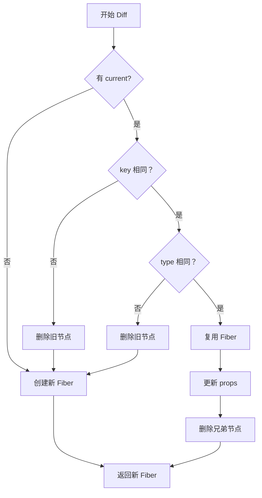

# Diff 算法（单节点）

Diff 算法是 React 核心算法之一，负责比对新旧 Fiber 树并找出最小变更。

## 📦 模块位置

```
packages/react-reconciler/src/
├── ReactChildFiber.js      # Diff 算法核心实现
└── ReactFiberBeginWork.js  # 调用 Diff
```

## 🎯 Diff 策略

React Diff 采用启发式算法，时间复杂度 O(n)：

```
传统 Diff: O(n³)  ←  三层循环
React Diff: O(n)  ←  三次遍历

策略：
1. 不同类型元素 → 直接替换
2. 相同类型元素 → 复用并更新属性
3. key 相同时 → 复用节点
```

## 🔍 单节点 Diff

### 核心流程

```javascript
// packages/react-reconciler/src/ReactChildFiber.js

function reconcileSingleElement(
  returnFiber: Fiber,
  currentFirstChild: Fiber | null,
  element: ReactElement,
  lanes: Lanes,
): Fiber {
  // 1. 检查 key 是否匹配
  const key = element.key;
  let child = currentFirstChild;
  
  while (child !== null) {
    // 2. key 不匹配，删除旧节点
    if (child.key !== key) {
      deleteRemainingChildren(returnFiber, child);
      child = child.sibling;
      continue;
    }
    
    // 3. key 匹配，检查类型
    if (child.elementType === element.type) {
      // 4. 类型匹配，复用节点
      const existing = useFiber(child, element.props, lanes);
      existing.return = returnFiber;
      
      // 5. 删除兄弟节点
      deleteRemainingChildren(returnFiber, child.sibling);
      
      return existing;
    } else {
      // 6. 类型不匹配，删除并创建新节点
      deleteRemainingChildren(returnFiber, child);
      break;
    }
  }
  
  // 7. 创建新 Fiber
  return createChild(returnFiber, element, lanes);
}
```

### 完整流程图解



## 📊 三种情况

### 1. 节点删除（key 或 type 变化）

```jsx
// Before
<div key="a">A</div>

// After
<div key="b">B</div>  // key 变化

// Diff 结果：删除旧节点，创建新节点
```

```javascript
// 内部处理
if (child.key !== newKey) {
  // 标记为删除
  child.flags |= Deletion;
  
  // 继续检查兄弟节点
  child = child.sibling;
}
```

### 2. 节点更新（type 相同）

```jsx
// Before
<div className="old">Content</div>

// After
<div className="new">Content</div>  // type 相同，props 变化

// Diff 结果：复用节点，标记 Update
```

```javascript
// 内部处理
if (child.elementType === newElement.type) {
  // 复用现有 Fiber
  const existing = useFiber(child, newElement.props);
  existing.return = returnFiber;
  
  // 标记更新
  existing.flags |= Update;
  
  return existing;
}
```

### 3. 节点替换（type 变化）

```jsx
// Before
<div>Content</div>

// After
<span>Content</span>  // type 变化

// Diff 结果：删除旧节点，创建新节点
```

```javascript
// 内部处理
if (child.elementType !== newElement.type) {
  // 标记删除
  deleteRemainingChildren(returnFiber, child);
  
  // 创建新 Fiber
  return createChild(returnFiber, newElement);
}
```

## 🔬 源码深度

### useFiber 复用 Fiber

```javascript
// packages/react-reconciler/src/ReactChildFiber.js

function useFiber(
  fiber: Fiber,
  pendingProps: mixed,
  lanes: Lanes,
): Fiber {
  // 创建新的 WorkInProgress Fiber
  const workInProgress = createWorkInProgress(
    fiber,
    pendingProps,
    lanes
  );
  
  // 重置不影响复用的属性
  workInProgress.index = 0;
  workInProgress.sibling = null;
  
  return workInProgress;
}
```

### createWorkInProgress

```javascript
// packages/react-reconciler/src/ReactFiber.js

function createWorkInProgress(
  current: Fiber,
  pendingProps: mixed,
  lanes: Lanes,
): Fiber {
  let workInProgress = current.alternate;
  
  if (workInProgress === null) {
    // 首次创建
    workInProgress = createFiber(
      current.tag,
      pendingProps,
      current.key,
      current.mode
    );
    workInProgress.type = current.type;
    workInProgress.stateNode = current.stateNode;
    
    // 连接双缓冲
    workInProgress.alternate = current;
    current.alternate = workInProgress;
  } else {
    // 复用现有 WorkInProgress
    workInProgress.pendingProps = pendingProps;
    workInProgress.type = current.type;
    
    // 重置副作用
    workInProgress.flags = NoFlags;
    workInProgress.subtreeFlags = NoFlags;
    workInProgress.deletions = null;
  }
  
  // 复制其他属性
  workInProgress.lanes = current.lanes;
  workInProgress.childLanes = current.childLanes;
  
  return workInProgress;
}
```

### deleteRemainingChildren

```javascript
// 删除剩余子节点

function deleteRemainingChildren(
  returnFiber: Fiber,
  currentFirstChild: Fiber | null,
): null {
  let child = currentFirstChild;
  
  while (child !== null) {
    // 标记删除
    deleteChild(returnFiber, child);
    child = child.sibling;
  }
  
  return null;
}

function deleteChild(returnFiber, child) {
  // 添加到删除队列
  const deletions = returnFiber.deletions;
  if (deletions === null) {
    returnFiber.deletions = [child];
    returnFiber.flags |= ChildDeletion;
  } else {
    deletions.push(child);
  }
  
  // 标记为删除
  child.flags |= Deletion;
}
```

### createChild 创建新 Fiber

```javascript
function createChild(
  returnFiber: Fiber,
  newChild: ReactElement,
  lanes: Lanes,
): Fiber {
  // 创建 Fiber Node
  const created = createFiber(
    newChild.type,
    newChild.props,
    newChild.key,
    returnFiber.mode
  );
  
  created.ref = coerceRef(returnFiber, null, newChild);
  created.return = returnFiber;
  
  // 标记为插入
  created.flags |= Placement;
  
  return created;
}
```

## 📝 不同元素类型的 Diff

### 1. React Element

```javascript
function reconcileSingleElement(returnFiber, current, element) {
  // 处理 React 元素（JSX）
  // 见上面的 reconcileSingleElement
}
```

### 2. React Portal

```javascript
function reconcileSinglePortal(returnFiber, current, portal) {
  // Portal 也是单节点 Diff
  const key = portal.key;
  
  // 与 Element 逻辑类似
  // 但 tag 不同（HostPortal vs HostComponent）
}
```

### 3. React Fragment

```javascript
function reconcileSingleFragment(returnFiber, current, fragment) {
  // Fragment 的子节点需要递归 Diff
  // 见多节点 Diff
}
```

### 4. Text/Number

```javascript
function reconcileSingleTextNode(returnFiber, current, text) {
  // 文本节点没有 key
  if (current !== null && current.tag === HostText) {
    // 复用文本节点
    const existing = useFiber(current, text);
    existing.return = returnFiber;
    return existing;
  }
  
  // 创建新文本节点
  const created = createFiber(HostText, text, null, returnFiber.mode);
  created.return = returnFiber;
  created.flags |= Placement;
  return created;
}
```

## ⚠️ 注意事项

### 1. Key 的重要性

```jsx
// ❌ 不好的做法：没有 key 或 key 重复
{items.map(item => (
  <Item item={item} />  // 没有 key
))}

// ❌ 不好的做法：使用 index 作为 key
{items.map((item, index) => (
  <Item key={index} item={item} />  // index 作为 key
))}

// ✅ 好的做法：使用唯一 ID
{items.map(item => (
  <Item key={item.id} item={item} />  // 唯一 ID
))}
```

### 2. Key 的作用

```
Key 帮助 React 识别节点：

Before (无 key):
<div>A</div>
<div>B</div>
<div>C</div>

After (添加 D 到开头):
<div>D</div>  ← React 不知道是新增，可能误判为更新
<div>A</div>
<div>B</div>
<div>C</div>

Before (有 key):
<div key="a">A</div>
<div key="b">B</div>
<div key="c">C</div>

After (添加 D 到开头):
<div key="d">D</div>  ← React 知道是新增
<div key="a">A</div>
<div key="b">B</div>
<div key="c">C</div>
```

### 3. 同层比较

```
React 只比较同一层级的节点：

    App                    App
   /   \      Diff        /   \
  A     B     ────▶     A'    B'
 / \   / \              / \   / \
C   D E   F            C'  D'E'  F'

A 和 A' 比较，不会和 B 比较
C 和 C' 比较，不会和 E 比较
```

## 🔬 调试技巧

### 观察 Diff 过程

```javascript
// 开发模式下添加日志
const originalReconcileChildFibers = reconcileChildFibers;
reconcileChildFibers = function(returnFiber, currentFirstChild, newChild) {
  console.group('Diff');
  console.log('Return:', returnFiber.type);
  console.log('Current:', currentFirstChild?.key || 'null');
  console.log('New:', newChild?.key || newChild?.type || 'text');
  
  const result = originalReconcileChildFibers(returnFiber, currentFirstChild, newChild);
  
  console.log('Result flags:', result?.flags);
  console.groupEnd();
  
  return result;
};
```

### 检查不必要的渲染

```jsx
// 使用 React.memo 检查哪些组件可以优化
const MemoComponent = React.memo(({ value }) => {
  console.log('Render:', value);
  return <div>{value}</div>;
}, (prevProps, nextProps) => {
  console.log('Props changed:', prevProps, nextProps);
  return prevProps.value === nextProps.value;
});
```

## 🐛 常见问题

### Q: 为什么需要 key？

**A**: Key 帮助 React 识别哪些节点可以复用，减少 DOM 操作。

### Q: 可以使用 index 作为 key 吗？

**A**: 
- ✅ 可以：列表固定、无排序/过滤
- ❌ 不可以：列表会变化、有排序/过滤

### Q: key 必须唯一吗？

**A**: 只在同层级唯一即可，不同层级可以重复。

```jsx
// ✅ 合法：不同组件的 key 可以重复
<Parent>
  <Item key="1" />
  <Item key="2" />
</Parent>
<OtherParent>
  <Item key="1" />  {/* 和上面的 key="1" 不冲突 */}
</OtherParent>
```

---

## 📖 下一步

- [多节点 Diff 算法](./diff-multiple) - 数组/列表 Diff