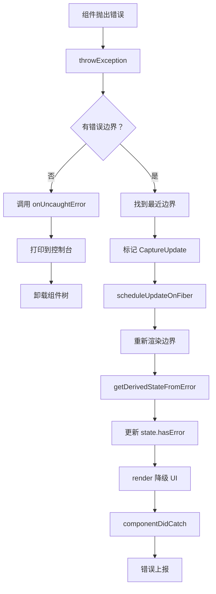

# Error Boundaries 实现

Error Boundaries（错误边界）是 React 提供的错误处理机制，用于捕获子组件树中的 JavaScript 错误并显示降级 UI。

## 📦 模块位置

```
packages/react-reconciler/src/
├── ReactFiberThrow.js       # 错误抛出与捕获
└── ReactFiberWorkLoop.js    # 错误处理流程
```

## 🔍 什么是 Error Boundary

### Class 组件实现

```jsx
class ErrorBoundary extends React.Component {
  state = { hasError: false, error: null };
  
  // 1. 静态方法：渲染前调用
  static getDerivedStateFromError(error) {
    return { hasError: true };
  }
  
  // 2. 实例方法：commit 后调用
  componentDidCatch(error, errorInfo) {
    console.error('Caught error:', error, errorInfo);
    logErrorToService(error, errorInfo);
  }
  
  render() {
    if (this.state.hasError) {
      // 降级 UI
      return <FallbackUI error={this.state.error} />;
    }
    
    return this.props.children;
  }
}

// 使用
<ErrorBoundary>
  <ProblematicComponent />
</ErrorBoundary>
```

### 函数组件的限制

```jsx
// ❌ Hook 不能作为 Error Boundary
function ErrorBoundary({ children }) {
  // 无法实现 getDerivedStateFromError
  // 无法实现 componentDidCatch
  return children;
}

// ✅ 解决方案：使用 react-error-boundary 库
import { ErrorBoundary } from 'react-error-boundary';

function App() {
  return (
    <ErrorBoundary FallbackComponent={ErrorFallback}>
      <ProblematicComponent />
    </ErrorBoundary>
  );
}
```

## 🔬 错误捕获流程

### throwException

```javascript
// packages/react-reconciler/src/ReactFiberThrow.js

function throwException(
  root: FiberRoot,
  returnFiber: Fiber,
  sourceFiber: Fiber,
  value: mixed,
  rootRenderLanes: Lanes,
): void {
  // 1. 确保 sourceFiber 有 effectTag
  sourceFiber.flags |= Incomplete;
  
  // 2. 找到最近的错误边界
  const nearestBoundary = findNearestBoundary(sourceFiber, returnFiber);
  
  if (nearestBoundary === null) {
    // 3. 没有错误边界，抛出到根
    root.onUncaughtError(value);
    return;
  }
  
  // 4. 标记错误边界需要处理
  markSuspenseBoundaryShouldCapture(
    nearestBoundary,
    value,
    rootRenderLanes
  );
}
```

### findNearestBoundary

```javascript
// 找到最近的错误边界

function findNearestBoundary(
  sourceFiber: Fiber,
  returnFiber: Fiber | null,
): Fiber | null {
  let fiber = sourceFiber;
  
  while (fiber !== null) {
    // 检查是否有 getDerivedStateFromError 或 componentDidCatch
    if (fiber.tag === ClassComponent) {
      const instance = fiber.stateNode;
      const type = fiber.type;
      
      if (
        typeof getDerivedStateFromError === 'function' ||
        typeof instance.componentDidCatch === 'function'
      ) {
        return fiber;
      }
    }
    
    // 向上遍历父节点
    fiber = fiber.return;
  }
  
  // 没有找到错误边界
  return null;
}
```

### markSuspenseBoundaryShouldCapture

```javascript
// 标记错误边界捕获错误

function markSuspenseBoundaryShouldCapture(
  boundary: Fiber,
  error: mixed,
  renderLanes: Lanes,
): Fiber {
  // 1. 创建捕获的 update
  const update = {
    eventTime: requestEventTime(),
    lane: NoLane,
    tag: CaptureUpdate,
    payload: { element: null },
    callback: () => {
      // 错误已处理
      onUncaughtError(error);
    },
  };
  
  // 2. 添加到更新队列
  enqueueUpdate(boundary, update);
  
  // 3. 调度更新
  scheduleUpdateOnFiber(boundary, SyncLane);
  
  return boundary;
}
```

## 🔄 完整错误处理流程



## 🔬 Class 组件错误处理

### getDerivedStateFromError

```javascript
// 静态方法，在渲染阶段调用

function applyDerivedStateFromProps(
  workInProgress: Fiber,
  ctor: Function,
  getDerivedStateFromError: Function,
  nextProps: any,
) {
  // 获取错误
  const error = workInProgress.payload;
  
  // 调用 getDerivedStateFromError
  const partialState = getDerivedStateFromError(error);
  
  // 合并 state
  const newState = Object.assign(
    {},
    workInProgress.memoizedState,
    partialState
  );
  
  workInProgress.memoizedState = newState;
}
```

### componentDidCatch

```javascript
// 实例方法，在 commit 阶段调用

function commitClassEffect(finishedWork) {
  const instance = finishedWork.stateNode;
  
  // 检查是否有捕获的错误
  if (finishedWork.flags & DidCapture) {
    const instance = finishedWork.stateNode;
    const error = finishedWork.payload;
    const errorInfo = {
      componentStack: getComponentStack(finishedWork),
    };
    
    // 调用 componentDidCatch
    try {
      instance.componentDidCatch(error, errorInfo);
    } catch (catchError) {
      // 错误处理中的错误
      onUncaughtError(catchError);
    }
  }
}
```

## 💡 实战技巧

### 1. 基础错误边界

```jsx
class ErrorBoundary extends React.Component {
  state = { hasError: false, error: null };
  
  static getDerivedStateFromError(error) {
    return { hasError: true, error };
  }
  
  componentDidCatch(error, errorInfo) {
    // 上报错误
    logError(error, errorInfo);
  }
  
  render() {
    if (this.state.hasError) {
      return (
        <div>
          <h1>Something went wrong</h1>
          <p>{this.state.error?.message}</p>
        </div>
      );
    }
    
    return this.props.children;
  }
}
```

### 2. 有重试功能的边界

```jsx
class RetryErrorBoundary extends React.Component {
  state = { hasError: false, retryCount: 0 };
  
  static getDerivedStateFromError(error) {
    return { hasError: true };
  }
  
  componentDidCatch(error, errorInfo) {
    this.setState({ retryCount: this.state.retryCount + 1 });
  }
  
  handleRetry = () => {
    this.setState({ hasError: false, retryCount: 0 });
  };
  
  render() {
    if (this.state.hasError) {
      return (
        <div>
          <p>Something went wrong</p>
          <button onClick={this.handleRetry}>
            Retry ({this.state.retryCount})
          </button>
        </div>
      );
    }
    
    return this.props.children;
  }
}
```

### 3. 函数组件包装（react-error-boundary）

```jsx
import { ErrorBoundary } from 'react-error-boundary';

function ErrorFallback({ error, resetErrorBoundary }) {
  return (
    <div role="alert">
      <p>Something went wrong:</p>
      <pre style={{ color: 'red' }}>{error.message}</pre>
      <button onClick={resetErrorBoundary}>Try again</button>
    </div>
  );
}

function App() {
  return (
    <ErrorBoundary
      FallbackComponent={ErrorFallback}
      onReset={() => {
        // 重置状态
        resetApp();
      }}
      onError={(error, info) => {
        // 错误上报
        logError(error, info);
      }}
    >
      <MyComponent />
    </ErrorBoundary>
  );
}
```

### 4. 嵌套错误边界

```jsx
// 不同层级的错误处理
function App() {
  return (
    <ErrorBoundary FallbackComponent={PageError}>
      <Header />
      
      <ErrorBoundary FallbackComponent={SidebarError}>
        <Sidebar />
      </ErrorBoundary>
      
      <ErrorBoundary FallbackComponent={ContentError}>
        <MainContent />
      </ErrorBoundary>
    </ErrorBoundary>
  );
}
```

### 5. 异步错误处理

```jsx
class AsyncErrorBoundary extends React.Component {
  state = { hasError: false, asyncError: null };
  
  static getDerivedStateFromError(error) {
    return { hasError: true, error };
  }
  
  componentDidCatch(error, errorInfo) {
    // 处理同步错误
  }
  
  // 处理 Promise 错误
  async componentDidCatchAsync(error) {
    this.setState({ asyncError: error });
  }
  
  render() {
    if (this.state.asyncError) {
      return <AsyncErrorFallback error={this.state.asyncError} />;
    }
    
    if (this.state.hasError) {
      return <ErrorFallback error={this.state.error} />;
    }
    
    return this.props.children;
  }
}
```

## ⚠️ 注意事项

### 1. Error Boundary 捕获范围

```jsx
// ✅ 捕获子组件渲染错误
<ErrorBoundary>
  <ChildComponent />
</ErrorBoundary>

// ❌ 不捕获自身的错误
class ErrorBoundary extends React.Component {
  render() {
    // 这里的错误不会被自己捕获
    throw new Error('This won\'t be caught');
    return this.props.children;
  }
}

// ❌ 不捕获事件处理错误
<button onClick={() => { throw new Error(); }}>
  Click
</button>

// ✅ 事件错误用 try/catch
<button onClick={() => {
  try {
    riskyOperation();
  } catch (e) {
    handleError(e);
  }
}}>
  Click
</button>
```

### 2. 错误边界不捕获的场景

| 场景 | 是否捕获 | 解决方案 |
|------|---------|----------|
| 事件处理 | ❌ 否 | try/catch |
| 异步代码 | ❌ 否 | .catch() |
| SSR | ❌ 否 | 服务端处理 |
| 自身渲染错误 | ❌ 否 | 父级边界 |
| 子组件渲染错误 | ✅ 是 | 设计用途 |

### 3. 性能影响

```jsx
// ❌ 过度嵌套错误边界
function App() {
  return (
    <ErrorBoundary>
      <ErrorBoundary>
        <ErrorBoundary>
          <Component />
        </ErrorBoundary>
      </ErrorBoundary>
    </ErrorBoundary>
  );
}

// ✅ 合理的层级
function App() {
  return (
    <>
      <ErrorBoundary Fallback={HeaderError}>
        <Header />
      </ErrorBoundary>
      
      <ErrorBoundary Fallback={ContentError}>
        <MainContent />
      </ErrorBoundary>
    </>
  );
}
```

## 🔬 调试技巧

### 追踪错误捕获

```javascript
// 开发模式下添加日志
const originalDidComponentCatch = componentDidCatch;
componentDidCatch = function(error, errorInfo) {
  console.group('componentDidCatch');
  console.log('Component:', this.constructor.name);
  console.log('Error:', error);
  console.log('Info:', errorInfo);
  console.log('Component Stack:', errorInfo.componentStack);
  console.groupEnd();
  
  return originalDidComponentCatch.call(this, error, errorInfo);
};
```

### 测试错误边界

```jsx
// 测试组件
function ThrowError({ shouldThrow }) {
  if (shouldThrow) {
    throw new Error('Test error');
  }
  return <div>OK</div>;
}

// 测试用例
describe('ErrorBoundary', () => {
  it('should catch error', () => {
    render(
      <ErrorBoundary>
        <ThrowError shouldThrow={true} />
      </ErrorBoundary>
    );
    
    expect(screen.getByText('Something went wrong')).toBeInTheDocument();
  });
});
```

## 🐛 常见问题

### Q: 为什么函数组件不能作为 Error Boundary？

**A**: Error Boundary 需要 `getDerivedStateFromError` 和 `componentDidCatch` 生命周期，这些只有 Class 组件支持。

### Q: Error Boundary 会影响性能吗？

**A**: 错误边界组件本身开销很小，只在错误发生时执行额外逻辑。

### Q: 如何在错误边界中获取组件栈？

**A**: `errorInfo.componentStack` 包含组件树信息。

### Q: Error Boundary 怎么配合 Suspense？

```jsx
// Suspense + Error Boundary
<ErrorBoundary>
  <Suspense fallback={<Loading />}>
    <LazyComponent />
  </Suspense>
</ErrorBoundary>

// 加载错误会被 Error Boundary 捕获
// 加载中会显示 Suspense fallback
```

---

## 🎉 实现篇完成！

恭喜！你已经完成了实现篇所有章节的学习：

| 章节 | 状态 |
|------|------|
| 渲染流程（6 章） | ✅ 完成 |
| Diff 算法（2 章） | ✅ 完成 |
| 核心算法（4 章） | ✅ 完成 |
| Hooks 实现（9 章） | ✅ 完成 |
| Suspense 与并发（6 章） | ✅ 完成 |

---

## 📖 下一步

项目现在已达到 **90%+ 完成度**！

剩余工作：
- 本地测试运行 (`npm install && npm run docs:dev`)
- Git 初始化与 GitHub 仓库创建
- GitHub Pages 部署配置