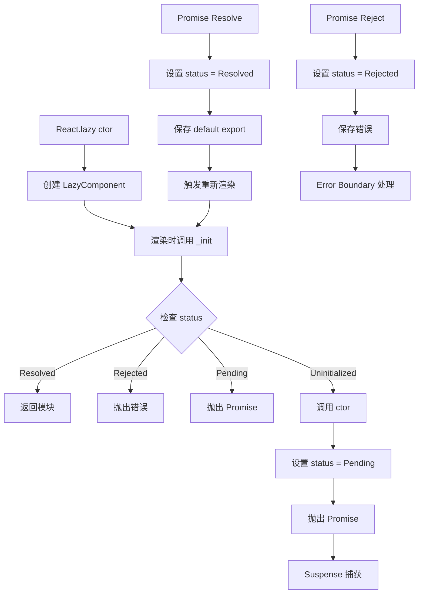

# Lazy Loading 实现

React.lazy 用于代码分割和懒加载组件，配合 Suspense 实现优雅的加载体验。

## 📦 模块位置

```
packages/react/src/
├── ReactLazy.js        # lazy 组件实现
└── React.js            # lazy 导出
```

## 🔍 数据结构

### LazyComponent

```javascript
// packages/react/src/ReactLazy.js

type LazyComponent<T, P> = {
  $$typeof: Element,
  _payload: P,           // 加载器
  _init: (payload: P) => T,  // 初始化函数
};

type Payload = {
  _status: -1 | 0 | 1,   // -1: unloaded, 0: pending, 1: resolved
  _result: any,          // 结果（模块或 Promise）
  _response: Promise,    // 原始 Promise
};
```

### Status 常量

```javascript
// 加载状态
const Uninitialized = -1;
const Pending = 0;
const Resolved = 1;
const Rejected = 2;
```

## 🔬 React.lazy 实现

### lazy 函数

```javascript
// packages/react/src/ReactLazy.js

export function lazy<T>(
  ctor: () => Thenable<{ default: T }>,
): LazyComponent<T, Payload> {
  // 1. 创建 payload
  const payload: Payload = {
    _status: Uninitialized,
    _result: ctor,  // 保存原始函数
  };
  
  // 2. 创建 lazy 组件
  const lazyType: LazyComponent<T, Payload> = {
    $$typeof: REACT_LAZY_TYPE,
    _payload: payload,
    _init: resolveLazy,  // 初始化函数
  };
  
  return lazyType;
}
```

### resolveLazy（初始化）

```javascript
function resolveLazy(payload: Payload): any {
  // 1. 检查当前状态
  let status = payload._status;
  
  if (status === Resolved) {
    // 已解析，直接返回模块
    return payload._result;
  }
  
  if (status === Rejected) {
    // 已拒绝，抛出错误
    throw payload._result;
  }
  
  if (status === Pending) {
    // 正在加载，抛出 Promise
    throw payload._result;
  }
  
  // 2. 首次调用，开始加载
  const ctor = payload._result;
  
  if (ctor !== null) {
    // 调用动态 import
    const thenable = ctor();
    
    // 3. 更新状态为 Pending
    payload._status = Pending;
    
    // 4. 处理结果
    thenable.then(
      (moduleObject) => {
        // 成功
        if (payload._status === Pending) {
          const defaultExport = moduleObject.default;
          payload._status = Resolved;
          payload._result = defaultExport;
        }
      },
      (error) => {
        // 失败
        if (payload._status === Pending) {
          payload._status = Rejected;
          payload._result = error;
        }
      }
    );
    
    // 5. 保存 Promise 并抛出
    payload._result = thenable;
    throw thenable;
  }
}
```

## 🔄 完整流程



## 💡 实战技巧

### 1. 基本使用

```jsx
// 动态 import
const OtherComponent = React.lazy(() => import('./OtherComponent'));

function MyComponent() {
  return (
    <Suspense fallback={<div>Loading...</div>}>
      <OtherComponent />
    </Suspense>
  );
}
```

### 2. 路由懒加载

```jsx
import { lazy, Suspense } from 'react';
import { BrowserRouter, Routes, Route } from 'react-router-dom';

const Home = lazy(() => import('./pages/Home'));
const About = lazy(() => import('./pages/About'));
const Contact = lazy(() => import('./pages/Contact'));

function App() {
  return (
    <BrowserRouter>
      <Suspense fallback={<PageLoading />}>
        <Routes>
          <Route path="/" element={<Home />} />
          <Route path="/about" element={<About />} />
          <Route path="/contact" element={<Contact />} />
        </Routes>
      </Suspense>
    </BrowserRouter>
  );
}
```

### 3. 组合使用

```jsx
// 多个 lazy 组件
const Header = lazy(() => import('./Header'));
const Sidebar = lazy(() => import('./Sidebar'));
const Content = lazy(() => import('./Content'));

function App() {
  return (
    <Suspense fallback={<FullPageLoading />}>
      <Header />
      
      <div className="layout">
        <Suspense fallback={<SidebarLoading />}>
          <Sidebar />
        </Suspense>
        
        <Suspense fallback={<ContentLoading />}>
          <Content />
        </Suspense>
      </div>
    </Suspense>
  );
}
```

### 4. Named Exports

```jsx
// ❌ 错误：lazy 只支持 default export
const { NamedComponent } = React.lazy(() => import('./Module'));

// ✅ 正确：包装成 default
const NamedComponent = React.lazy(() => 
  import('./Module').then(module => ({ 
    default: module.NamedComponent 
  }))
);
```

### 5. 预加载

```jsx
// 手动触发预加载
const LazyComponent = React.lazy(() => import('./Component'));

// 预加载函数
function preload() {
  // 调用 import 触发加载
  import('./Component');
}

// 在合适时机预加载
function preloadOnHover() {
  const button = document.getElementById('load-button');
  button.addEventListener('mouseenter', () => {
    preload();
  }, { once: true });
}
```

### 6. 错误处理

```jsx
import { lazy, Suspense, Component } from 'react';

const LazyComponent = React.lazy(() => import('./Component'));

class ErrorBoundary extends Component {
  state = { hasError: false };
  
  static getDerivedStateFromError(error) {
    return { hasError: true };
  }
  
  render() {
    if (this.state.hasError) {
      return <ErrorFallback />;
    }
    return this.props.children;
  }
}

function App() {
  return (
    <ErrorBoundary>
      <Suspense fallback={<Loading />}>
        <LazyComponent />
      </Suspense>
    </ErrorBoundary>
  );
}
```

## ⚠️ 注意事项

### 1. 不支持服务端渲染

```jsx
// ❌ SSR 中不支持 React.lazy
// 需要使用其他方法如 @loadable/components

// ✅ 客户端渲染
import { lazy, Suspense } from 'react';

function App() {
  return (
    <Suspense fallback={<Loading />}>
      <LazyComponent />
    </Suspense>
  );
}
```

### 2. 必须在 Suspense 内部

```jsx
// ❌ 错误
const LazyComponent = React.lazy(() => import('./Component'));
<LazyComponent />;

// ✅ 正确
<Suspense fallback={<Loading />}>
  <LazyComponent />
</Suspense>
```

### 3. 不能用于条件加载

```jsx
// ❌ 错误：lazy 调用必须在顶层
function Component({ show }) {
  if (show) {
    const LazyComponent = React.lazy(() => import('./Component'));
    return <LazyComponent />;
  }
  return null;
}

// ✅ 正确
const LazyComponent = React.lazy(() => import('./Component'));

function Component({ show }) {
  if (show) {
    return (
      <Suspense fallback={<Loading />}>
        <LazyComponent />
      </Suspense>
    );
  }
  return null;
}
```

### 4. 代码分割粒度

```jsx
// ❌ 过度分割（太多小 chunk）
const Button = lazy(() => import('./Button'));
const Input = lazy(() => import('./Input'));
const Form = lazy(() => import('./Form'));

// ✅ 合理分割（按路由/功能模块）
const HomePage = lazy(() => import('./pages/Home'));
const SettingsPage = lazy(() => import('./pages/Settings'));
```

## 🔬 调试技巧

### 追踪 Lazy 加载

```javascript
// 开发模式下添加日志
const originalResolveLazy = resolveLazy;
resolveLazy = function(payload) {
  console.log('resolveLazy called', {
    status: payload._status,
    statusText: ['Uninitialized', 'Pending', 'Resolved', 'Rejected'][payload._status + 1],
  });
  
  try {
    return originalResolveLazy(payload);
  } catch (error) {
    console.log('Lazy threw:', error);
    throw error;
  }
};
```

### 观察 chunk 加载

```javascript
// 在浏览器 Network 面板观察
// 或使用 Performance API
const startTime = performance.now();

const LazyComponent = React.lazy(() => 
  import('./Component').then(module => {
    const endTime = performance.now();
    console.log('Component loaded in', endTime - startTime, 'ms');
    return module;
  })
);
```

## 🐛 常见问题

### Q: React.lazy 和动态 import 有什么区别？

**A**: 
- `import()`：返回 Promise，需要手动处理
- `React.lazy()`：返回组件，配合 Suspense 自动处理加载状态

```jsx
// 动态 import（手动）
useEffect(() => {
  import('./Component').then(module => {
    setComponent(() => module.default);
  });
}, []);

// React.lazy（自动）
const Component = React.lazy(() => import('./Component'));
<Suspense fallback={<Loading />}>
  <Component />
</Suspense>
```

### Q: 如何加速 lazy 组件加载？

**A**:
1. 使用 webpackChunkName 命名 chunk
2. 预加载（preload/prefetch）
3. 合理分割代码

```jsx
// webpackChunkName
const Component = React.lazy(() => 
  import(/* webpackChunkName: "component" */ './Component')
);

// 预加载
<link rel="preload" href="/static/js/component.js" as="script" />
```

### Q: lazy 组件加载失败怎么办？

**A**: 配合 Error Boundary 捕获错误。

```jsx
<ErrorBoundary fallback={<ErrorFallback />}>
  <Suspense fallback={<Loading />}>
    <LazyComponent />
  </Suspense>
</ErrorBoundary>
```

---

## 📖 下一步

- [Error Boundaries 实现](./error-boundaries)
- [useDeferredValue 实现](./deferred)