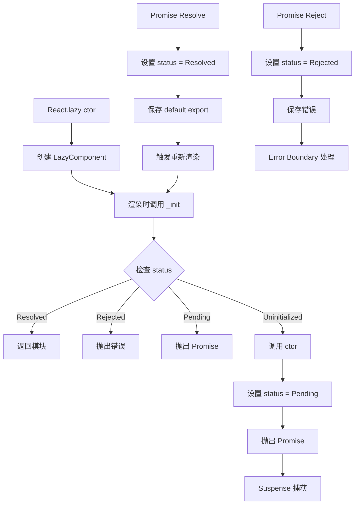

# Lazy Loading 实现

React.lazy 用于代码分割和懒加载组件，配合 Suspense 实现优雅的加载体验。

## 📦 模块位置

```
packages/react/src/
├── ReactLazy.js        # lazy 组件实现
└── React.js            # lazy 导出
```

## 🔍 数据结构

### LazyComponent

```javascript
// packages/react/src/ReactLazy.js

type LazyComponent<T, P> = {
  $$typeof: symbol,
  _payload: P,           // 加载器
  _init: (payload: P) => T,  // 初始化函数
};

type Payload = {
  _status: -1 | 0 | 1 | 2,   // -1: unloaded, 0: pending, 1: resolved, 2: rejected
  _result: any,          // 结果（模块或 Promise/错误）
};
```

### Status 常量

```javascript
// 加载状态
const Uninitialized = -1;
const Pending = 0;
const Resolved = 1;
const Rejected = 2;
```

## 🔬 React.lazy 实现

### lazy 函数

```javascript
// packages/react/src/ReactLazy.js

export function lazy<T>(
  ctor: () => Thenable<{ default: T }>,
): LazyComponent<T, Payload> {
  // 1. 创建 payload
  const payload: Payload = {
    _status: Uninitialized,
    _result: ctor,  // 保存原始函数
  };
  
  // 2. 创建 lazy 组件
  const lazyType: LazyComponent<T, Payload> = {
    $$typeof: REACT_LAZY_TYPE,
    _payload: payload,
    _init: resolveLazy,  // 初始化函数
  };
  
  return lazyType;
}
```

### resolveLazy（初始化）

```javascript
function resolveLazy(payload: Payload): any {
  // 1. 检查当前状态
  let status = payload._status;
  
  if (status === Resolved) {
    // 已解析，直接返回模块
    return payload._result;
  }
  
  if (status === Rejected) {
    // 已拒绝，抛出错误
    throw payload._result;
  }
  
  if (status === Pending) {
    // 正在加载，抛出 Promise
    throw payload._result;
  }
  
  // 2. 首次调用，开始加载
  const ctor = payload._result;
  
  if (ctor !== null) {
    // 调用动态 import
    const thenable = ctor();
    
    // 3. 更新状态为 Pending
    payload._status = Pending;
    
    // 4. 处理结果
    thenable.then(
      (moduleObject) => {
        // 成功
        if (payload._status === Pending) {
          const defaultExport = moduleObject.default;
          payload._status = Resolved;
          payload._result = defaultExport;
        }
      },
      (error) => {
        // 失败
        if (payload._status === Pending) {
          payload._status = Rejected;
          payload._result = error;
        }
      }
    );
    
    // 5. 保存 Promise 并抛出
    payload._result = thenable;
    throw thenable;
  }
}
```

## 🔄 完整流程



## 💡 实战技巧

### 1. 基本使用

```jsx
// 动态 import
const OtherComponent = React.lazy(() => import('./OtherComponent'));

function MyComponent() {
  return (
    <Suspense fallback={<div>Loading...</div>}>
      <OtherComponent />
    </Suspense>
  );
}
```

### 2. 路由懒加载

```jsx
import { lazy, Suspense } from 'react';
import { BrowserRouter, Routes, Route } from 'react-router-dom';

const Home = lazy(() => import('./pages/Home'));
const About = lazy(() => import('./pages/About'));

function App() {
  return (
    <BrowserRouter>
      <Suspense fallback={<PageLoading />}>
        <Routes>
          <Route path="/" element={<Home />} />
          <Route path="/about" element={<About />} />
        </Routes>
      </Suspense>
    </BrowserRouter>
  );
}
```

### 3. 错误处理

```jsx
import { lazy, Suspense } from 'react';

const LazyComponent = lazy(() => import('./Component'));

function App() {
  return (
    <ErrorBoundary fallback={<ErrorFallback />}>
      <Suspense fallback={<Loading />}>
        <LazyComponent />
      </Suspense>
    </ErrorBoundary>
  );
}
```

## ⚠️ 注意事项

### 1. 使用限制

```jsx
// ❌ 错误：lazy 只支持 default export
const { NamedComponent } = React.lazy(() => import('./Module'));

// ✅ 正确：包装成 default
const NamedComponent = React.lazy(() => 
  import('./Module').then(module => ({ 
    default: module.NamedComponent 
  }))
);
```

### 2. 必须在 Suspense 内部

```jsx
// ❌ 错误
const LazyComponent = React.lazy(() => import('./Component'));
<LazyComponent />;

// ✅ 正确
<Suspense fallback={<Loading />}>
  <LazyComponent />
</Suspense>
```

## 🔬 调试技巧

### 追踪加载状态

```javascript
// 观察加载状态
const LazyComponent = React.lazy(() => 
  import('./Component').then(module => {
    console.log('Component loaded');
    return module;
  })
);
```

## 📖 下一步
- [Error Boundaries 实现](./error-boundaries)
- [useDeferredValue 实现](./deferred)