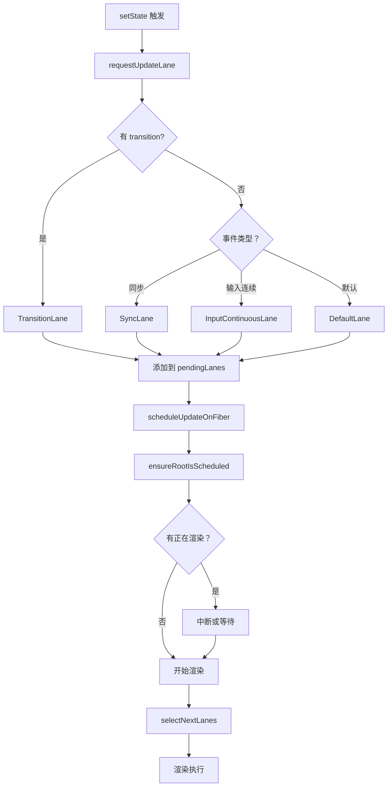

# 优先级调度算法

React 18 使用 Lane 模型进行优先级调度，这是 React 并发渲染的核心基础。

## 📦 模块位置

```
packages/react-reconciler/src/
└── ReactFiberLane.js    # Lane 优先级模型实现
```

## 🔍 Lane 模型概述

### 什么是 Lane

Lane 是 React 18 引入的优先级模型，使用位掩码（bitmask）表示优先级：

```javascript
// 每个 Lane 是一个二进制位
const Lane1 = 0b00000000000000000000000000000001;  // 1
const Lane2 = 0b00000000000000000000000000000010;  // 2
const Lane3 = 0b00000000000000000000000000000100;  // 4
const Lane4 = 0b00000000000000000000000000001000;  // 8
```

### 优势

- **高效的位运算**：O(1) 时间复杂度
- **批量处理**：多个优先级可以合并
- **精确控制**：每个更新可以有独立的优先级

## 🔬 Lane 定义

### 优先级常量

```javascript
// packages/react-reconciler/src/ReactFiberLane.js

// ===== 高优先级 =====

// 同步 lane（最高优先级）
const SyncLane = 0b00000000000000000000000000000001;

// 连续事件（输入、点击）
const InputContinuousHydrationLane = 0b00000000000000000000000000000010;
const InputContinuousLane = 0b00000000000000000000000000000100;

// ===== 默认优先级 =====

const DefaultHydrationLane = 0b00000000000000000000000000001000;
const DefaultLane = 0b00000000000000000000000000010000;

// ===== Transition 优先级 =====

const TransitionHydrationLane = 0b00000000000000000000000000100000;
const TransitionLanes = 0b0000000000000000000000001111111111100000;  // 位掩码

const TransitionLane1 = 0b00000000000000000000000000100000;
const TransitionLane2 = 0b00000000000000000000000001000000;
const TransitionLane3 = 0b00000000000000000000000010000000;
const TransitionLane4 = 0b00000000000000000000000100000000;
const TransitionLane5 = 0b00000000000000000000001000000000;
const TransitionLane6 = 0b00000000000000000000010000000000;
const TransitionLane7 = 0b00000000000000000000100000000000;
const TransitionLane8 = 0b00000000000000000001000000000000;

// ===== 低优先级 =====

const SelectiveHydrationLane = 0b00000000000000000010000000000000;

// 空闲 lane（最低优先级）
const IdleHydrationLane = 0b00000000000000000100000000000000;
const IdleLane = 0b00000000000000001000000000000000;

// Offscreen（后台渲染）
const OffscreenLane = 0b00000000000000010000000000000000;
```

### 优先级排序（从高到低）

```
SyncLane (同步)
  ↓
InputContinuousLane (输入连续)
  ↓
DefaultLane (默认)
  ↓
TransitionLane1-8 (过渡)
  ↓
IdleLane (空闲)
  ↓
OffscreenLane (后台)
```

## 🔬 核心位运算

### 检查是否包含某个 Lane

```javascript
// 检查 lanes 集合是否包含 lane
function includesLane(lanes: Lanes, lane: Lane): boolean {
  return (lanes & lane) !== NoLanes;
}

// 示例
const lanes = DefaultLane | TransitionLane1;  // 0b00010010
includesLane(lanes, DefaultLane);  // true
includesLane(lanes, SyncLane);      // false
```

### 添加 Lane 到集合

```javascript
// 添加 lane 到 lanes 集合
function addLane(lanes: Lanes, lane: Lane): Lanes {
  return lanes | lane;  // 位或运算
}

// 示例
let lanes = DefaultLane;
lanes = addLane(lanes, TransitionLane1);
// lanes = 0b00010010
```

### 移除 Lane

```javascript
// 从 lanes 集合中移除 lane
function removeLane(lanes: Lanes, lane: Lane): Lanes {
  return lanes & ~lane;  // 位与非运算
}

// 示例
let lanes = DefaultLane | TransitionLane1;  // 0b00010010
lanes = removeLane(lanes, TransitionLane1);
// lanes = 0b00000010 (只剩 DefaultLane)
```

### 检查是否是子集

```javascript
// 检查 lanes1 是否是 lanes2 的子集
function isSubsetOfLanes(lanes1: Lanes, lanes2: Lanes): boolean {
  // 如果 lanes1 是 lanes2 的子集，那么 lanes1 & lanes2 === lanes1
  return (lanes1 & lanes2) === lanes1;
}

// 示例
isSubsetOfLanes(DefaultLane, DefaultLane | TransitionLane1);  // true
isSubsetOfLanes(DefaultLane | SyncLane, DefaultLane);        // false
```

### 获取最高优先级

```javascript
// 获取 lanes 中最高优先级的 lane（最低位）
function getHighestPriorityLane(lanes: Lanes): Lane {
  // 获取最低位的 1
  return lanes & -lanes;
}

// 示例
const lanes = DefaultLane | TransitionLane1;  // 0b00010010
const highest = getHighestPriorityLane(lanes);  // 0b00000010 (DefaultLane)
```

### 获取最低优先级

```javascript
// 获取 lanes 中最低优先级的 lane（最高位）
function getLowestPriorityLane(lanes: Lanes): Lane {
  // 获取最高位的 1
  return Math.clz32(lanes) ? 1 << (31 - Math.clz32(lanes)) : 0;
}
```

## 🔄 优先级调度流程



## 🔬 核心函数

### requestUpdateLane

```javascript
// packages/react-reconciler/src/ReactFiberLane.js

function requestUpdateLane(fiber: Fiber): Lane {
  // 1. 检查是否在 transition 中
  const transition = ReactCurrentBatchConfig.transition;
  
  if (transition !== null) {
    // 2. Transition 更新 - 低优先级
    return getNextTransitionLane();
  }
  
  // 3. 检查事件优先级
  const eventLane = getCurrentUpdatePriority();
  
  if (eventLane !== NoLane) {
    return eventLane;
  }
  
  // 4. 默认优先级
  return DefaultLane;
}
```

### selectNextLanes

```javascript
// 选择下一批要渲染的 lanes

function selectNextLanes(root: FiberRoot): Lanes {
  const pendingLanes = root.pendingLanes;
  
  // 1. 没有待处理的更新
  if (pendingLanes === NoLanes) {
    return NoLanes;
  }
  
  // 2. 获取最高优先级的非空闲 lanes
  let nextLanes = getNextLanes(pendingLanes, root.suspendedLanes);
  
  if (nextLanes !== NoLanes) {
    return nextLanes;
  }
  
  // 3. 如果只有空闲 lanes，也处理
  return getHighestPriorityLane(pendingLanes);
}
```

### getNextLanes

```javascript
// 获取接下来要处理的 lanes

function getNextLanes(pendingLanes: Lanes, suspendedLanes: Lanes): Lanes {
  // 1. 过滤掉正在 suspense 的 lanes
  const nonIdleLanes = pendingLanes & ~suspendedLanes;
  
  // 2. 获取非空闲的最高优先级
  const nonIdlePendingLanes = nonIdleLanes & NonIdleLanes;
  
  if (nonIdlePendingLanes !== NoLanes) {
    // 有非空闲更新
    return getHighestPriorityLane(nonIdlePendingLanes);
  }
  
  // 3. 只有空闲更新
  return getHighestPriorityLane(pendingLanes);
}
```

## 💡 实战场景

### 1. 同步更新

```jsx
// 同步事件（最高优先级）
function handleClick() {
  setCount(c => c + 1);  // SyncLane 或 DefaultLane
}

// 立即响应，不可中断
```

### 2. 连续输入

```jsx
// 输入、拖拽等连续事件
function handleInput(e) {
  setValue(e.target.value);  // InputContinuousLane
}

// 高优先级，但可以被同步更新中断
```

### 3. Transition 更新

```jsx
// 过渡更新（低优先级）
function handleTabChange() {
  startTransition(() => {
    setTab(newTab);  // TransitionLane
  });
}

// 可以被高优先级更新中断
```

### 4. 后台渲染

```jsx
// Offscreen 组件（最低优先级）
<Offscreen mode="hidden">
  <HeavyComponent />  // OffscreenLane
</Offscreen>

// 在后台渲染，不阻塞用户交互
```

## ⚠️ 注意事项

### 1. Lane 不是越多越好

```jsx
// ❌ 不推荐：过度使用 transition
function handleClick() {
  startTransition(() => {
    setCount(c => c + 1);  // 简单更新不需要 transition
  });
}

// ✅ 推荐：只对耗时更新使用 transition
function handleClick() {
  // 简单更新
  setCount(c => c + 1);
  
  // 复杂更新用 transition
  startTransition(() => {
    setFilteredData(complexFilter(data));
  });
}
```

### 2. 优先级倒置

```
优先级倒置问题：

高优先级更新 → 被低优先级阻塞 ❌

解决方案：
- React 的调度器会抢占
- 高优先级可以中断低优先级
```

### 3. Lane 合并

```javascript
// 多个相同优先级的更新会合并
setCount(1);
setCount(2);  // 同优先级，会合并
setFlag(true);

// 最终只渲染一次
```

## 🔬 调试技巧

### 追踪 Lane 分配

```javascript
// 开发模式下添加日志
const originalRequestUpdateLane = requestUpdateLane;
requestUpdateLane = function(fiber) {
  const lane = originalRequestUpdateLane(fiber);
  
  const laneNames = {
    [SyncLane]: 'Sync',
    [InputContinuousLane]: 'InputContinuous',
    [DefaultLane]: 'Default',
    [TransitionLane1]: 'Transition1',
    [IdleLane]: 'Idle',
  };
  
  console.log('requestUpdateLane:', fiber.type?.name, '→', laneNames[lane] || lane);
  
  return lane;
};
```

### 可视化优先级

```javascript
// 在 React DevTools 中查看
// Settings → Debugging → Track updates
// 可以看到每个更新的优先级
```

## 🐛 常见问题

### Q: Lane 和优先级是什么关系？

**A**: Lane 是优先级的位表示。数值越小，优先级越高。

### Q: 如何知道更新的优先级？

**A**: 使用 React DevTools Profiler 或添加调试日志。

### Q: Transition 一定比 Default 慢吗？

**A**: 不一定。如果没有高优先级任务，Transition 也会立即执行。只是可以被中断。

---

## 📖 下一步

- [任务调度与时间切片](./scheduling)
- [Error Boundaries 实现](./error-boundaries)