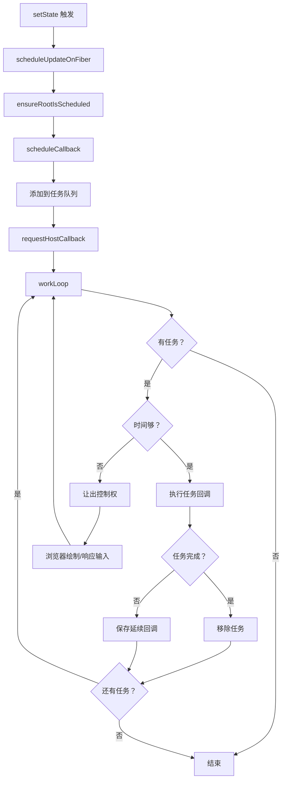

# 任务调度与时间切片实现

时间切片（Time Slicing）是 React 18 并发渲染的核心机制，允许 React 将渲染任务分割成多个小块，轮流执行。

## 📦 模块位置

```
packages/react-reconciler/src/
├── ReactFiberWorkLoop.js    # 工作循环
└── Scheduler.js             # 调度器（fork 自 scheduler 包）
```

## 🔍 核心概念

### 什么是时间切片

```
传统渲染（React 17 及之前）：
├──────────────────────────────┤
│        不可中断的渲染          │ 100ms
└──────────────────────────────┘
  阻塞用户交互 ❌

时间切片（React 18）：
├────┤  ├────┤  ├────┤  ├────┤
│渲染│  │响应│  │渲染│  │响应│ 5ms 一片
└────┘  └────┘  └────┘  └────┘
  可以暂停，响应用户 ✅
```

### 工作时间限制

```javascript
// 默认时间切片限制
const DEFAULT_TIMEOUT_INTERVAL = 5;  // 5ms
const MAX_PAYLOAD_SIZE = 1024 * 1024;

// 每一帧的工作时间
const frameInterval = 5;  // 约 120fps
```

## 🔬 Scheduler 实现

### 调度器入口

```javascript
// packages/scheduler/src/Scheduler.js

function unstable_scheduleCallback(priorityLevel, callback, options) {
  const currentTime = exports.unstable_now();
  
  letstartTime;
  let timeout;
  
  // 根据优先级设置超时时间
  switch (priorityLevel) {
    case ImmediatePriority:
      timeout = IMMEDIATE_PRIORITY_TIMEOUT;  // -1 (立即)
      break;
    case UserBlockingPriority:
      timeout = USER_BLOCKING_PRIORITY_TIMEOUT;  // 250ms
      break;
    case NormalPriority:
      timeout = NORMAL_PRIORITY_TIMEOUT;  // 5000ms
      break;
    case LowPriority:
      timeout = LOW_PRIORITY_TIMEOUT;  // 10000ms
      break;
    case IdlePriority:
      timeout = IDLE_PRIORITY_TIMEOUT;  // MAX_SAFE_INTEGER
      break;
    default:
      timeout = NORMAL_PRIORITY_TIMEOUT;
  }
  
  // 计算过期时间
  const expirationTime = startTime + timeout;
  
  // 创建任务
  const task = {
    id: taskIdCounter++,
    callback,
    priorityLevel,
    startTime,
    expirationTime,
    timerNode: null,
  };
  
  // 添加到任务队列
  push(task);
  
  // 检查是否需要立即执行
  if (!isHostCallbackScheduled && !isPerformingWork) {
    isHostCallbackScheduled = true;
    requestHostCallback(flushWork);
  }
  
  return task;
}
```

### 优先级定义

```javascript
// 优先级常量
const ImmediatePriority = 1;     // 立即执行
const UserBlockingPriority = 2;  // 用户阻塞（输入）
const NormalPriority = 3;       // 默认
const LowPriority = 4;          // 低优先级
const IdlePriority = 5;         // 空闲

// 优先级到 Lane 的映射
function priorityToLane(priority: Priority): Lane {
  switch (priority) {
    case ImmediatePriority:
      return SyncLane;
    case UserBlockingPriority:
      return InputContinuousLane;
    case NormalPriority:
      return DefaultLane;
    case LowPriority:
      return TransitionLane;
    case IdlePriority:
      return IdleLane;
    default:
      return DefaultLane;
  }
}
```

## 🔄 工作循环

### workLoop

```javascript
// packages/scheduler/src/Scheduler.js

function workLoop(hasTimeRemaining, initialTime) {
  let currentTime = initialTime;
  
  // 1. 推进时间
  advanceTimers(currentTime);
  
  // 2. 获取最高优先级的任务
  currentTask = peek(taskQueue);
  
  while (currentTask !== null) {
    // 3. 检查是否过期
    if (currentTask.expirationTime > currentTime && (!hasTimeRemaining || shouldYieldToHost())) {
      // 时间到了，让出控制权
      break;
    }
    
    // 4. 执行任务回调
    const callback = currentTask.callback;
    
    if (typeof callback === 'function') {
      currentTask.callback = null;
      
      // 5. 执行并获取下一优先级
      const continuationCallback = callback();
      
      // 6. 如果有延续回调，重新调度
      if (typeof continuationCallback === 'function') {
        currentTask.callback = continuationCallback;
      } else {
        // 任务完成
        if (currentTask === peek(taskQueue)) {
          pop(taskQueue);
        }
      }
    } else {
      pop(taskQueue);
    }
    
    // 7. 获取下一个任务
    currentTask = peek(taskQueue);
    
    // 8. 检查时间
    currentTime = exports.unstable_now();
    
    // 检查是否需要让出
    if (shouldYieldToHost()) {
      // 时间切片到了，让出控制权给浏览器
      break;
    }
  }
  
  // 9. 如果还有任务，继续调度
  if (currentTask !== null) {
    requestHostCallback(workLoop);
  } else {
    isHostCallbackScheduled = false;
  }
}
```

### shouldYieldToHost

```javascript
// 检查是否应该让出控制权给浏览器

function shouldYieldToHost() {
  // 1. 检查是否超过时间限制
  const timeElapsed = exports.unstable_now() - startTime;
  
  if (timeElapsed >= frameInterval) {
    // 超过 5ms，让出
    return true;
  }
  
  // 2. 检查是否有高优先级任务
  const highestPriorityTask = peek(taskQueue);
  
  if (highestPriorityTask !== null) {
    const currentPriority = currentTask.priorityLevel;
    const highestPriority = highestPriorityTask.priorityLevel;
    
    // 有高优先级任务，让出
    if (highestPriority < currentPriority) {
      return true;
    }
  }
  
  // 3. 检查浏览器输入
  if (shouldYieldToHostUsingInput()) {
    return true;
  }
  
  // 4. 检查主线程是否忙
  if (isInputPending()) {
    return true;
  }
  
  // 不让出，继续执行
  return false;
}
```

## 🔬 React 中的集成

### performConcurrentWorkOnRoot

```javascript
// packages/react-reconciler/src/ReactFiberWorkLoop.js

function performConcurrentWorkOnRoot(root, didTimeout) {
  // 1. 记录开始时间
  const originalCallbackNode = root.callbackNode;
  
  // 2. 检查是否有过期任务
  const didFlushPassiveEffects = flushPassiveEffects();
  
  if (didFlushPassiveEffects) {
    // 有副作用需要处理，重新调度
    return performConcurrentWorkOnRoot.bind(null, root);
  }
  
  // 3. 开始工作
  let expirationTime = root.nextExpirationTimeToWorkOn;
  
  // 4. 检查工作是否完成
  const workExit = performUnitOfWork();
  
  if (workExit !== null) {
    // 5. 工作未完成，检查是否需要让出
    if (shouldYield()) {
      // 时间切片，让出控制权
      return performConcurrentWorkOnRoot.bind(null, root);
    }
    
    // 6. 继续工作
    return performConcurrentWorkOnRoot(root, false);
  }
  
  // 7. 工作完成，提交
  return finishConcurrentRender(root, workExit, expirationTime);
}
```

### scheduleUpdateOnFiber

```javascript
// 调度更新

function scheduleUpdateOnFiber(
  fiber: Fiber,
  lane: Lane,
): FiberRoot | null {
  const root = enqueueUpdate(fiber, lane);
  
  if (root !== null) {
    // 标记更新
    markUpdateLaneFromFiberToRoot(root, fiber, lane);
    
    // 调度根
    ensureRootIsScheduled(root);
  }
}

function ensureRootIsScheduled(root: FiberRoot) {
  const newCallbackNode = scheduleCallback(
    schedulerPriorityLevel,
    performConcurrentWorkOnRoot.bind(null, root)
  );
  
  root.callbackNode = newCallbackNode;
}
```

## 📊 完整流程图



## 💡 实战技巧

### 1. 使用 transition 触发时间切片

```jsx
function SearchResults() {
  const [query, setQuery] = useState('');
  const [results, setResults] = useState([]);
  const [isPending, startTransition] = useTransition();
  
  function handleChange(e) {
    const nextQuery = e.target.value;
    setQuery(nextQuery);  // 紧急：输入框立即更新
    
    // 非紧急：结果可以延迟
    startTransition(() => {
      const filtered = expensiveFilter(items, nextQuery);
      setResults(filtered);
      // 这个更新会被时间切片分割
    });
  }
  
  return (
    <>
      <input value={query} onChange={handleChange} />
      {isPending && <Loading />}
      <List items={results} />
    </>
  );
}
```

### 2. 配合 useDeferredValue

```jsx
function ExpensiveList({ items }) {
  // 延迟渲染，触发时间切片
  const deferredItems = useDeferredValue(items);
  
  return (
    <ul>
      {deferredItems.map(item => (
        <li key={item.id}>{item.name}</li>
      ))}
    </ul>
  );
}
```

### 3. 大量列表渲染

```jsx
function LargeList({ items }) {
  // 使用虚拟滚动 + 时间切片
  const visibleItems = useVisibleItems(items);
  
  return (
    <div>
      {visibleItems.map(item => (
        <ListItem key={item.id} item={item} />
      ))}
    </div>
  );
}

// useVisibleValue 内部使用 useDeferredValue 实现时间切片
```

### 4. 自定义调度

```jsx
// 模拟时间切片的自定义 Hook
function useTimeSlicedRender(renderFn) {
  const [isComplete, setIsComplete] = useState(false);
  const [result, setResult] = useState(null);
  
  useEffect(() => {
    let cancelled = false;
    
    async function render() {
      const items = [];
      const chunkSize = 100;
      
      for (let i = 0; i < data.length; i += chunkSize) {
        if (cancelled) return;
        
        // 时间切片：每批渲染后让出
        await new Promise(resolve => setTimeout(resolve, 0));
        
        const chunk = data.slice(i, i + chunkSize);
        items.push(...chunk.map(renderFn));
        setResult([...items]);
      }
      
      setIsComplete(true);
    }
    
    render();
    
    return () => {
      cancelled = true;
    };
  }, []);
  
  return { isComplete, result };
}
```

## ⚠️ 注意事项

### 1. 时间切片不是银弹

```jsx
// ❌ 不推荐：过度依赖时间切片
function BadExample() {
  // 应该优化算法，而不是依赖时间切片
  const result = useMemo(() => 
    expensiveCalculation(data),  // 100ms
    [data]
  );
}

// ✅ 推荐：优化 + 时间切片
function GoodExample() {
  const deferredData = useDeferredValue(data);
  const result = useMemo(() => 
    expensiveCalculation(deferredData),  // 可被中断
    [deferredData]
  );
}
```

### 2. 时间切片的成本

```
时间切片开销：

每次让出/恢复都有开销：
- 保存执行上下文
- 调度器检查
- 任务队列管理

建议：
- 耗时 > 50ms 的任务考虑时间切片
- 耗时 < 10ms 的任务直接用同步渲染
```

### 3. 调试时间切片

```javascript
// React DevTools Profiler 可以观察时间切片
// 查看 "Self Time" 和 "Render Time"

// 手动追踪
performance.mark('render-start');
// ... 渲染
performance.mark('render-end');
performance.measure('render', 'render-start', 'render-end');
```

## 🔬 调试技巧

### 追踪时间切片

```javascript
// 开发模式下添加日志
const originalWorkLoop = workLoop;
workLoop = function(hasTimeRemaining, initialTime) {
  const startTime = performance.now();
  
  console.log('workLoop started', {
    hasTimeRemaining,
    taskQueueLength: taskQueue.length,
  });
  
  const result = originalWorkLoop(hasTimeRemaining, initialTime);
  
  const duration = performance.now() - startTime;
  console.log('workLoop completed', { duration });
  
  return result;
};
```

### 可视化渲染时间

```jsx
function RenderTime({ children, label }) {
  useEffect(() => {
    const start = performance.now();
    return () => {
      const duration = performance.now() - start;
      console.log(`${label} rendered in ${duration.toFixed(2)}ms`);
    };
  }, [label]);
  
  return children;
}

// 使用
<RenderTime label="ExpensiveComponent">
  <ExpensiveComponent />
</RenderTime>
```

## 🐛 常见问题

### Q: 时间切片会影响性能吗？

**A**: 轻微。每次让出/恢复有约 0.1-0.5ms 开销，但换来的是更好的用户体验。

### Q: 如何知道是否需要时间切片？

**A**: 使用 React DevTools Profiler 观察渲染时间。单帧 > 16ms（60fps）或 > 50ms 时考虑时间切片。

### Q: 时间切片和 Web Worker 有什么区别？

**A**: 时间切片在主线程执行，可以被中断；Web Worker 在后台线程，不能直接操作 DOM。

---

## 📖 下一步

- [Error Boundaries 实现](./error-boundaries)