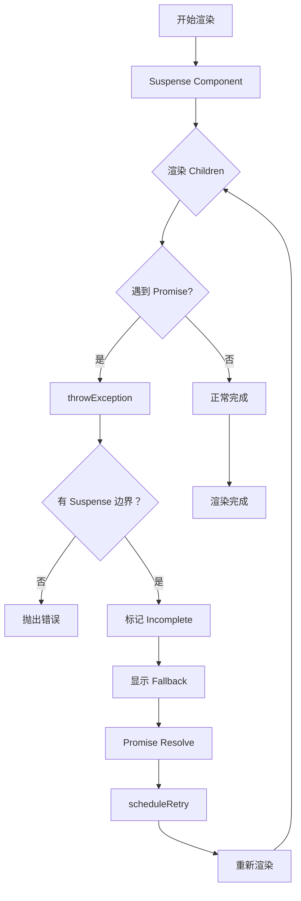

# Suspense 实现

Suspense 是 React 处理异步加载的核心组件，支持懒加载、代码分割和数据获取的优雅降级。

## 📦 模块位置

```
packages/react-reconciler/src/
├── ReactFiberSuspenseComponent.js  # Suspense Fiber 定义
├── ReactFiberSuspenseWorkLoop.js   # Suspense 调度逻辑
└── ReactFiberThrow.js              # 异常处理（throw promise）
```

## 🔍 数据结构

### SuspenseComponent

```javascript
// packages/react-reconciler/src/ReactFiberSuspenseComponent.js

type SuspenseState = {
  // 当前的 fallback 状态
  dehydrated: null | SuspenseInstance,
  retryLane: Lane,  // 重试时的优先级
  pollingMs: number, // 轮询间隔（用于过期回退）
};

type SuspenseInstance = {
  // SSR hydration 相关
  data: any,
};
```

### Suspense Fiber Tag

```javascript
// Fiber tag 定义
const SuspenseComponent = 13;

// 内部标志
const DidCapture = 0b00000000000000000000000000001000;  // 已捕获 fallback
const Incomplete = 0b00000000000000000000000010000000;   // 未完成
```

## 🔬 Suspense 组件结构

```jsx
<Suspense fallback={<Loading />}>
  <LazyComponent />
</Suspense>

// 内部结构
{
  tag: SuspenseComponent,
  memoizedProps: {
    fallback: <Loading />,
    children: <LazyComponent />,
  },
  memoizedState: {
    dehydrated: null,
    retryLane: OffscreenLane,
  },
}
```

## 🔬 核心流程

### beginWork 中的 Suspense 处理

```javascript
// packages/react-reconciler/src/ReactFiberBeginWork.js

function beginWork(current, workInProgress, renderLanes) {
  switch (workInProgress.tag) {
    case SuspenseComponent: {
      return updateSuspenseComponent(
        current,
        workInProgress,
        renderLanes
      );
    }
  }
}
```

### updateSuspenseComponent

```javascript
// packages/react-reconciler/src/ReactFiberSuspenseWorkLoop.js

function updateSuspenseComponent(
  current: Fiber | null,
  workInProgress: Fiber,
  renderLanes: Lanes,
) {
  // 1. 检查是否有已捕获的状态
  const currentState = workInProgress.memoizedState;
  
  if (currentState !== null) {
    // 2. 当前显示 fallback
    return updateSuspenseFallbackComponent(
      current,
      workInProgress,
      renderLanes
    );
  } else {
    // 3. 正常渲染 children
    return updateSuspensePrimaryChildren(
      current,
      workInProgress,
      renderLanes
    );
  }
}
```

### updateSuspensePrimaryChildren

```javascript
function updateSuspensePrimaryChildren(
  current: Fiber | null,
  workInProgress: Fiber,
  renderLanes: Lanes,
) {
  // 1. 获取 children
  const nextChildren = workInProgress.pendingProps.children;
  
  // 2. 包裹在隐藏模式下（可能 Suspense 会触发）
  const nextPrimaryChildren = reconcileChildFibers(
    workInProgress,
    current?.child,
    nextChildren,
    renderLanes
  );
  
  // 3. 设置 completeWork
  workInProgress.stateNode = null;
  
  return nextPrimaryChildren;
}
```

## 🔄 异步加载流程

### Thenable / Promise 处理

```javascript
// packages/react-reconciler/src/ReactFiberThrow.js

function throwException(
  root: FiberRoot,
  returnFiber: Fiber,
  sourceFiber: Fiber,
  value: mixed,
  rootRenderLanes: Lanes,
): void {
  // 1. 检查是否是 Promise/Thenable
  if (value !== null && typeof value === 'object') {
    if (typeof value.then === 'function') {
      // 2. 这是 Thenable，进入 Suspense 流程
      wakeables.add(value);
      
      // 3. 找到最近的 Suspense 边界
      const suspenseBoundary = getNearestSuspenseBoundary(returnFiber);
      
      if (suspenseBoundary !== null) {
        // 4. 标记 Suspense 为 Incomplete
        suspenseBoundary.flags |= Incomplete;
        
        // 5. 设置重试 lane
        suspenseBoundary.memoizedState = {
          dehydrated: null,
          retryLane: OffscreenLane,
        };
        
        // 6. 捕获 fallback
        captureSuspenseBoundary(suspenseBoundary);
        
        return;
      }
    }
  }
  
  // 没有 Suspense 边界，抛出错误
  throw value;
}
```

### captureSuspenseBoundary

```javascript
// 捕获 Suspense 边界（显示 fallback）

function captureSuspenseBoundary(suspenseBoundary) {
  // 1. 标记为已捕获
  suspenseBoundary.flags |= DidCapture;
  
  // 2. 更新 state
  suspenseBoundary.memoizedState = {
    dehydrated: null,
    retryLane: OffscreenLane,
  };
  
  // 3. 创建 fallback 子树
  const fallbackChildren = suspenseBoundary.pendingProps.fallback;
  suspenseBoundary.child = createFiberFromFragment(
    fallbackChildren,
    suspenseBoundary.mode,
    NoLanes,
  );
}
```

### 重试机制

```javascript
// packages/react-reconciler/src/ReactFiberSuspenseWorkLoop.js

function retryDehydratedSuspenseBoundary(suspenseBoundary) {
  // 1. 清除捕获状态
  suspenseBoundary.flags &= ~DidCapture;
  
  // 2. 清空 memoizedState
  suspenseBoundary.memoizedState = null;
  
  // 3. 重新调度渲染
  const root = markUpdateLaneFromFiberToRoot(suspenseBoundary);
  scheduleUpdateOnFiber(suspenseBoundary, OffscreenLane);
}

// 当 Promise resolve 时调用
function onResolve() {
  // 队列中的重试
  const retryQueue = suspenseBoundary.updateQueue;
  if (retryQueue !== null) {
    retryQueue.forEach(retry => retry());
  }
}
```

## 📊 完整流程图



## 💡 实战技巧

### 1. 基本使用

```jsx
// 代码分割
const LazyComponent = React.lazy(() => import('./HeavyComponent'));

function App() {
  return (
    <Suspense fallback={<LoadingSpinner />}>
      <LazyComponent />
    </Suspense>
  );
}
```

### 2. 嵌套 Suspense

```jsx
// 多个 Suspense 边界
function App() {
  return (
    <Suspense fallback={<PageLoading />}>
      <Header />
      
      <Suspense fallback={<SidebarLoading />}>
        <Sidebar />
      </Suspense>
      
      <Suspense fallback={<ContentLoading />}>
        <MainContent />
      </Suspense>
    </Suspense>
  );
}
```

### 3. 数据加载 Suspense

```jsx
// 配合 React Query / SWR
function UserProfile({ userId }) {
  // 这个方法会抛出 Promise
  const user = userResource.read({ userId });
  
  return <div>{user.name}</div>;
}

function App() {
  return (
    <Suspense fallback={<Loading />}>
      <UserProfile userId={123} />
    </Suspense>
  );
}

// Resource 实现
const userResource = {
  read({ userId }) {
    if (!cache.has(userId)) {
      // 抛出 Promise
      throw fetchUser(userId).then(data => {
        cache.set(userId, data);
      });
    }
    return cache.get(userId);
  },
};
```

### 4. 错误处理

```jsx
// 配合 Error Boundary
function App() {
  return (
    <ErrorBoundary fallback={<ErrorPage />}>
      <Suspense fallback={<Loading />}>
        <LazyComponent />
      </Suspense>
    </ErrorBoundary>
  );
}
```

## ⚠️ 注意事项

### 1. Suspense 必须在 Server Component 之上

```jsx
// ❌ 错误：顺序不对
<Suspense fallback={<Loading />}>
  <ServerComponent />  {/* 服务端组件应该包裹 Suspense */}
</Suspense>

// ✅ 正确
<ServerComponent>
  <Suspense fallback={<Loading />}>
    <ClientComponent />
  </Suspense>
</ServerComponent>
```

### 2. Lazy 组件必须在 Suspense 内部

```jsx
// ❌ 错误：没有 Suspense
const LazyComponent = React.lazy(() => import('./Component'));
<LazyComponent />  // 会抛出错误

// ✅ 正确
<Suspense fallback={<Loading />}>
  <LazyComponent />
</Suspense>
```

### 3. 避免不必要的嵌套

```jsx
// ❌ 不推荐：过多嵌套
<Suspense fallback={<Loading />}>
  <Suspense fallback={<Loading />}>
    <Component />
  </Suspense>
</Suspense>

// ✅ 推荐：单一边界
<Suspense fallback={<Loading />}>
  <Component />
</Suspense>
```

### 4. Fallback 状态持久化

```jsx
// fallback 会保持显示直到所有 Promise 完成
function App() {
  return (
    <Suspense fallback={<Loading />}>
      <ComponentA />  {/* 加载快 */}
      <ComponentB />  {/* 加载慢 */}
    </Suspense>
  );
}
// 即使 ComponentA 已完成，也会等 ComponentB
```

## 🔬 调试技巧

### 追踪 Suspense 状态

```javascript
// 开发模式下添加日志
const originalUpdateSuspense = updateSuspenseComponent;
updateSuspenseComponent = function(current, workInProgress, renderLanes) {
  console.group('updateSuspenseComponent');
  console.log('Current state:', current?.memoizedState);
  console.log('Props:', workInProgress.pendingProps);
  
  const result = originalUpdateSuspense(current, workInProgress, renderLanes);
  
  console.log('Result state:', workInProgress.memoizedState);
  console.groupEnd();
  
  return result;
};
```

### 观察 Promise 状态

```javascript
// 追踪 Promise 创建和 resolve
const originalThen = Promise.prototype.then;
Promise.prototype.then = function(onFulfilled, onRejected) {
  console.log('Promise.then called');
  
  const wrappedOnFulfilled = (value) => {
    console.log('Promise resolved:', value);
    return onFulfilled(value);
  };
  
  return originalThen.call(this, wrappedOnFulfilled, onRejected);
};
```

## 🐛 常见问题

### Q: Suspense 怎么处理多个 Promise？

**A**: Suspense 会等待最近的 Promise 完成。嵌套的 Suspense 边界允许分阶段显示内容。

### Q: Lazy 组件可以放在 Suspense 外面吗？

**A**: 不可以。Lazy 组件必须包裹在 Suspense 内，否则会抛出错误。

### Q: Suspense 在 SSR 中如何工作？

**A**: 
1. 服务端：Suspense 会 "dehydrate" 加载状态
2. 客户端：hydration 后继续等待 Promise

```jsx
// 服务端
Suspense fallback={<Loading />}>
  {/* 服务端可能不渲染子内容 */}
</Suspense>

// 客户端 hydration 后继续等待
```

### Q: 如何手动触发 Suspense 重试？

**A**: Promise resolve 后 React 会自动重试。也可以通过 `startTransition` 触发重新渲染。

---

## 📖 下一步

- [Lazy Loading 实现](./lazy)
- [Error Boundaries 实现](./error-boundaries)