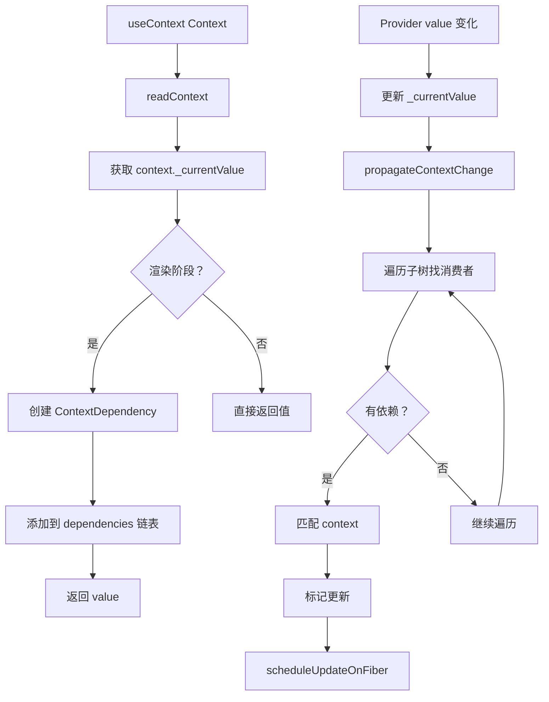

# useContext 实现

useContext 是 React Context API 的 Hook 形式，用于消费 Context 值。

## 📦 模块位置

```
packages/react-reconciler/src/
├── ReactFiberHooks.js       # useContext Hook 实现
└── ReactFiberNewContext.js  # Context 核心逻辑
```

## 🔍 数据结构

### Context 对象

```javascript
// packages/react-reconciler/src/ReactFiberNewContext.js

type ReactContext<T> = {
  $$typeof: symbol,
  _currentValue: T,           // 当前值
  _currentValue2: T,          // 双缓冲（并发渲染）
  _threadCount: number,       // 线程计数
  Provider: ReactProviderType<T>,
  Consumer: ReactContext<T>,
};
```

### Provider

```javascript
type ReactProviderType<T> = {
  $$typeof: symbol,
  _context: ReactContext<T>,
};

// JSX 中使用时
<Context.Provider value={value}>
  {children}
</Context.Provider>
```

### Context Dependency

```javascript
// Hook 中存储的依赖
type ContextDependency = {
  context: ReactContext<any>,
  observedBits: number,
  next: ContextDependency<any>,
};
```

## 🔬 useContext 实现

### readContext

```javascript
// packages/react-reconciler/src/ReactFiberNewContext.js

function readContext<T>(context: Context<T>): T {
  // 1. 检查是否在渲染阶段
  if (didReceiveUpdate) {
    // 优化：检查是否需要更新
    const slotIndex = context.$$id % MAX_CONTEXT_SLOTS;
    const previousValue = currentlyRenderingFiber.slots[slotIndex];
    
    if (previousValue !== null) {
      // 检查值是否变化
      const newValue = context._currentValue;
      if (!Object.is(previousValue, newValue)) {
        markWorkInProgressReceivedUpdate();
      }
    }
  }
  
  // 2. 读取当前值
  const value = context._currentValue;
  
  // 3. 记录依赖（用于更新时触发重新渲染）
  if (isDisallowedContextReadInDEV) {
    // DEV only warning
  }
  
  // 4. 添加依赖到 fiber
  if (currentlyRenderingFiber !== null) {
    // 创建依赖对象
    const contextItem = {
      context: context,
      observedBits: ObservedBits.all,
      next: null,
    };
    
    // 添加到 dependencies 链表
    if (currentlyRenderingFiber.dependencies === null) {
      currentlyRenderingFiber.dependencies = {
        lanes: NoLanes,
        firstContext: contextItem,
      };
    } else {
      // 连接到链表末尾
      const last = currentlyRenderingFiber.dependencies.lastContext;
      if (last === null) {
        currentlyRenderingFiber.dependencies.firstContext = contextItem;
      } else {
        last.next = contextItem;
      }
      currentlyRenderingFiber.dependencies.lastContext = contextItem;
    }
  }
  
  return value;
}
```

### useContext Hook

```javascript
// packages/react-reconciler/src/ReactFiberHooks.js

function useContext<T>(
  Context: Context<T>,
  observedBits: void | number,
): T {
  // 1. 标记需要重新渲染的 lanes
  if (disableSchedulerTimeoutInWorkLoop) {
    markWorkInProgressReceivedUpdate();
  }
  
  // 2. 调用 readContext
  if (currentlyRenderingFiber !== null) {
    // 确保在渲染阶段调用
    return readContext(Context, observedBits);
  } else {
    // 非渲染阶段（如事件处理）
    return Context._currentValue;
  }
}
```

## 🔄 Context 更新流程

### Context 值变化

```javascript
// packages/react-react/src/ReactContext.js

// Provider 渲染时更新值
function updateContextProvider(providerType, newProps) {
  const context = providerType._context;
  const newValue = newProps.value;
  
  // 更新当前值
  context._currentValue = newValue;
  context._currentValue2 = newValue;
}
```

### 消费者更新

```javascript
// packages/react-reconciler/src/ReactFiberNewContext.js

function propagateContextChange<T>(
  workInProgress: Fiber,
  context: Context<T>,
  renderLanes: Lanes,
): void {
  // 1. 找到第一个消费者
  let fiber = workInProgress.child;
  
  if (fiber !== null) {
    fiber.return = workInProgress;
  }
  
  // 2. 遍历子树，找到所有消费者
  while (fiber !== null) {
    let childFiber = fiber.child;
    
    // 3. 检查是否有 Context 依赖
    if (fiber.dependencies !== null) {
      const dependencies = fiber.dependencies;
      const firstContext = dependencies.firstContext;
      
      if (firstContext !== null) {
        // 4. 遍历依赖链表
        let contextItem = firstContext;
        while (contextItem !== null) {
          // 5. 检查是否是变化的 Context
          if (contextItem.context === context) {
            // 标记需要更新
            markUpdateLaneFromFiberToRoot(fiber, renderLanes);
            
            // 创建新的 workInProgress
            if (fiber.alternate === null) {
              fiber.alternate = createWorkInProgress(fiber, fiber.pendingProps);
            }
            
            // 标记更新
            fiber.flags |= (Placement | Update);
            
            break;
          }
          contextItem = contextItem.next;
        }
      }
    }
    
    // 6. 继续遍历
    if (childFiber !== null) {
      childFiber.return = fiber;
      fiber = childFiber;
    } else {
      // 向上回溯
      while (fiber !== workInProgress) {
        let sibling = fiber.sibling;
        if (sibling !== null) {
          sibling.return = fiber.return;
          fiber = sibling;
          break;
        }
        fiber = fiber.return;
      }
      
      if (fiber === workInProgress) {
        break;
      }
    }
  }
}
```

## 📊 完整流程图



## 💡 实战技巧

### 1. 基本使用

```jsx
// 创建 Context
const ThemeContext = React.createContext('light');

// Provider
function App() {
  const [theme, setTheme] = useState('light');
  
  return (
    <ThemeContext.Provider value={theme}>
      <Toolbar />
    </ThemeContext.Provider>
  );
}

// Consumer
function Toolbar() {
  const theme = useContext(ThemeContext);
  return <div className={theme}>Toolbar</div>;
}
```

### 2. 多个 Context

```jsx
function Component() {
  const theme = useContext(ThemeContext);
  const user = useContext(UserContext);
  const locale = useContext(LocaleContext);
  
  // 任何一个变化都会触发重新渲染
  return <div>{user.name} - {theme} - {locale}</div>;
}
```

### 3. 避免不必要的渲染

```jsx
// ❌ 不推荐：整个组件重新渲染
function ExpensiveComponent() {
  const theme = useContext(ThemeContext);
  const user = useContext(UserContext);
  
  // theme 或 user 变化都会重新渲染
  return <div>{user.name} - {theme}</div>;
}

// ✅ 推荐：拆分组件
function ExpensiveComponent() {
  return (
    <>
      <ThemePart />
      <UserPart />
    </>
  );
}

function ThemePart() {
  const theme = useContext(ThemeContext);
  return <div>{theme}</div>;
}

function UserPart() {
  const user = useContext(UserContext);
  return <div>{user.name}</div>;
}
```

### 4. Context + useReducer

```jsx
const StateContext = React.createContext(null);
const DispatchContext = React.createContext(null);

function reducer(state, action) {
  switch (action.type) {
    case 'increment':
      return { count: state.count + 1 };
    default:
      return state;
  }
}

function App() {
  const [state, dispatch] = useReducer(reducer, { count: 0 });
  
  return (
    <StateContext.Provider value={state}>
      <DispatchContext.Provider value={dispatch}>
        <Counter />
      </DispatchContext.Provider>
    </StateContext.Provider>
  );
}

function Counter() {
  const state = useContext(StateContext);
  const dispatch = useContext(DispatchContext);
  
  return (
    <button onClick={() => dispatch({ type: 'increment' })}>
      Count: {state.count}
    </button>
  );
}
```

## ⚠️ 注意事项

### 1. Provider 值变化

```jsx
// ❌ 错误：每次渲染都创建新对象
function App() {
  return (
    <Context.Provider value={{ count: 0 }}>
      <Child />
    </Context.Provider>
  );
}
// Child 每次都重新渲染

// ✅ 正确：使用 useMemo
function App() {
  const value = useMemo(() => ({ count: 0 }), []);
  
  return (
    <Context.Provider value={value}>
      <Child />
    </Context.Provider>
  );
}
```

### 2. Context 默认值

```jsx
// 默认值只在没有 Provider 时使用
const MyContext = createContext('default');

function App() {
  // value 为 null 时，useContext 返回 'default'
  return (
    <MyContext.Provider value={null}>
      <Child />
    </MyContext.Provider>
  );
}
```

### 3. Context 性能

```
Context 更新传播：

Provider
│
├─ Child1 (有依赖) ⚡ 更新
├─ Child2 (无依赖) ⏭️ 跳过
│  ├─ GrandChild (有依赖) ⚡ 更新
│  └─ GrandChild2 (无依赖) ⏭️ 跳过
└─ Child3 (有依赖) ⚡ 更新

只有依赖该 Context 的组件会更新
```

## 🔬 深度解析

### Context 依赖收集

```javascript
// Fiber 的 dependencies 结构

fiber.dependencies = {
  lanes: NoLanes,           // 待处理的更新
  firstContext: {           // 第一个依赖
    context: ThemeContext,
    observedBits: 0b11,
    next: {
      context: UserContext,
      observedBits: 0b11,
      next: null
    }
  },
  lastContext: ...          // 最后一个依赖
};
```

### observedBits（已废弃）

```javascript
// React 16.x 的位掩码优化（已废弃）
const theme = useContext(ThemeContext, 0b01);  // 只监听特定位

// React 17+ 不再支持
const theme = useContext(ThemeContext);  // 总是监听全部
```

## 🔬 调试技巧

### 追踪 Context 依赖

```javascript
// 开发模式下添加日志
const originalReadContext = readContext;
readContext = function(context, observedBits) {
  console.group('readContext');
  console.log('Context:', context.displayName || 'Anonymous');
  console.log('Component:', currentlyRenderingFiber.type?.name);
  
  const value = originalReadContext(context, observedBits);
  
  console.log('Value:', value);
  console.groupEnd();
  
  return value;
};
```

### 观察 Context 传播

```javascript
// 追踪 propagateContextChange
const originalPropagate = propagateContextChange;
propagateContextChange = function(workInProgress, context, renderLanes) {
  console.group('propagateContextChange');
  console.log('Context:', context.displayName);
  console.log('Provider:', workInProgress.type?.name);
  console.log('Lanes:', renderLanes);
  
  const result = originalPropagate(workInProgress, context, renderLanes);
  
  console.groupEnd();
  return result;
};
```

## 🐛 常见问题

### Q: Context 和 Props 有什么区别？

**A**:
- Props：显式传递，层级清晰
- Context：隐式传递，适合全局状态

```jsx
// Props（显式）
<App>
  <Toolbar theme="dark">
    <Button theme="dark" />
  </Toolbar>
</App>

// Context（隐式）
<ThemeContext.Provider value="dark">
  <App>
    <Toolbar>
      <Button />
    </Toolbar>
  </App>
</ThemeContext.Provider>
```

### Q: 如何避免 Context 导致的过度渲染？

**A**:
1. 拆分 Context（不要把所有状态放一个 Context）
2. 拆分组件（只让需要的部分消费 Context）
3. 使用 useMemo 缓存值

```jsx
// ✅ 拆分 Context
const ThemeContext = createContext();
const UserContext = createContext();

const theme = useContext(ThemeContext);  // 只响应 theme 变化
const user = useContext(UserContext);     // 只响应 user 变化
```

### Q: useContext 和 Context.Consumer 有什么区别？

**A**: 功能相同，useContext 更简洁。

```jsx
// useContext
const value = useContext(Context);

// Context.Consumer
<Context.Consumer>
  {value => <Child value={value} />}
</Context.Consumer>
```

---

## 📖 下一步

- [useTransition 实现](./use-transition)
- [useId 实现](./use-id)