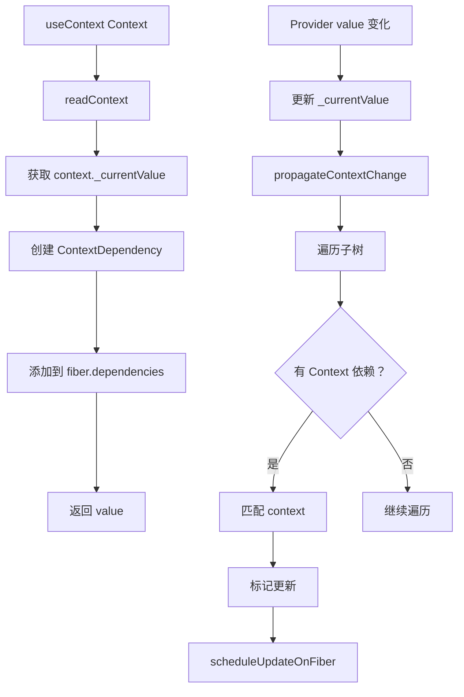

# useContext 实现

useContext 是 React Context API 的 Hook 形式，用于消费 Context 值。它通过依赖收集机制实现高效的更新传播。

## 📦 模块位置

```
packages/react-reconciler/src/
├── ReactFiberHooks.js       # useContext Hook 实现
└── ReactFiberNewContext.js  # Context 核心逻辑
```

## 🔍 数据结构

### Context 对象

```javascript
// packages/react-reconciler/src/ReactFiberNewContext.js

type ReactContext<T> = {
  $$typeof: symbol,
  _currentValue: T,           // 当前值（当前渲染树）
  _currentValue2: T,          // 当前值（备用渲染树，用于并发）
  _threadCount: number,       // 并发线程计数
  Provider: ReactProviderType<T>,
  Consumer: ReactContext<T>,
  _currentRenderer?: Object | null,   // 渲染器标识
  _currentRenderer2?: Object | null,  // 备用渲染器标识
};

// Provider 类型
type ReactProviderType<T> = {
  $$typeof: symbol,
  _context: ReactContext<T>,
};
```

### Context Dependency

```javascript
// Hook 中存储的依赖
type ContextDependency<T> = {
  context: ReactContext<T>,
  observedBits: number,      // 已废弃，始终为全量
  next: ContextDependency<T>,
};

// Fiber 的 dependencies 结构
type Dependencies = {
  lanes: Lanes,              // 待处理的更新车道
  firstContext: ContextDependency<mixed> | null,  // 第一个依赖
};
```

## 🔬 useContext 实现

### readContext（核心读取逻辑）

```javascript
// packages/react-reconciler/src/ReactFiberNewContext.js

function readContext<T>(
  context: ReactContext<T>,
  observedBits: void | number,
): T {
  // 1. 获取当前渲染的 Fiber
  const fiber = currentlyRenderingFiber;
  
  if (fiber === null) {
    // 非渲染阶段（如事件处理）
    return context._currentValue;
  }
  
  // 2. 读取当前值
  const value = context._currentValue;
  
  // 3. 创建依赖记录（用于更新时触发重新渲染）
  const contextItem: ContextDependency<T> = {
    context,
    observedBits: MAX_SIGNED_31_BIT_INT,  // React 17+ 不再使用位掩码
    next: null,
  };
  
  // 4. 添加到 dependencies 链表
  if (fiber.dependencies === null) {
    fiber.dependencies = {
      lanes: NoLanes,
      firstContext: contextItem,
    };
  } else {
    // 添加到链表末尾
    let last = fiber.dependencies.firstContext;
    while (last.next !== null) {
      last = last.next;
    }
    last.next = contextItem;
  }
  
  return value;
}
```

### useContext Hook 实现

```javascript
// packages/react-reconciler/src/ReactFiberHooks.js

function useContext<T>(
  Context: ReactContext<T>,
  observedBits: void | number,
): T {
  // 1. 验证参数（开发模式）
  if (__DEV__) {
    if (observedBits !== undefined) {
      console.error(
        'useContext() second argument is reserved for future use in React. ' +
          'Passing it is not supported. ' +
          'You passed: %s.%s',
        observedBits,
        typeof observedBits === 'number' && Array.isArray(arguments[2])
          ? '\n\nDid you call array.map(useContext)? ' +
              'Calling Hooks inside a loop is not supported. ' +
              'Learn more at https://react.dev/link/rules-of-hooks'
          : '',
      );
    }
  }
  
  // 2. 调用 readContext 读取值并记录依赖
  return readContext(Context, observedBits);
}
```

## 🔄 Context 更新流程

### Provider 值更新

```javascript
// packages/react-reconciler/src/ReactFiberBeginWork.js

function updateContextProvider(
  current: Fiber | null,
  workInProgress: Fiber,
  renderLanes: Lanes,
) {
  const providerType: ReactProviderType<any> = workInProgress.type;
  const context: ReactContext<any> = providerType._context;
  const newProps = workInProgress.pendingProps;
  const newValue = newProps.value;
  
  // 1. 更新 Context 值
  context._currentValue = newValue;
  context._currentValue2 = newValue;
  
  // 2. 传播变化给所有消费者
  propagateContextChange(workInProgress, context, renderLanes);
  
  // 3. 继续渲染子节点
  const newChildren = newProps.children;
  reconcileChildren(current, workInProgress, newChildren, renderLanes);
}
```

### propagateContextChange（传播机制）

```javascript
// packages/react-reconciler/src/ReactFiberNewContext.js

function propagateContextChange<T>(
  workInProgress: Fiber,
  context: ReactContext<T>,
  renderLanes: Lanes,
): void {
  // 1. 从 Provider 的子节点开始遍历
  let fiber = workInProgress.child;
  if (fiber !== null) {
    fiber.return = workInProgress;
  }
  
  // 2. 深度优先遍历整个子树
  while (fiber !== null) {
    let nextFiber = null;
    
    // 3. 检查当前 Fiber 是否有 Context 依赖
    const dependencies = fiber.dependencies;
    if (dependencies !== null) {
      nextFiber = fiber.child;
      
      // 4. 遍历依赖链表
      let contextItem = dependencies.firstContext;
      while (contextItem !== null) {
        // 5. 检查是否是变化的 Context
        if (contextItem.context === context) {
          // 6. 标记需要更新
          markUpdateLaneFromFiberToRoot(fiber, renderLanes);
          
          // 7. 确保有 workInProgress
          if (fiber.alternate === null) {
            fiber.alternate = createWorkInProgress(fiber, fiber.pendingProps);
          }
          
          // 8. 标记更新标志
          fiber.flags |= UpdateEffect;
          
          // 9. 继续处理子节点
          break;
        }
        contextItem = contextItem.next;
      }
    }
    
    // 10. 继续遍历
    if (nextFiber !== null) {
      nextFiber.return = fiber;
      fiber = nextFiber;
    } else {
      // 向上回溯
      while (fiber !== workInProgress) {
        const sibling = fiber.sibling;
        if (sibling !== null) {
          sibling.return = fiber.return;
          fiber = sibling;
          break;
        }
        fiber = fiber.return;
      }
      
      if (fiber === workInProgress) {
        break;
      }
    }
  }
}
```

## 📊 完整流程图



## 💡 实战技巧

### 1. 基本使用

```jsx
// 创建 Context
const ThemeContext = React.createContext('light');

// Provider
function App() {
  const [theme, setTheme] = useState('light');
  
  return (
    <ThemeContext.Provider value={theme}>
      <Toolbar />
    </ThemeContext.Provider>
  );
}

// Consumer
function Toolbar() {
  const theme = useContext(ThemeContext);
  return <div className={theme}>Toolbar</div>;
}
```

### 2. 多个 Context

```jsx
function Component() {
  const theme = useContext(ThemeContext);
  const user = useContext(UserContext);
  const locale = useContext(LocaleContext);
  
  // 任何一个变化都会触发重新渲染
  return <div>{user.name} - {theme} - {locale}</div>;
}
```

### 3. 避免不必要的渲染

```jsx
// ❌ 不推荐：整个组件重新渲染
function ExpensiveComponent() {
  const theme = useContext(ThemeContext);
  const user = useContext(UserContext);
  
  // theme 或 user 变化都会重新渲染
  return <div>{user.name} - {theme}</div>;
}

// ✅ 推荐：拆分组件
function ExpensiveComponent() {
  return (
    <>
      <ThemePart />
      <UserPart />
    </>
  );
}

function ThemePart() {
  const theme = useContext(ThemeContext);
  return <div>{theme}</div>;
}

function UserPart() {
  const user = useContext(UserContext);
  return <div>{user.name}</div>;
}
```

### 4. Context + useReducer 模式

```jsx
const StateContext = React.createContext(null);
const DispatchContext = React.createContext(null);

function reducer(state, action) {
  switch (action.type) {
    case 'increment':
      return { count: state.count + 1 };
    case 'decrement':
      return { count: state.count - 1 };
    default:
      return state;
  }
}

function App() {
  const [state, dispatch] = useReducer(reducer, { count: 0 });
  
  return (
    <StateContext.Provider value={state}>
      <DispatchContext.Provider value={dispatch}>
        <Counter />
      </DispatchContext.Provider>
    </StateContext.Provider>
  );
}

function Counter() {
  const state = useContext(StateContext);
  const dispatch = useContext(DispatchContext);
  
  return (
    <div>
      <button onClick={() => dispatch({ type: 'decrement' })}>-</button>
      <span>{state.count}</span>
      <button onClick={() => dispatch({ type: 'increment' })}>+</button>
    </div>
  );
}
```

### 5. 性能优化模式

```jsx
// ✅ 拆分 Context 避免过度渲染
const ThemeContext = React.createContext();
const UserContext = React.createContext();

// ✅ 使用 useMemo 缓存 Provider 值
function App() {
  const [theme, setTheme] = useState('light');
  const [user, setUser] = useState({ name: 'John' });
  
  const themeValue = useMemo(() => ({ theme, setTheme }), [theme]);
  const userValue = useMemo(() => ({ user, setUser }), [user]);
  
  return (
    <ThemeContext.Provider value={themeValue}>
      <UserContext.Provider value={userValue}>
        <Content />
      </UserContext.Provider>
    </ThemeContext.Provider>
  );
}
```

## ⚠️ 注意事项

### 1. Provider 值变化

```jsx
// ❌ 错误：每次渲染都创建新对象
function App() {
  return (
    <Context.Provider value={{ count: 0 }}>
      <Child />
    </Context.Provider>
  );
}
// Child 每次都重新渲染

// ✅ 正确：使用 useMemo 或 useState
function App() {
  const [count, setCount] = useState(0);
  const value = useMemo(() => ({ count, setCount }), [count]);
  
  return (
    <Context.Provider value={value}>
      <Child />
    </Context.Provider>
  );
}
```

### 2. Context 默认值

```jsx
// 默认值只在没有 Provider 时使用
const MyContext = createContext('default');

function App() {
  // value 为 undefined 时，useContext 返回 'default'
  return (
    <MyContext.Provider value={undefined}>
      <Child />
    </MyContext.Provider>
  );
}
```

### 3. Context 性能陷阱

```jsx
// ❌ 错误：在 Provider 中直接创建函数
function App() {
  return (
    <Context.Provider value={{ onClick: () => {} }}>
      <Child />
    </Context.Provider>
  );
}

// ✅ 正确：使用 useCallback 或 useMemo
function App() {
  const onClick = useCallback(() => {}, []);
  const value = useMemo(() => ({ onClick }), [onClick]);
  
  return (
    <Context.Provider value={value}>
      <Child />
    </Context.Provider>
  );
}
```

## 🔬 深度解析

### Context 依赖收集机制

```javascript
// 每个使用 useContext 的组件都会记录依赖
function Component() {
  const theme = useContext(ThemeContext);
  const user = useContext(UserContext);
  
  // 组件的 fiber.dependencies 会包含：
  // {
  //   lanes: NoLanes,
  //   firstContext: {
  //     context: ThemeContext,
  //     observedBits: 0b111...,
  //     next: {
  //       context: UserContext,
  //       observedBits: 0b111...,
  //       next: null
  //     }
  //   }
  // }
}
```

### Context 更新传播

```
Context 更新传播流程：

1. Provider 渲染
   ├── 更新 context._currentValue
   └── 调用 propagateContextChange

2. propagateContextChange
   ├── 从 Provider 开始遍历
   ├── 检查每个组件的 dependencies
   ├── 匹配到相关 Context
   └── 标记需要更新

3. 调度更新
   ├── 标记更新车道
   └── scheduleUpdateOnFiber
```

## 🔬 调试技巧

### 追踪 Context 依赖

```javascript
// 开发模式下查看 Context 依赖
function DebugContext({ children }) {
  const theme = useContext(ThemeContext);
  
  useEffect(() => {
    console.log('Theme context value:', theme);
  }, [theme]);
  
  return children;
}

// 在 React DevTools 中查看：
// 1. 选择组件
// 2. 查看 Hooks 面板
// 3. 可以看到 useContext 的值
```

### 观察 Context 传播

```javascript
// 使用 React DevTools Profiler
// 1. 打开 Profiler
// 2. 记录 Context 变化
// 3. 查看哪些组件重新渲染
```

## 🐛 常见问题

### Q: Context 和 Props 有什么区别？

**A**:
- Props：显式传递，层级清晰，适合父子通信
- Context：隐式传递，适合全局状态或跨层级通信

```jsx
// Props（显式）
<App>
  <Toolbar theme="dark">
    <Button theme="dark" />
  </Toolbar>
</App>

// Context（隐式）
<ThemeContext.Provider value="dark">
  <App>
    <Toolbar>
      <Button />
    </Toolbar>
  </App>
</ThemeContext.Provider>
```

### Q: 如何避免 Context 导致的过度渲染？

**A**:
1. 拆分 Context（不要把所有状态放一个 Context）
2. 拆分组件（只让需要的部分消费 Context）
3. 使用 useMemo 缓存 Provider 值
4. 考虑使用状态管理库

```jsx
// ✅ 拆分 Context
const ThemeContext = createContext();
const UserContext = createContext();

// 组件只订阅需要的 Context
const theme = useContext(ThemeContext);  // 只响应 theme 变化
const user = useContext(UserContext);    // 只响应 user 变化
```

### Q: useContext 和 Context.Consumer 有什么区别？

**A**: 功能相同，useContext 更简洁，性能更好。

```jsx
// useContext（推荐）
const value = useContext(Context);

// Context.Consumer（类组件或需要渲染 props）
<Context.Consumer>
  {value => <Child value={value} />}
</Context.Consumer>
```

### Q: 为什么 Context 更新后某些组件没有重新渲染？

**A**: 可能原因：
1. 组件没有使用 useContext
2. Provider 值引用相同（对象/数组）
3. 使用了 React.memo 且 props 未变化

---

## 📖 下一步

- [useTransition 实现](./use-transition)
- [useId 实现](./use-id)