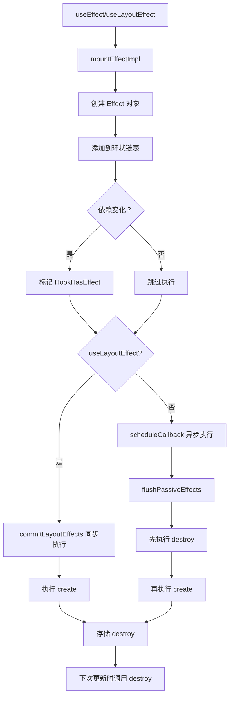

# useEffect / useLayoutEffect 实现

useEffect 和 useLayoutEffect 是处理副作用的核心 Hook，它们的实现机制相似但执行时机不同。

## 📦 模块位置

```
packages/react-reconciler/src/
├── ReactFiberHooks.js       # Hooks 核心实现
└── ReactFiberCommitWork.js  # Effect 调度与执行
```

## 🔍 数据结构

### Effect 对象

```javascript
// packages/react-reconciler/src/ReactFiberHooks.js

type Effect = {
  tag: HookFlags,              // Effect 标志（HookFlags 类型）
  inst: EffectInstance,        // Effect 实例
  create: () => (() => void) | void,  // 创建函数（副作用）
  deps: Array<mixed> | void | null,   // 依赖数组
  next: Effect,                // 下一个 Effect（环状链表）
};

// Effect 实例
type EffectInstance = {
  destroy: void | (() => void),  // 清理函数
};

// Hook 标志
const HookHasEffect = 0b00000001;  // 需要执行
const HookPassive = 0b00000010;    // useEffect
const HookLayout = 0b00000100;     // useLayoutEffect
```

### FunctionComponentUpdateQueue

```javascript
// 组件级别的更新队列
type FunctionComponentUpdateQueue = {
  lastEffect: Effect | null,      // 环状链表的最后一个
  events: Array<EventFunctionPayload<any, any, any>> | null,
  stores: Array<StoreConsistencyCheck<any>> | null,
  memoCache: MemoCache | null,
};
```

## 🔬 useEffect 实现

### mountEffect

```javascript
// packages/react-reconciler/src/ReactFiberHooks.js

function mountEffect(
  create: () => (() => void) | void,
  deps: Array<mixed> | void | null,
): void {
  if (
    __DEV__ &&
    (currentlyRenderingFiber.mode & StrictEffectsMode) !== NoMode
  ) {
    // StrictMode 下包含额外的调试标志
    mountEffectImpl(
      MountPassiveDevEffect | PassiveEffect | PassiveStaticEffect,
      HookPassive,
      create,
      deps,
    );
  } else {
    mountEffectImpl(
      PassiveEffect | PassiveStaticEffect,
      HookPassive,
      create,
      deps,
    );
  }
}
```

### mountEffectImpl

```javascript
function mountEffectImpl(
  fiberFlags: Flags,
  hookFlags: HookFlags,
  create: () => (() => void) | void,
  deps: Array<mixed> | void | null,
): void {
  // 1. 创建 Hook
  const hook = mountWorkInProgressHook();
  
  // 2. 解析依赖
  const nextDeps = deps === undefined ? null : deps;
  
  // 3. 标记 Fiber 的副作用标志
  currentlyRenderingFiber.flags |= fiberFlags;
  
  // 4. 创建 Effect 对象并推送到队列
  hook.memoizedState = pushSimpleEffect(
    HookHasEffect | hookFlags,  // 标记需要执行
    createEffectInstance(),     // 创建 Effect 实例
    create,                     // create 函数
    nextDeps                    // 依赖数组
  );
}
```

### pushSimpleEffect（创建 Effect 链表）

```javascript
function pushSimpleEffect(
  tag: HookFlags,
  inst: EffectInstance,
  create: () => (() => void) | void,
  deps: Array<mixed> | void | null,
): Effect {
  const effect: Effect = {
    tag,
    create,
    deps,
    inst,
    next: (null: any),  // 环状链表
  };
  return pushEffectImpl(effect);
}

function pushEffectImpl(effect: Effect): Effect {
  let componentUpdateQueue: null | FunctionComponentUpdateQueue =
    (currentlyRenderingFiber.updateQueue: any);
  
  if (componentUpdateQueue === null) {
    // 创建新的更新队列
    componentUpdateQueue = createFunctionComponentUpdateQueue();
    currentlyRenderingFiber.updateQueue = (componentUpdateQueue: any);
  }
  
  const lastEffect = componentUpdateQueue.lastEffect;
  if (lastEffect === null) {
    // 第一个 Effect，创建环状链表
    componentUpdateQueue.lastEffect = effect.next = effect;
  } else {
    // 添加到环状链表末尾
    const firstEffect = lastEffect.next;
    lastEffect.next = effect;
    effect.next = firstEffect;
    componentUpdateQueue.lastEffect = effect;
  }
  
  return effect;
}
```

### updateEffect

```javascript
function updateEffect(
  create: () => (() => void) | void,
  deps: Array<mixed> | void | null,
): void {
  updateEffectImpl(PassiveEffect, HookPassive, create, deps);
}

function updateEffectImpl(
  fiberFlags: Flags,
  hookFlags: HookFlags,
  create: () => (() => void) | void,
  deps: Array<mixed> | void | null,
): void {
  const hook = updateWorkInProgressHook();
  const nextDeps = deps === undefined ? null : deps;
  const effect: Effect = hook.memoizedState;
  const inst = effect.inst;

  // currentHook 为 null 的情况：首次挂载或严格模式重渲染
  if (currentHook !== null) {
    if (nextDeps !== null) {
      const prevEffect: Effect = currentHook.memoizedState;
      const prevDeps = prevEffect.deps;
      
      // 使用 Object.is 比较依赖
      if (areHookInputsEqual(nextDeps, prevDeps)) {
        // 依赖未变化，不执行副作用
        hook.memoizedState = pushSimpleEffect(
          hookFlags,  // 不标记 HasEffect
          inst,
          create,
          nextDeps
        );
        return;
      }
    }
  }

  // 依赖变化或无依赖，标记需要执行
  currentlyRenderingFiber.flags |= fiberFlags;
  hook.memoizedState = pushSimpleEffect(
    HookHasEffect | hookFlags,
    createEffectInstance(),
    create,
    nextDeps
  );
}
```

### areHookInputsEqual（依赖比较）

```javascript
function areHookInputsEqual(
  nextDeps: Array<mixed>,
  prevDeps: Array<mixed> | null,
): boolean {
  if (__DEV__) {
    if (ignorePreviousDependencies) {
      // 热重载时强制重新执行
      return false;
    }
  }

  if (prevDeps === null) {
    if (__DEV__) {
      console.error(
        '%s received a final argument during this render, but not during ' +
          'the previous render. Even though the final argument is optional, ' +
          'its type cannot change between renders.',
        currentHookNameInDev,
      );
    }
    return false;
  }

  if (__DEV__) {
    // 开发模式下检查长度变化
    if (nextDeps.length !== prevDeps.length) {
      console.error(
        'The final argument passed to %s changed size between renders. The ' +
          'order and size of this array must remain constant.\n\n' +
          'Previous: %s\n' +
          'Incoming: %s',
        currentHookNameInDev,
        `[${prevDeps.join(', ')}]`,
        `[${nextDeps.join(', ')}]`,
      );
    }
  }

  // 逐项比较（使用 Object.is）
  for (let i = 0; i < prevDeps.length && i < nextDeps.length; i++) {
    if (is(nextDeps[i], prevDeps[i])) {
      continue;
    }
    return false;
  }
  return true;
}
```

## 🔬 useLayoutEffect 实现

### mountLayoutEffect

```javascript
function mountLayoutEffect(
  create: () => (() => void) | void,
  deps: Array<mixed> | void | null,
): void {
  let fiberFlags: Flags = UpdateEffect | LayoutStaticEffect;
  
  if (
    __DEV__ &&
    (currentlyRenderingFiber.mode & StrictEffectsMode) !== NoMode
  ) {
    // 严格模式下包含额外的调试标志
    fiberFlags |= MountLayoutDevEffect;
  }
  
  mountEffectImpl(
    fiberFlags,
    HookLayout,
    create,
    deps,
  );
}
```

### updateLayoutEffect

```javascript
function updateLayoutEffect(
  create: () => (() => void) | void,
  deps: Array<mixed> | void | null,
): void {
  updateEffectImpl(UpdateEffect, HookLayout, create, deps);
}
```

## 🔄 Effect 执行流程

### 执行时序对比

```
useEffect vs useLayoutEffect 执行时机：

首次渲染：
├── commitRoot
│   ├── commitBeforeMutationEffects
│   ├── commitMutationEffects
│   ├── commitLayoutEffects (useLayoutEffect 执行)
│   └── commitPassiveEffects (useEffect 调度)
└── 浏览器绘制

更新渲染：
├── commitRoot
│   ├── commitBeforeMutationEffects
│   ├── commitMutationEffects
│   ├── commitLayoutEffects (useLayoutEffect 执行)
│   └── commitPassiveEffects (useEffect 调度)
└── 浏览器绘制
```

### commitLayoutEffects（执行 useLayoutEffect）

```javascript
// packages/react-reconciler/src/ReactFiberCommitWork.js

function commitLayoutEffects(
  finishedRoot: FiberRoot,
  finishedWork: Fiber,
  committedLanes: Lanes,
) {
  inProgressLanes = committedLanes;
  inProgressRoot = finishedRoot;
  
  // 遍历 Fiber 树执行 Layout Effects
  nextEffect = finishedWork;
  commitLayoutEffects_begin(finishedWork, finishedRoot, committedLanes);
  
  inProgressLanes = null;
  inProgressRoot = null;
}

function commitLayoutEffectOnFiber(
  finishedRoot: FiberRoot,
  current: Fiber | null,
  finishedWork: Fiber,
  committedLanes: Lanes,
): void {
  // 执行 Layout Effects
  if ((finishedWork.flags & LayoutMask) !== NoFlags) {
    switch (finishedWork.tag) {
      case FunctionComponent:
      case ForwardRef:
      case SimpleMemoComponent: {
        // 执行 useLayoutEffect
        commitHookEffectListMount(
          HookLayout | HookHasEffect,
          finishedWork,
        );
        break;
      }
    }
  }
}

function commitHookEffectListMount(
  tag: HookFlags,
  finishedWork: Fiber,
) {
  const updateQueue: FunctionComponentUpdateQueue | null =
    (finishedWork.updateQueue: any);
  const lastEffect = updateQueue !== null ? updateQueue.lastEffect : null;
  
  if (lastEffect !== null) {
    const firstEffect = lastEffect.next;
    let effect = firstEffect;
    
    do {
      if ((effect.tag & tag) === tag) {
        // 执行 create 函数
        const create = effect.create;
        effect.inst.destroy = create();
      }
      effect = effect.next;
    } while (effect !== firstEffect);
  }
}
```

### flushPassiveEffects（执行 useEffect）

```javascript
// packages/react-reconciler/src/ReactFiberWorkLoop.js

function flushPassiveEffects() {
  // 检查是否有待执行的被动 Effects
  if ((rootWithPendingPassiveEffects !== null ||
       rootDoesHavePassiveEffects) &&
      !rootWithPassiveEffectsIsScheduled) {
    
    // 调度执行
    scheduleCallback(NormalPriority, flushPassiveEffectsImpl);
  }
}

function flushPassiveEffectsImpl() {
  if (rootWithPendingPassiveEffects === null) {
    return false;
  }

  const root = rootWithPendingPassiveEffects;
  const lanes = pendingPassiveEffectsLanes;
  rootWithPendingPassiveEffects = null;
  pendingPassiveEffectsLanes = NoLanes;

  // 1. 执行销毁函数（cleanup）
  commitPassiveUnmountEffects(root.current);
  
  // 2. 执行创建函数（effect）
  commitPassiveMountEffects(root.current);

  return true;
}

function commitPassiveUnmountEffects(current: Fiber) {
  // 执行 useEffect 的 cleanup
  commitHookEffectListUnmount(
    HookPassive | HookHasEffect,
    current,
  );
}

function commitPassiveMountEffects(current: Fiber) {
  // 执行 useEffect 的 create
  commitHookEffectListMount(
    HookPassive | HookHasEffect,
    current,
  );
}

function commitHookEffectListUnmount(
  tag: HookFlags,
  finishedWork: Fiber,
) {
  const updateQueue: FunctionComponentUpdateQueue | null =
    (finishedWork.updateQueue: any);
  const lastEffect = updateQueue !== null ? updateQueue.lastEffect : null;
  
  if (lastEffect !== null) {
    const firstEffect = lastEffect.next;
    let effect = firstEffect;
    
    do {
      if ((effect.tag & tag) === tag) {
        // 执行 destroy 函数
        const destroy = effect.inst.destroy;
        if (destroy !== undefined) {
          effect.inst.destroy = undefined;
          destroy();
        }
      }
      effect = effect.next;
    } while (effect !== firstEffect);
  }
}
```

## 📊 完整流程图



## 💡 实战技巧

### 1. 依赖数组最佳实践

```jsx
// ✅ 推荐：包含所有依赖
useEffect(() => {
  fetchData(userId).then(setData);
}, [userId]);

// ⚠️ 小心：空数组只在首次执行
useEffect(() => {
  // 只执行一次
}, []);

// ❌ 错误：遗漏依赖
let count = 0;
useEffect(() => {
  const id = setInterval(() => {
    console.log(count);  // 总是 0
  }, 1000);
  return () => clearInterval(id);
}, []);  // count 不在依赖中

// ✅ 正确：使用 ref 或函数式更新
const [count, setCount] = useState(0);
useEffect(() => {
  const id = setInterval(() => {
    setCount(c => c + 1);  // 函数式更新
  }, 1000);
  return () => clearInterval(id);
}, []);
```

### 2. 清理函数

```jsx
// 订阅清理
useEffect(() => {
  const subscription = subscribe(data => {
    setData(data);
  });
  
  // 清理函数
  return () => {
    subscription.unsubscribe();
  };
}, [subscribe]);

// 事件监听清理
useEffect(() => {
  function handleResize() {
    setWindowSize(window.innerWidth);
  }
  
  window.addEventListener('resize', handleResize);
  
  // 清理事件监听
  return () => {
    window.removeEventListener('resize', handleResize);
  };
}, []);

// 定时器清理
useEffect(() => {
  const id = setInterval(() => {
    tick();
  }, 1000);
  
  // 清理定时器
  return () => {
    clearInterval(id);
  };
}, []);
```

### 3. React 18 StrictMode 双重执行

```jsx
// React 18 StrictMode 下，Effect 会执行两次
// 用于检测副作用是否可清理

useEffect(() => {
  console.log('Effect');
  return () => console.log('Cleanup');
}, []);

// 输出：
// Effect
// Cleanup
// Effect
```

### 4. 异步 Effect

```jsx
// ❌ 错误：Effect 不能是 async
useEffect(async () => {
  await fetchData();
}, []);

// ✅ 正确：在 Effect 内部定义异步函数
useEffect(() => {
  async function fetch() {
    await fetchData();
  }
  fetch();
}, []);

// 或使用 IIFE
useEffect(() => {
  (async () => {
    await fetchData();
  })();
}, []);
```

### 5. 条件 Effect

```jsx
// ✅ 推荐：Effect 内部条件判断
useEffect(() => {
  if (shouldFetch) {
    fetchData().then(setData);
  }
}, [shouldFetch, fetchData]);

// ❌ 避免：条件创建 Effect
if (shouldFetch) {
  useEffect(() => {
    fetchData();
  }, []);
}
```

## 🐛 常见问题

### Q: useEffect 和 useLayoutEffect 有什么区别？

| 特性 | useEffect | useLayoutEffect |
|------|-----------|-----------------|
| 执行时机 | commit 后异步 | commit 阶段同步 |
| 阻塞绘制 | 否 | 是 |
| 适用场景 | 数据获取、订阅 | DOM 操作、测量 |
| 性能影响 | 较小 | 可能影响性能 |

### Q: 为什么 useEffect 在 StrictMode 下执行两次？

**A**: 帮助检测副作用是否可清理，确保组件卸载时能正确清理。

### Q: 如何在 Effect 中获取最新 state？

```jsx
// ❌ 错误：闭包陷阱
useEffect(() => {
  const id = setInterval(() => {
    console.log(count);  // 总是初始值
  }, 1000);
  return () => clearInterval(id);
}, []);

// ✅ 正确：使用 ref
const countRef = useRef(count);
countRef.current = count;

useEffect(() => {
  const id = setInterval(() => {
    console.log(countRef.current);
  }, 1000);
  return () => clearInterval(id);
}, []);

// 或使用函数式更新
useEffect(() => {
  const id = setInterval(() => {
    setCount(c => {
      console.log(c);
      return c;
    });
  }, 1000);
  return () => clearInterval(id);
}, []);
```

### Q: 如何调试 Effect 执行顺序？

```javascript
// 开发模式下添加日志
useEffect(() => {
  console.log('useEffect executed');
  return () => console.log('useEffect cleanup');
}, []);

useLayoutEffect(() => {
  console.log('useLayoutEffect executed');
  return () => console.log('useLayoutEffect cleanup');
}, []);

// 输出顺序：
// useLayoutEffect executed
// useEffect executed
// useLayoutEffect cleanup
// useEffect cleanup
```

---

## 📖 下一步

- [useMemo / useCallback 实现](./use-memo)
- [useRef 实现](./use-ref)