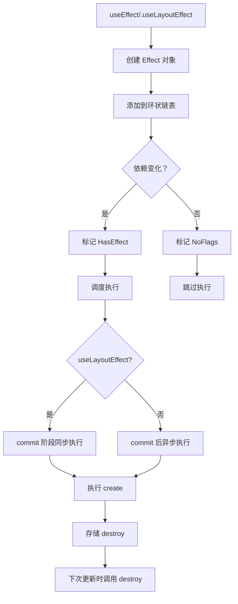

# useEffect / useLayoutEffect 实现

useEffect 和 useLayoutEffect 是处理副作用的核心 Hook，它们的实现机制相似但执行时机不同。

## 📦 模块位置

```
packages/react-reconciler/src/
├── ReactFiberHooks.js       # Hooks 核心实现
└── ReactFiberCommitWork.js  # Effect 调度与执行
```

## 🔍 数据结构

### Effect 对象

```javascript
// packages/react-reconciler/src/ReactFiberHooks.js

type Effect = {
  tag: number,              // Effect 标志
  create: () => mixed,      // 创建函数（副作用）
  destroy: (() => mixed) | void, // 清理函数
  deps: Array<mixed> | null,     // 依赖数组
  next: Effect,             // 下一个 Effect（环状链表）
};

// Effect 标志
const PassiveEffect = 0b0000000000000000000000000000010;  // useEffect
const LayoutEffect = 0b0000000000000000000000000000100;    // useLayoutEffect
const HasEffect = 0b0000000000000000000000000000001;       // 需要执行
```

### Hook 中的 Effect 队列

```javascript
type Hook = {
  memoizedState: any,
  baseState: any,
  baseQueue: Update<any>,
  queue: UpdateQueue<any>,
  next: Hook,
  
  // Effect 相关
  memoizedState: {
    baseState: any,
    baseQueue: Update<any>,
    queue: UpdateQueue<any>,
    lastEffect: Effect | null,  // 环状链表的最后一个
  } | null,
};
```

## 🔬 useEffect 实现

### mountEffect

```javascript
// packages/react-reconciler/src/ReactFiberHooks.js

function mountEffect(
  create: () => (() => void) | void,
  deps: Array<mixed> | void | null,
): void {
  // 标记为 Passive（useEffect）
  return mountEffectImpl(
    PassiveEffect | PassiveStaticEffect,
    PassiveEffect,
    create,
    deps
  );
}
```

### mountEffectImpl

```javascript
function mountEffectImpl(
  fiberFlags,      // Fiber flags
  hookFlags,       // Hook flags
  create,          // create 函数
  deps,            // 依赖数组
): void {
  // 1. 创建 Hook
  const hook = mountWorkInProgressHook();
  
  // 2. 解析依赖
  const nextDeps = deps === undefined ? null : deps;
  
  // 3. 标记副作用
  currentlyRenderingFiber.flags |= fiberFlags;
  
  // 4. 创建 Effect 对象
  hook.memoizedState = pushEffect(
    HasEffect | hookFlags,  // 标记需要执行
    create,
    undefined,              // destroy 初始为 undefined
    nextDeps
  );
}
```

### pushEffect（创建 Effect 链表）

```javascript
function pushEffect(
  HookHasEffect,      // 是否有副作用
  create,            // create 函数
  destroy,           // destroy 函数
  deps,              // 依赖数组
): Effect {
  // 1. 创建 Effect 对象
  const effect = {
    tag: HookHasEffect,
    create,
    destroy,
    deps,
    next: null,
  };
  
  // 2. 获取当前组件的 Effect 队列
  const componentUpdateQueue = currentlyRenderingFiber.updateQueue;
  
  // 3. 如果队列为空，创建环状链表
  if (componentUpdateQueue === null) {
    // 创建新队列
    const queue = {
      lastEffect: effect,
    };
    effect.next = effect;  // 指向自己（环状）
    currentlyRenderingFiber.updateQueue = queue;
  } else {
    // 4. 添加到环状链表末尾
    const lastEffect = componentUpdateQueue.lastEffect;
    
    if (lastEffect === null) {
      // 第一个 Effect
      componentUpdateQueue.lastEffect = effect;
      effect.next = effect;
    } else {
      // 插入到链表
      const firstEffect = lastEffect.next;
      lastEffect.next = effect;
      effect.next = firstEffect;
      componentUpdateQueue.lastEffect = effect;
    }
  }
  
  return effect;
}
```

### updateEffect

```javascript
function updateEffect(
  create: () => (() => void) | void,
  deps: Array<mixed> | void | null,
): void {
  // 1. 获取当前 Hook
  const current = currentHook;
  
  // 2. 获取旧 Effect
  const prevEffect = current.memoizedState;
  const destroy = prevEffect.destroy;
  
  // 3. 检查依赖变化
  if (deps !== undefined && deps !== null) {
    const prevDeps = prevEffect.deps;
    
    // 快速比较依赖
    if (areHookInputsEqual(deps, prevDeps)) {
      // 依赖没变化，跳过执行
      pushEffect(NoFlags, create, destroy, deps);
      return;
    }
  }
  
  // 4. 依赖变化或无依赖，标记执行
  currentlyRenderingFiber.flags |= PassiveEffect;
  pushEffect(HasEffect, create, destroy, deps);
}
```

### areHookInputsEqual（依赖比较）

```javascript
function areHookInputsEqual(
  nextDeps: Array<mixed>,
  prevDeps: Array<mixed>,
): boolean {
  // 1. 检查长度
  if (prevDeps === null || nextDeps.length !== prevDeps.length) {
    return false;
  }
  
  // 2. 逐项比较（使用 Object.is）
  for (let i = 0; i < prevDeps.length && i < nextDeps.length; i++) {
    if (Object.is(nextDeps[i], prevDeps[i])) {
      continue;
    }
    return false;
  }
  
  return true;
}
```

## 🔬 useLayoutEffect 实现

### mountLayoutEffect

```javascript
function mountLayoutEffect(
  create: () => (() => void) | void,
  deps: Array<mixed> | void | null,
): void {
  return mountEffectImpl(
    LayoutEffect,        // 标志不同
    LayoutEffect,
    create,
    deps
  );
}
```

### 执行时机差异

```javascript
// useEffect - 在 commit 后异步执行
function schedulePassiveEffects(finishedWork) {
  const updateQueue = finishedWork.updateQueue;
  
  if (updateQueue !== null) {
    // 调度到宏任务
    scheduleCallback(NormalPriority, () => {
      flushPassiveEffects();
    });
  }
}

// useLayoutEffect - 在 commit 阶段同步执行
function commitLayoutEffects(finishedWork) {
  forEachEffect(effect => {
    if (effect.tag & LayoutEffect) {
      // 同步执行
      const create = effect.create;
      effect.destroy = create();
    }
  });
}
```

## 🔄 Effect 执行流程

### flushPassiveEffects（执行 useEffect）

```javascript
// packages/react-reconciler/src/ReactFiberWorkLoop.js

function flushPassiveEffects() {
  // 1. 执行销毁函数
  forEachEffect(effect => {
    const destroy = effect.destroy;
    if (destroy !== null) {
      // 执行上次的清理函数
      destroy();
    }
  });
  
  // 2. 执行创建函数
  forEachEffect(effect => {
    const create = effect.create;
    // 执行副作用
    effect.destroy = create();
  });
}
```

### commitHookEffectListMount

```javascript
// packages/react-reconciler/src/ReactFiberCommitWork.js

function commitHookEffectListMount(
  lastEffect: lastEffect,
  finishedWork: Fiber,
) {
  const effectRing = lastEffect;
  
  if (effectRing === null) {
    return;
  }
  
  let effect = effectRing.next;
  
  do {
    // 检查是否是 Layout Effect
    if ((effect.tag & LayoutEffect) !== NoFlags) {
      // 同步执行 create
      const create = effect.create;
      effect.destroy = create();
    }
    
    effect = effect.next;
  } while (effect !== effectRing);
}
```

### commitHookEffectListUnmount

```javascript
// 组件卸载时执行清理

function commitHookEffectListUnmount(
  tag: HookFlags,
  finishedWork,
) {
  const effectRing = finishedWork.updateQueue?.lastEffect;
  
  if (effectRing !== null) {
    let effect = effectRing.next;
    
    do {
      if ((effect.tag & tag) !== NoFlags) {
        // 执行 destroy
        const destroy = effect.destroy;
        if (destroy !== undefined) {
          effect.destroy = undefined;
          destroy();
        }
      }
      
      effect = effect.next;
    } while (effect !== effectRing);
  }
}
```

## 📊 完整流程图



## 💡 实战技巧

### 1. 依赖数组最佳实践

```jsx
// ✅ 推荐：包含所有依赖
useEffect(() => {
  fetchData(userId).then(setData);
}, [userId]);

// ⚠️ 小心：空数组只在首次执行
useEffect(() => {
  // 只执行一次
}, []);

// ❌ 错误：遗漏依赖
let count = 0;
useEffect(() => {
  const id = setInterval(() => {
    console.log(count);  // 总是 0
  }, 1000);
  return () => clearInterval(id);
}, []);  // count 不在依赖中

// ✅ 正确
const [count, setCount] = useState(0);
useEffect(() => {
  const id = setInterval(() => {
    setCount(c => c + 1);  // 函数式更新
  }, 1000);
  return () => clearInterval(id);
}, []);
```

### 2. 清理函数

```jsx
// 订阅清理
useEffect(() => {
  const subscription = subscribe(data => {
    setData(data);
  });
  
  // 清理函数
  return () => {
    subscription.unsubscribe();
  };
}, []);

// 事件监听清理
useEffect(() => {
  function handleResize() {
    setWindow_size(window.innerWidth);
  }
  
  window.addEventListener('resize', handleResize);
  
  // 清理事件监听
  return () => {
    window.removeEventListener('resize', handleResize);
  };
}, []);

// 定时器清理
useEffect(() => {
  const id = setInterval(() => {
    tick();
  }, 1000);
  
  // 清理定时器
  return () => {
    clearInterval(id);
  };
}, []);
```

### 3. 多个 Effect

```jsx
// Effect 按顺序执行
useEffect(() => {
  console.log('Effect 1');
  return () => console.log('Cleanup 1');
}, []);

useEffect(() => {
  console.log('Effect 2');
}, []);

// 清理顺序：后注册的先清理
// Cleanup 2 → Cleanup 1
```

### 4. 条件 Effect

```jsx
// ✅ 推荐：Effect 内部条件判断
useEffect(() => {
  if (shouldFetch) {
    fetchData().then(setData);
  }
}, [shouldFetch, fetchData]);

// ❌ 避免：条件创建 Effect
if (shouldFetch) {
  useEffect(() => {
    fetchData();
  }, []);
}
```

## ⚠️ 注意事项

### 1. Effect 执行时机

```
useEffect 执行时机：

1. 首次渲染后
   ├── commit Layout 阶段
   └── 浏览器绘制后（异步）

2. props/state 变化后
   ├── commit 阶段调度
   └── 浏览器绘制后执行

3. 组件卸载时
   └── 执行清理函数
```

### 2. StrictMode 双重执行

```jsx
// React 18 StrictMode 下，Effect 会执行两次

useEffect(() => {
  console.log('Effect');
  return () => console.log('Cleanup');
}, []);

// 输出：
// Effect
// Cleanup
// Effect
```

### 3. 异步 Effect

```jsx
// ❌ 错误：Effect 不能是 async
useEffect(async () => {
  await fetchData();
}, []);

// ✅ 正确：在 Effect 内部定义异步函数
useEffect(() => {
  async function fetch() {
    await fetchData();
  }
  fetch();
}, []);

// 或使用 IIFE
useEffect(() => {
  (async () => {
    await fetchData();
  })();
}, []);
```

## 🔬 调试技巧

### 观察 Effect 执行

```javascript
// 开发模式下添加日志
const originalCommitHookEffectListMount = commitHookEffectListMount;
commitHookEffectListMount = function(lastEffect, finishedWork) {
  console.group('commitHookEffectListMount');
  console.log('Component:', finishedWork.type?.name || 'Anonymous');
  
  let effect = lastEffect.next;
  let i = 0;
  
  do {
    console.log(`Effect ${i}:`, {
      tag: effect.tag,
      hasDeps: effect.deps !== null,
      deps: effect.deps,
    });
    i++;
    effect = effect.next;
  } while (effect !== lastEffect.next);
  
  console.groupEnd();
  return originalCommitHookEffectListMount(lastEffect, finishedWork);
};
```

### 追踪 Effect 清理

```javascript
// 追踪 destroy 调用
const originalFlushPassiveEffects = flushPassiveEffects;
flushPassiveEffects = function() {
  console.group('flushPassiveEffects');
  
  // 追踪销毁
  forEachEffect(effect => {
    if (effect.destroy !== null) {
      console.log('Executing destroy:', {
        component: currentlyRenderingFiber.type?.name,
        destroy: effect.destroy,
      });
    }
  });
  
  const result = originalFlushPassiveEffects();
  
  console.groupEnd();
  return result;
};
```

## 🐛 常见问题

### Q: useEffect 和 useLayoutEffect 有什么区别？

**A**:
- useEffect：commit 后异步执行，不阻塞绘制
- useLayoutEffect：commit 阶段同步执行，阻塞绘制

### Q: 为什么 useEffect 在 StrictMode 下执行两次？

**A**: 帮助检测副作用是否可清理。

### Q: 如何在 Effect 中获取最新 state？

```jsx
// ❌ 错误：闭包陷阱
useEffect(() => {
  const id = setInterval(() => {
    console.log(count);  // 总是初始值
  }, 1000);
  return () => clearInterval(id);
}, []);

// ✅ 正确：使用 ref
const countRef = useRef(count);
countRef.current = count;

useEffect(() => {
  const id = setInterval(() => {
    console.log(countRef.current);
  }, 1000);
  return () => clearInterval(id);
}, []);

// 或使用函数式更新
useEffect(() => {
  const id = setInterval(() => {
    setCount(c => {
      console.log(c);
      return c;
    });
  }, 1000);
  return () => clearInterval(id);
}, []);
```

---

## 📖 下一步

- [useMemo / useCallback 实现](./use-memo)
- [useRef 实现](./use-ref)