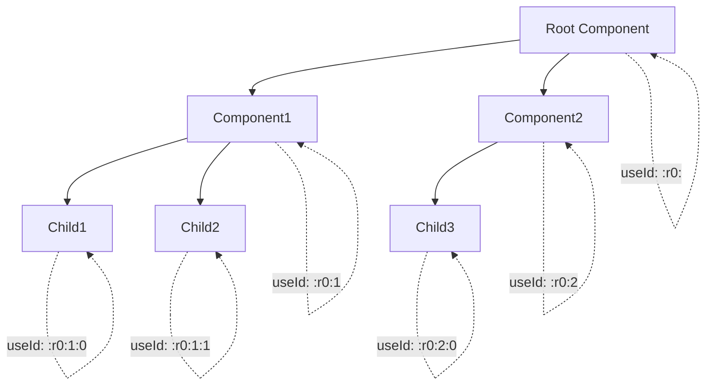

# useId 实现

useId 是 React 18 新增的 Hook，用于生成稳定的唯一 ID，主要用于服务端渲染（SSR）场景，确保服务端和客户端生成的 ID 保持一致。

## 📦 模块位置

```
packages/react-reconciler/src/
└── ReactFiberHooks.js    # useId Hook 实现

packages/react-dom-bindings/src/shared/ReactServerRenderingTransport.js  # ID 生成逻辑
```

## 🔍 问题背景

### SSR Hydration 不匹配问题

```jsx
// ❌ 问题：SSR 和客户端生成不同的 ID
function Form() {
  const [id] = useState(() => {
    // 服务端生成 :r0:
    // 客户端生成 :r1:（因为组件树可能不同）
    return `input-${Math.random().toString(36).slice(2)}`;
  });
  
  return (
    <>
      <label htmlFor={id}>Name</label>
      <input id={id} />
    </>
  );
}
```

### useId 解决方案

```jsx
// ✅ 正确：useId 保证 SSR 和客户端一致
function Form() {
  const id = useId();  // 服务端和客户端生成相同的 ID
  
  return (
    <>
      <label htmlFor={id}>Name</label>
      <input id={id} />
    </>
  );
}
```

## 🔬 useId 实现

### mountId（首次渲染）

```javascript
// packages/react-reconciler/src/ReactFiberHooks.js

function mountId(): string {
  const hook = mountWorkInProgressHook();
  
  // 获取当前渲染的根
  const root = ((getWorkInProgressRoot(): any): FiberRoot);
  
  // 获取标识符前缀
  const identifierPrefix = root.identifierPrefix;
  
  let id;
  
  // 检查是否是 hydration 模式
  if (getIsHydrating()) {
    // 服务端渲染时的特殊处理
    const treeId = getTreeId();
    
    // 使用 :r 前缀表示服务端生成的 ID
    id = '_' + identifierPrefix + 'R_' + treeId;
    
    // 处理多个 useId 的情况
    const localId = localIdCounter++;
    if (localId > 0) {
      id += 'H' + localId.toString(32);
    }
    
    id += '_';
  } else {
    // 客户端渲染
    const globalClientId = globalClientIdCounter++;
    id = '_' + identifierPrefix + 'r_' + globalClientId.toString(32) + '_';
  }
  
  hook.memoizedState = id;
  return id;
}
```

### updateId（更新渲染）

```javascript
function updateId(): string {
  const hook = updateWorkInProgressHook();
  
  // 返回已有的 ID（不会重新生成）
  const id: string = hook.memoizedState;
  return id;
}
```

### rerenderId（重渲染）

```javascript
function rerenderId(): string {
  return updateId();
}
```

## 🔗 ID 生成算法

### 服务端渲染（SSR）

```javascript
// 服务端渲染时的 ID 格式
// :r[TreeId][H][LocalId]_

// 示例：
// :r0:           - 根树第一个 useId
// :r0H1:         - 根树第二个 useId
// :r1:           - 第二个树
// :r1H2:         - 第二个树第三个 useId
```

### 客户端渲染（CSR）

```javascript
// 客户端渲染时的 ID 格式
// _[identifierPrefix]r_[globalClientId]_

// 示例：
// _r0_           - 第一个 useId
// _r1_           - 第二个 useId
// _myApp_r2_     - 带前缀的第三个 useId
```

### 树形 ID 结构



## 🔬 源码深度分析

### 全局计数器

```javascript
// packages/react-reconciler/src/ReactFiberHooks.js

// 客户端 ID 计数器
let globalClientIdCounter: number = 0;

// 本地 ID 计数器（用于 hydration）
let localIdCounter: number = 0;

// 重置计数器（用于测试）
function resetIdCounters() {
  globalClientIdCounter = 0;
  localIdCounter = 0;
}
```

### 树 ID 生成

```javascript
// 获取当前渲染树的唯一标识
function getTreeId(): string {
  const root = getWorkInProgressRoot();
  if (root === null) {
    return '';
  }
  
  // 使用 root 的 treeId 或默认树
  return root.treeId || '';
}

// 组件栈深度用于组件内唯一性
function getComponentStackDepth(): number {
  return localIdCounter++;
}
```

## 💡 实战技巧

### 1. 表单标签关联

```jsx
function Form() {
  // 每个字段独立的 ID
  const nameId = useId();
  const emailId = useId();
  const passwordId = useId();
  
  return (
    <form>
      <div>
        <label htmlFor={nameId}>Name</label>
        <input id={nameId} name="name" />
      </div>
      
      <div>
        <label htmlFor={emailId}>Email</label>
        <input id={emailId} name="email" type="email" />
      </div>
      
      <div>
        <label htmlFor={passwordId}>Password</label>
        <input id={passwordId} name="password" type="password" />
      </div>
    </form>
  );
}
```

### 2. 列表中的唯一 ID

```jsx
function TodoList({ todos }) {
  const listId = useId();
  
  return (
    <ul>
      {todos.map((todo, index) => {
        const checkboxId = `${listId}-todo-${index}`;
        
        return (
          <li key={todo.id}>
            <input
              id={checkboxId}
              type="checkbox"
              checked={todo.completed}
            />
            <label htmlFor={checkboxId}>{todo.text}</label>
          </li>
        );
      })}
    </ul>
  );
}
```

### 3. 组合组件中的 ID

```jsx
function TextField({ label }) {
  const id = useId();
  
  return (
    <div>
      <label htmlFor={id}>{label}</label>
      <input id={id} />
    </div>
  );
}

// 使用时每个 TextField 都有唯一的 ID
function Form() {
  return (
    <>
      <TextField label="Name" />
      <TextField label="Email" />
      <TextField label="Phone" />
    </>
  );
}
```

### 4. 可复用组件模式

```jsx
function AccordionItem({ title, children }) {
  const id = useId();
  const headerId = `${id}-header`;
  const contentId = `${id}-content`;
  
  return (
    <div>
      <h3 id={headerId}>
        <button aria-controls={contentId}>{title}</button>
      </h3>
      <div id={contentId} aria-labelledby={headerId}>
        {children}
      </div>
    </div>
  );
}
```

### 5. 避免的用法

```jsx
// ❌ 不要在循环中直接调用 useId
function Form({ fields }) {
  // 错误：hooks 不能在循环中调用
  return fields.map(field => {
    const id = useId();  // 错误！
    return <input key={field.id} id={id} />;
  });
}

// ✅ 正确：在子组件中调用 useId
function TextField({ label }) {
  const id = useId();  // 在组件顶层调用
  return <input id={id} />;
}

function Form({ fields }) {
  return fields.map(field => (
    <TextField key={field.id} label={field.label} />
  ));
}
```

## ⚠️ 注意事项

### 1. useId vs useState

```jsx
// ❌ 不推荐：useState 生成 ID 在 SSR 会有问题
function Component() {
  const [id] = useState(() => Math.random().toString(36).slice(2));
  return <input id={id} />;
}

// ✅ 推荐：useId 保证 SSR 一致性
function Component() {
  const id = useId();
  return <input id={id} />;
}
```

### 2. useId vs 外部数据

```jsx
// useId 只适用于 UI 辅助用途
// ❌ 不要用 useId 作为数据 key
function List({ items }) {
  return items.map(item => (
    <Item key={useId()} item={item} />  // 错误！
  ));
}

// ✅ 正确：用数据本身的 ID
function List({ items }) {
  return items.map(item => (
    <Item key={item.id} item={item} />
  ));
}
```

### 3. SSR 一致性保证

```
服务端渲染：
App
└── Form
    └── TextField (id: :r0:)
    └── TextField (id: :r0:1:)

客户端 hydration：
App
└── Form
    └── TextField (id: :r0:)     ← 匹配
    └── TextField (id: :r0:1:)   ← 匹配

使用 useState 则不会匹配：
服务端：:r0:, :r0:1:
客户端：随机 ID（不匹配）
```

### 4. 多根节点情况

```jsx
// 如果有多个 React 根，每个根有独立的 ID 空间
const root1 = createRoot(container1);
root1.render(<App />);  // 生成 :r0:xxx

const root2 = createRoot(container2);
root2.render(<App />);  // 生成 :r1:xxx（独立的 ID 空间）
```

### 5. 条件渲染

```jsx
// ✅ useId 在条件渲染中也是稳定的
function Component({ showInput }) {
  const id = useId();  // 无论 showInput 如何变化，id 都相同
  
  return showInput ? <input id={id} /> : null;
}
```

## 🔬 调试技巧

### 观察 ID 生成

```javascript
// 开发模式下查看生成的 ID
function DebugComponent() {
  const id = useId();
  
  useEffect(() => {
    console.log('Generated ID:', id);
  }, [id]);
  
  return <input id={id} />;
}
```

### 检查 SSR 匹配

```javascript
// 检查 hydration 是否成功
hydrateRoot(container, <App />);

// 如果 ID 不匹配会有警告
console.warn('Warning: Text content did not match. Server: ":r0:" Client: ":r1:"');
```

### 验证 ID 稳定性

```javascript
// 测试 ID 稳定性
function TestComponent() {
  const id1 = useId();
  const id2 = useId();
  
  console.log('First ID:', id1);
  console.log('Second ID:', id2);
  
  // 重新渲染时 ID 应该保持不变
  return <div id={id1}>{id2}</div>;
}
```

## 🐛 常见问题

### Q: useId 生成的 ID 是固定的吗？

**A**: 是的，只要组件树结构不变，ID 就是固定的。但如果组件树结构变化（如条件渲染），ID 也会变化。

### Q: useId 可以用于数据 key 吗？

**A**: 不建议。useId 的 ID 会随着组件结构变化，应该使用数据本身的唯一 ID。

### Q: useId 和 Math.random() 有什么区别？

**A**:
- Math.random()：每次渲染都变化，SSR 不匹配
- useId：基于组件树位置，SSR 和客户端一致

### Q: useId 会影响性能吗？

**A**: 影响极小。ID 只在首次渲染时生成，后续更新直接返回缓存值。

### Q: useId 在条件渲染中稳定吗？

**A**: 是的，useId 在条件渲染中也是稳定的，不会因为条件变化而改变。

---

## 📖 下一步

- [useSyncExternalStore 实现](./use-sync-external-store)
- [Suspense 实现](./suspense)