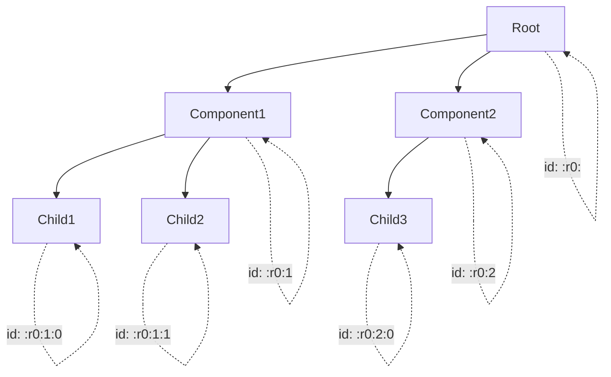

# useId 实现

useId 是 React 18 新增的 Hook，用于生成稳定的唯一 ID，主要用于服务端渲染（SSR）场景。

## 📦 模块位置

```
packages/react-reconciler/src/
└── ReactFiberHooks.js    # useId Hook 实现

packages/react/src/
└── ReactFiberConfig.js   # ID 生成逻辑
```

## 🔍 问题背景

### SSR Hydration 不匹配

```jsx
// ❌ 问题：SSR 和客户端生成不同的 ID
function Form() {
  const [id] = useState(() => {
    // 服务端生成 :r0:
    // 客户端生成 :r1:（因为组件树可能不同）
    return `input-${Math.random().toString(36).slice(2)}`;
  });
  
  return (
    <>
      <label htmlFor={id}>Name</label>
      <input id={id} />
    </>
  );
}
```

### useId 解决方案

```jsx
// ✅ 正确：useId 保证 SSR 和客户端一致
function Form() {
  const id = useId();  // 服务端和客户端生成相同的 ID
  
  return (
    <>
      <label htmlFor={id}>Name</label>
      <input id={id} />
    </>
  );
}
```

## 🔬 useId 实现

### Hook 入口

```javascript
// packages/react-reconciler/src/ReactFiberHooks.js

function useId(): string {
  // 1. 获取当前 Fiber
  const hook = updateWorkInProgressHook();
  
  // 2. 检查是否已有 ID
  let id = hook.memoizedState;
  
  if (id === null) {
    // 3. 首次渲染，生成新 ID
    id = generateId();
    hook.memoizedState = id;
  }
  
  return id;
}
```

### ID 生成逻辑

```javascript
// packages/react-dom-bindings/src/shared/ReactServerRenderingTransport.js

let globalClientId = 0;

function generateId(): string {
  // 1. 获取当前树 ID（tree ID）
  const treeId = getTreeId();
  
  // 2. 获取当前组件的 ID
  const componentId = globalClientId++;
  
  // 3. 组合成完整 ID
  // 格式：:r[dash-TreeId][dash-ComponentId]:
  return `:r${treeId}-${componentId}:`;
}

function getTreeId(): string {
  // 返回当前渲染树的唯一标识
  // 服务端和客户端使用相同的 treeId
  return currentTreeId;
}
```

### SSR 特殊处理

```javascript
// packages/react-dom/src/server/ReactDOMLegacyServerStreamConfig.js

// 服务端渲染时
function renderToString(element) {
  // 1. 设置 tree ID
  const previousTreeId = currentTreeId;
  currentTreeId = '';  // 根树 ID
  
  try {
    // 2. 渲染组件
    return renderComponent(element);
  } finally {
    // 3. 恢复
    currentTreeId = previousTreeId;
  }
}

// 客户端 hydration 时
function hydrateRoot(container, element) {
  // 1. 使用相同的 tree ID
  const previousTreeId = currentTreeId;
  currentTreeId = '';  // 与服务端一致
  
  try {
    // 2. 开始 hydration
    return hydrateComponent(element);
  } finally {
    currentTreeId = previousTreeId;
  }
}
```

## 📊 ID 分配机制



### 树形 ID 结构

```
ID 格式：:r[TreeId]-[ComponentId]:

示例：
- :r0:           - 根组件的第一个 useId
- :r0:1:         - 根组件的第二个 useId
- :r1:           - 第二个组件树
- :r1-2:3:       - 第二个树第三个组件的第四个 useId

分隔符：
- :      - 开始/结束标记
- r      - 表示这是一个 React ID
- -      - 树 ID 和组件 ID 分隔
```

## 🔬 源码深度

### useId 完整实现

```javascript
// packages/react-reconciler/src/ReactFiberHooks.js

function mountId(): string {
  // 1. 创建 Hook
  const hook = mountWorkInProgressHook();
  
  // 2. 获取当前渲染的树 ID
  const root = getWorkInProgressRoot();
  
  if (root === null) {
    // 不在渲染中，抛出错误
    throw new Error('Expected to be rendering');
  }
  
  // 3. 生成 ID
  const id = makeId(root, getComponentStack());
  
  // 4. 保存
  hook.memoizedState = id;
  
  return id;
}

function updateId(): string {
  // 1. 获取 Hook
  const hook = updateWorkInProgressHook();
  
  // 2. 返回已有的 ID（不会重新生成）
  return hook.memoizedState;
}
```

### makeId 实现

```javascript
// packages/react-dom-bindings/src/shared/ReactServerRenderingTransport.js

function makeId(root, componentStack): string {
  // 1. 获取树的标识
  const identifierPrefix = root.identifierPrefix;
  
  // 2. 获取当前树 ID
  const treeId = getTreeId(root);
  
  // 3. 获取组件栈深度（用于组件内唯一）
  const stackIndex = componentStack.length;
  
  // 4. 组合 ID
  let id = ':' + identifierPrefix + 'r' + treeId;
  
  if (stackIndex > 0) {
    id += '-' + stackIndex;
  }
  
  id += ':';
  
  return id;
}
```

### getTreeId 实现

```javascript
function getTreeId(root): string {
  // 返回当前渲染树的唯一标识
  // 服务端和客户端使用相同的算法
  
  // 如果 root 有特定的 tree ID
  if (root.treeId !== undefined) {
    return root.treeId;
  }
  
  // 默认返回空字符串（第一个树）
  return '';
}
```

## 💡 实战技巧

### 1. 表单标签关联

```jsx
function Form() {
  // 每个字段独立的 ID
  const nameId = useId();
  const emailId = useId();
  const passwordId = useId();
  
  return (
    <form>
      <div>
        <label htmlFor={nameId}>Name</label>
        <input id={nameId} name="name" />
      </div>
      
      <div>
        <label htmlFor={emailId}>Email</label>
        <input id={emailId} name="email" type="email" />
      </div>
      
      <div>
        <label htmlFor={passwordId}>Password</label>
        <input id={passwordId} name="password" type="password" />
      </div>
    </form>
  );
}
```

### 2. 列表中的唯一 ID

```jsx
function TodoList({ todos }) {
  const listId = useId();
  
  return (
    <ul>
      {todos.map((todo, index) => (
        <li key={todo.id}>
          <label htmlFor={`${listId}-todo-${index}`}>
            {todo.text}
          </label>
          <input
            id={`${listId}-todo-${index}`}
            type="checkbox"
            checked={todo.completed}
          />
        </li>
      ))}
    </ul>
  );
}
```

### 3. 组合组件中的 ID

```jsx
function TextField({ label }) {
  const id = useId();
  
  return (
    <div>
      <label htmlFor={id}>{label}</label>
      <input id={id} />
    </div>
  );
}

// 使用时每个 TextField 都有唯一的 ID
function Form() {
  return (
    <>
      <TextField label="Name" />
      <TextField label="Email" />
      <TextField label="Phone" />
    </>
  );
}
```

### 4. 避免的用法

```jsx
// ❌ 不要在循环中直接调用 useId
function Form({ fields }) {
  // hooks 不能在循环中调用
  return fields.map(field => (
    <TextField key={field.id} label={field.label} />
  ));
}

// ✅ 正确：在子组件中调用 useId
function TextField({ label }) {
  const id = useId();  // 在组件顶层调用
  return <input id={id} />;
}

function Form({ fields }) {
  return fields.map(field => (
    <TextField key={field.id} label={field.label} />
  ));
}
```

## ⚠️ 注意事项

### 1. useId vs useState

```jsx
// ❌ 不推荐：useState 生成 ID 在 SSR 会有问题
function Component() {
  const [id] = useState(() => Math.random().toString(36).slice(2));
  return <input id={id} />;
}

// ✅ 推荐：useId 保证 SSR 一致性
function Component() {
  const id = useId();
  return <input id={id} />;
}
```

### 2. useId vs 外部数据

```jsx
// useId 只适用于 UI 辅助用途
// ❌ 不要用 useId 作为数据 key
function List({ items }) {
  return items.map(item => (
    <Item key={useId()} item={item} />  // 错误！
  ));
}

// ✅ 正确：用数据本身的 ID
function List({ items }) {
  return items.map(item => (
    <Item key={item.id} item={item} />
  ));
}
```

### 3. useId 在 SSR 的表现

```
服务端渲染：
App
└── Form
    └── TextField (id: :r0:)
    └── TextField (id: :r0:1:)

客户端 hydration：
App
└── Form
    └── TextField (id: :r0:)     ← 匹配
    └── TextField (id: :r0:1:)   ← 匹配

使用 useState 则不会匹配：
服务端：:r0:, :r0:1:
客户端：随机 ID（不匹配）
```

### 4. 多根节点情况

```jsx
// 如果有多个 React 根，每个根有独立的 ID 空间
const root1 = createRoot(container1);
root1.render(<App />);  // 生成 :r0:xxx

const root2 = createRoot(container2);
root2.render(<App />);  // 生成 :r1:xxx（独立的 ID 空间）
```

## 🔬 调试技巧

### 观察 ID 生成

```javascript
// 开发模式下添加日志
const originalUseId = useId;
useId = function() {
  const id = originalUseId();
  console.log('useId called in:', currentlyRenderingFiber.type?.name, 'ID:', id);
  return id;
};
```

### 检查 SSR 匹配

```javascript
// 检查 hydration 是否成功
hydrateRoot(container, <App />);

// 如果 ID 不匹配会有警告
console.warn('Warning: Text content did not match. Server: ":r0:" Client: ":r1:"');
```

## 🐛 常见问题

### Q: useId 生成的 ID 是固定的吗？

**A**: 是的，只要组件结构不变，ID 就是固定的。但如果组件树结构变化（如条件渲染），ID 也会变化。

### Q: useId 可以用于数据 key 吗？

**A**: 不建议。useId 的 ID 会随着组件结构变化，应该使用数据本身的唯一 ID。

### Q: useId 和 Math.random() 有什么区别？

**A**:
- Math.random()：每次生成不同，SSR 不匹配
- useId：基于组件树位置，SSR 和客户端一致

### Q: useId 会影响性能吗？

**A**: 影响极小。ID 只在首次渲染时生成，后续更新直接返回缓存值。

---

## 📖 下一步

- [useSyncExternalStore 实现](./use-sync)
- [Suspense 实现](./suspense)