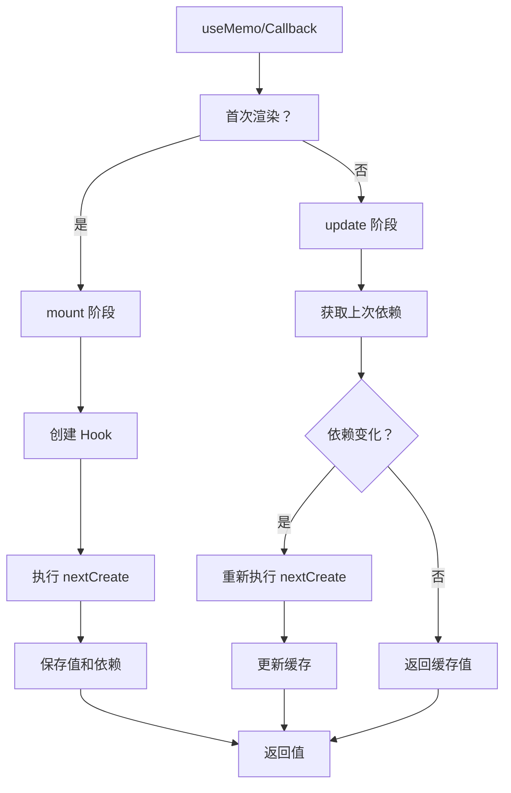

# useMemo / useCallback 实现

useMemo 和 useCallback 是 React 性能优化的核心 Hook，它们的实现机制几乎完全相同。

## 📦 模块位置

```
packages/react-reconciler/src/
└── ReactFiberHooks.js    # Hooks 核心实现
```

## 🔍 数据结构

### useMemo Hook 结构

```javascript
// packages/react-reconciler/src/ReactFiberHooks.js

type Hook = {
  memoizedState: [mixed, Array<mixed> | null], // [缓存值，依赖数组]
  baseState: any,
  baseQueue: Update<any>,
  queue: UpdateQueue<any>,
  next: Hook,
};
```

### Callback Hook 结构

```javascript
// useCallback 本质上存储的是函数
type Hook = {
  memoizedState: mixed,    // 缓存的回调函数
  // ... 其他属性
};
```

## 🔬 useMemo 实现

### mountMemo

```javascript
// packages/react-reconciler/src/ReactFiberHooks.js

function mountMemo<T>(
  nextCreate: () => T,
  deps: Array<mixed> | void | null,
): T {
  // 1. 创建 Hook
  const hook = mountWorkInProgressHook();
  
  // 2. 解析依赖
  const nextDeps = deps === undefined ? null : deps;
  
  // 3. 执行创建函数
  const nextValue = nextCreate();
  
  // 4. 保存值和依赖
  hook.memoizedState = [nextValue, nextDeps];
  
  return nextValue;
}
```

### updateMemo

```javascript
function updateMemo<T>(
  nextCreate: () => T,
  deps: Array<mixed> | void | null,
): T {
  // 1. 获取当前 Hook
  const hook = updateWorkInProgressHook();
  
  // 2. 获取上次的值和依赖
  const changeQueue = hook.queue;
  const prevState = hook.memoizedState;
  
  // 3. 获取上次的 create 函数和依赖
  const create = changeQueue !== null ? changeQueue.pending : null;
  const prevDeps = prevState[1];
  
  // 4. 依赖比较
  if (deps !== null && prevDeps !== null) {
    // 检查依赖是否变化
    if (areHookInputsEqual(deps, prevDeps)) {
      // 依赖没变，返回缓存值
      return prevState[0];
    }
  }
  
  // 5. 依赖变化，重新计算
  const nextValue = nextCreate();
  
  // 6. 更新缓存
  hook.memoizedState = [nextValue, deps];
  
  return nextValue;
}
```

### areHookInputsEqual（依赖比较）

```javascript
function areHookInputsEqual(
  nextDeps: Array<mixed>,
  prevDeps: Array<mixed>,
): boolean {
  // 1. 检查是否为 null
  if (prevDeps === null || nextDeps === null) {
    return false;
  }
  
  // 2. 检查长度
  if (nextDeps.length !== prevDeps.length) {
    return false;
  }
  
  // 3. 逐项使用 Object.is 比较
  for (let i = 0; i < prevDeps.length && i < nextDeps.length; i++) {
    if (Object.is(nextDeps[i], prevDeps[i])) {
      continue;
    }
    return false;
  }
  
  return true;
}
```

### Object.is 比较

```javascript
// Object.is 与 === 的区别
Object.is(0, -0);        // false
0 === -0;                // true

Object.is(NaN, NaN);     // true
NaN === NaN;             // false

Object.is(+0, -0);       // false
Object.is({}, {});       // false (引用不同)
```

## 🔬 useCallback 实现

### mountCallback

```javascript
function mountCallback<T>(
  callback: T,
  deps: Array<mixed> | void | null,
): T {
  // 1. 创建 Hook
  const hook = mountWorkInProgressHook();
  
  // 2. 解析依赖
  const nextDeps = deps === undefined ? null : deps;
  
  // 3. 保存回调函数和依赖
  hook.memoizedState = callback;
  hook.queue = {
    pending: null,
    lane: NoLanes,
    dispatch: null,
    lastRenderedReducer: () => {},
    lastRenderedState: null,
  };
  
  // 4. 存储依赖（通过 queue.pending）
  hook.queue.pending = nextDeps;
  
  return callback;
}
```

### updateCallback

```javascript
function updateCallback<T>(
  callback: T,
  deps: Array<mixed> | void | null,
): T {
  // 1. 获取当前 Hook
  const hook = updateWorkInProgressHook();
  
  // 2. 解析依赖
  const nextDeps = deps === undefined ? null : deps;
  
  // 3. 获取上次的回调和依赖
  const prevState = hook.memoizedState;
  const prevDeps = hook.queue.pending;
  
  // 4. 依赖比较
  if (nextDeps !== null && prevDeps !== null) {
    if (areHookInputsEqual(nextDeps, prevDeps)) {
      // 依赖没变，返回缓存的回调
      return prevState;
    }
  }
  
  // 5. 依赖变化，返回新回调
  hook.memoizedState = callback;
  hook.queue.pending = nextDeps;
  
  return callback;
}
```

## 📊 完整流程图



## 💡 实战技巧

### 1. 避免不必要的计算

```jsx
// ✅ 推荐：缓存昂贵的计算
const sortedList = useMemo(() => {
  return list.slice().sort((a, b) => a.value - b.value);
}, [list]);

// ❌ 不推荐：简单计算不需要 memo
const sum = useMemo(() => a + b, [a, b]);  // 过度优化
```

### 2. 传递给子组件

```jsx
// ✅ 推荐：避免子组件不必要的重渲染
const handler = useCallback(() => {
  doSomething(id);
}, [id]);

return <Child onClick={handler} />;

// ❌ 不推荐：每次渲染都创建新函数
return (
  <Child onClick={() => doSomething(id)} />
);
```

### 3. 配合 React.memo

```jsx
// 父组件
function Parent({ items }) {
  const handleClick = useCallback((id) => {
    console.log('Clicked:', id);
  }, []);
  
  return (
    <div>
      {items.map(item => (
        <MemoizedItem
          key={item.id}
          item={item}
          onClick={handleClick}
        />
      ))}
    </div>
  );
}

// 子组件
const MemoizedItem = React.memo(function Item({ item, onClick }) {
  return (
    <div onClick={() => onClick(item.id)}>
      {item.name}
    </div>
  );
});
```

### 4. 依赖项陷阱

```jsx
// ❌ 错误：遗漏依赖
function Component({ userId }) {
  const fetchUser = useCallback(() => {
    fetch(`/api/users/${userId}`);  // userId 变化但函数不更新
  }, []);  // 空数组
}

// ✅ 正确：包含所有依赖
function Component({ userId }) {
  const fetchUser = useCallback(() => {
    fetch(`/api/users/${userId}`);
  }, [userId]);
}

// ✅ 或使用函数更新
function Component({ userId }) {
  const fetchUser = useCallback(() => {
    // 使用闭包获取最新 userId
  }, []);
}
```

## ⚠️ 注意事项

### 1. 不要过度优化

```jsx
// ❌ 不推荐：简单值不需要 memo
const name = useMemo(() => 'John', []);  // 没必要

// ✅ 推荐：只有计算昂贵时才使用
const sortedData = useMemo(() => {
  return data.slice().sort(compare);
}, [data]);
```

### 2. 依赖数组的陷阱

```jsx
// ❌ 错误：对象作为依赖
function Component() {
  const config = { timeout: 5000 };
  
  useEffect(() => {
    fetchData(config);
  }, [config]);  // 每次都执行（新对象）
}

// ✅ 正确：展开或提取
function Component() {
  const timeout = 5000;
  
  useEffect(() => {
    fetchData({ timeout });
  }, [timeout]);
}

// ✅ 或使用 useMemo 缓存对象
function Component() {
  const config = useMemo(() => ({ timeout: 5000 }), []);
  
  useEffect(() => {
    fetchData(config);
  }, [config]);
}
```

### 3. useCallback 的 stale closure

```jsx
// ❌ 错误：闭包陷阱
function Component() {
  const [count, setCount] = useState(0);
  
  const handleClick = useCallback(() => {
    console.log(count);  // 总是 0
  }, []);
  
  return (
    <>
      <p>{count}</p>
      <button onClick={handleClick}>Increment</button>
    </>
  );
}

// ✅ 正确：使用 ref 或函数更新
function Component() {
  const [count, setCount] = useState(0);
  const countRef = useRef(count);
  countRef.current = count;
  
  const handleClick = useCallback(() => {
    console.log(countRef.current);  // 最新值
  }, []);
  
  return (
    <>
      <p>{count}</p>
      <button onClick={() => setCount(c => c + 1)}>Increment</button>
    </>
  );
}
```

## 🔬 useMemo vs useCallback

### 使用场景区别

| Hook | 适用场景 | 返回值 |
|------|---------|--------|
| useMemo | 计算结果缓存 | 值 |
| useCallback | 函数引用稳定 | 函数 |

### 等价关系

```jsx
// useCallback 等价于 useMemo 的语法糖
const fn = useCallback(() => {
  doSomething(a, b);
}, [a, b]);

// 等价于
const fn = useMemo(() => {
  return () => {
    doSomething(a, b);
  };
}, [a, b]);
```

## 🔍 优化原理

### 1. 减少子组件渲染

```jsx
// 没有 useMemo/useCallback
function Parent() {
  const [count, setCount] = useState(0);
  const handler = () => {};
  const value = {};
  
  return (
    <>
      <button onClick={() => setCount(c => c + 1)}>{count}</button>
      <Child handler={handler} value={value} />
    </>
  );
}

// Child 每次都会重渲染（新引用）

// 有 useMemo/useCallback
function Parent() {
  const [count, setCount] = useState(0);
  const handler = useCallback(() => {}, []);
  const value = useMemo(() => ({}), []);
  
  return (
    <>
      <button onClick={() => setCount(c => c + 1)}>{count}</button>
      <Child handler={handler} value={value} />
    </>
  );
}

// Child 不会重渲染（引用稳定）
```

### 2. 稳定性传递

```jsx
// 依赖链的稳定性
function App() {
  const [data, setData] = useState([]);
  
  // 稳定的 memo
  const sortedData = useMemo(() => {
    return data.slice().sort();
  }, [data]);
  
  // 稳定的 callback
  const handleClick = useCallback((item) => {
    console.log(item);
  }, []);
  
  // 稳定的对象
  const config = useMemo(() => ({
    onClick: handleClick,
    items: sortedData,
  }), [handleClick, sortedData]);
  
  return <List config={config} />;
}
```

## 🔬 调试技巧

### 观察 memo 效果

```javascript
// 在组件中添加日志
function ExpensiveComponent({ data }) {
  const result = useMemo(() => {
    console.log('Computing...');
    return expensiveCalculation(data);
  }, [data]);
  
  return <div>{result}</div>;
}

// 观察控制台，如果依赖没变不会打印
```

### 检查依赖变化

```javascript
// 自定义 Hook 调试
function useDebugMemo(create, deps) {
  const result = useMemo(() => {
    console.log('Memo changed, deps:', deps);
    return create();
  }, deps);
  
  return result;
}

// 使用
const value = useDebugMemo(() => expensive(), [data]);
```

## 🐛 常见问题

### Q: useMemo 一定能提高性能吗？

**A**: 不一定。useMemo 本身有开销，只有当计算成本 > 开销时才有收益。

```jsx
// ❌ 不值得优化
const doubled = useMemo(() => count * 2, [count]);

// ✅ 值得优化
const sorted = useMemo(() => {
  return hugeData.slice().sort(compare);
}, [hugeData]);
```

### Q: 依赖数组可以是空数组吗？

**A**: 可以，表示只计算一次。

```jsx
const initialValue = useMemo(() => {
  return expensiveSetup();
}, []);
```

### Q: 可以使用 useRef 代替 useMemo 吗？

**A**: 某些情况下可以，但 useRef 不触发重渲染。

```jsx
// 不需要触发渲染时使用 ref
const ref = useRef(null);

useEffect(() => {
  ref.current = expensiveCalculation();
}, []);
```

---

## 📖 下一步

- [useRef 实现](./use-ref)
- [useContext 实现](./use-context)