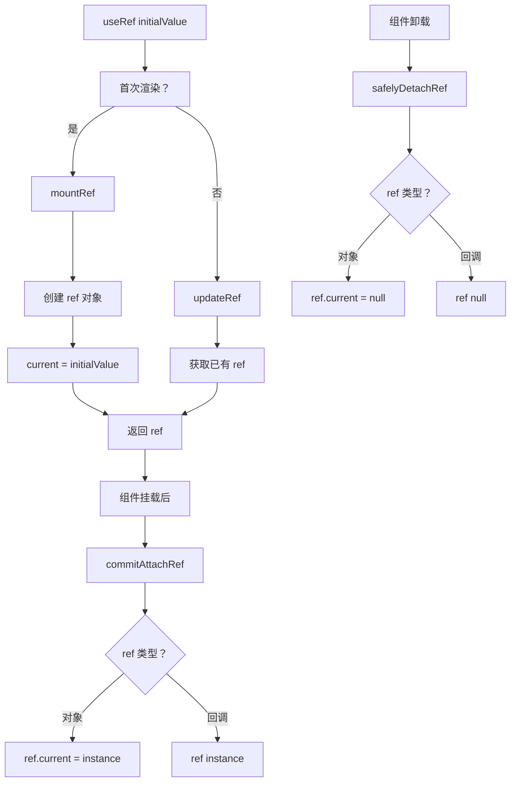

# useRef 实现

useRef 是最简单的 Hook 之一，用于创建可变的引用对象，不触发重新渲染。

## 📦 模块位置

```
packages/react-reconciler/src/
└── ReactFiberHooks.js    # Hooks 核心实现
```

## 🔍 数据结构

### Ref 对象结构

```javascript
// packages/react-reconciler/src/ReactFiberHooks.js

type RefObject = {
  current: any,  // 当前值（可变）
};

// Hook 中存储
type Hook = {
  memoizedState: RefObject,  // ref 对象
  next: Hook,
};
```

### Ref 的两种用途

```
1. DOM 引用
   useRef → current → DOM 元素

2. 可变容器（类似实例变量）
   useRef → current → 任意值（不触发渲染）
```

## 🔬 mountRef

### 创建 Ref Hook

```javascript
// packages/react-reconciler/src/ReactFiberHooks.js

function mountRef<T>(initialValue: T): RefObject {
  // 1. 创建 Hook
  const hook = mountWorkInProgressHook();
  
  // 2. 创建 ref 对象
  const ref = { current: initialValue };
  
  // 3. 保存 ref
  hook.memoizedState = ref;
  
  return ref;
}
```

## 🔬 updateRef

### 更新 Ref Hook

```javascript
function updateRef<T>(initialValue: T): RefObject {
  // 1. 获取当前 Hook
  const hook = updateWorkInProgressHook();
  
  // 2. 返回已有的 ref（忽略新的 initialValue）
  return hook.memoizedState;
}
```

### 关键点

```javascript
// useRef 在更新渲染时忽略 initialValue
// 始终保持第一次创建时的值

function Component() {
  // 每次渲染 useRef(0) 都返回同一个 ref
  const ref = useRef(0);
  
  // ref.current 初始为 0
  // 更新后 ref.current 可能改变，但 ref 对象不变
}
```

## 🔗 DOM Ref 附加

### commitAttachRef

```javascript
// packages/react-reconciler/src/ReactFiberCommitWork.js

function commitAttachRef(finishedWork) {
  const ref = finishedWork.ref;
  
  if (ref !== null) {
    const instance = finishedWork.stateNode;
    
    if (typeof ref === 'function') {
      // 回调 ref
      ref(instance);
    } else {
      // useRef 对象
      ref.current = instance;
    }
  }
}
```

### safelyDetachRef（卸载）

```javascript
function safelyDetachRef(finishedWork) {
  const ref = finishedWork.ref;
  
  if (ref !== null) {
    if (typeof ref === 'function') {
      // 回调 ref，调用 null 清理
      ref(null);
    } else {
      // useRef 对象，清空 current
      ref.current = null;
    }
  }
}
```

## 🔄 完整流程



## 💡 实战技巧

### 1. 访问 DOM 元素

```jsx
function FocusInput() {
  const inputRef = useRef(null);
  
  useEffect(() => {
    // DOM 挂载后聚焦
    inputRef.current.focus();
  }, []);
  
  return <input ref={inputRef} />;
}
```

### 2. 可变容器（不触发渲染）

```jsx
function Counter() {
  const countRef = useRef(0);
  const [_, forceUpdate] = useState(0);
  
  useEffect(() => {
    const interval = setInterval(() => {
      countRef.current += 1;
      console.log('Count:', countRef.current);
      // 不触发渲染
    }, 1000);
    
    return () => clearInterval(interval);
  }, []);
  
  const handleClick = () => {
    // 修改 ref 不会触发渲染
    countRef.current += 1;
    
    // 需要手动触发
    forceUpdate(n => n + 1);
  };
  
  return (
    <button onClick={handleClick}>
      Count: {countRef.current}
    </button>
  );
}
```

### 3. 保持函数引用稳定

```jsx
function Component({ onEvent }) {
  const latestCallback = useRef(onEvent);
  
  useEffect(() => {
    latestCallback.current = onEvent;
  }, [onEvent]);
  
  const stableHandler = useCallback(() => {
    // 总是调用最新的 onEvent
    latestCallback.current();
  }, []);
  
  return <Child onEvent={stableHandler} />;
}
```

### 4. 存储定时器 ID

```jsx
function Timer() {
  const intervalIdRef = useRef(null);
  
  useEffect(() => {
    intervalIdRef.current = setInterval(() => {
      tick();
    }, 1000);
    
    return () => {
      clearInterval(intervalIdRef.current);
    };
  }, []);
  
  return null;
}
```

### 5. 前一个值

```jsx
function usePrevious(value) {
  const ref = useRef();
  
  useEffect(() => {
    ref.current = value;
  }, [value]);
  
  return ref.current;  // 返回上次的值
}

// 使用
function Component({ count }) {
  const prevCount = usePrevious(count);
  
  return (
    <div>
      <p>Now: {count}</p>
      <p>Before: {prevCount}</p>
    </div>
  );
}
```

## ⚠️ 注意事项

### 1. Ref 不是响应式的

```jsx
// ❌ 错误：修改 ref 不会触发渲染
function Component() {
  const ref = useRef(0);
  
  return (
    <div>
      <p>{ref.current}</p>  {/* 总是 0 */}
      <button onClick={() => ref.current++}>
        Increment
      </button>
    </div>
  );
}

// ✅ 正确：使用 state
function Component() {
  const [count, setCount] = useState(0);
  const ref = useRef(0);
  
  return (
    <div>
      <p>{count}</p>  {/* 会更新 */}
      <button onClick={() => {
        ref.current++;
        setCount(c => c + 1);
      }}>
        Increment
      </button>
    </div>
  );
}
```

### 2. 回调 ref vs useRef

```jsx
// useRef（推荐）
function Component() {
  const ref = useRef(null);
  return <div ref={ref}>Content</div>;
}

// 回调 ref（需要时清理）
function Component() {
  const [element, setElement] = useState(null);
  
  return (
    <div ref={el => setElement(el)}>
      {element && <Child />}
    </div>
  );
}

// 回调 ref 的清理
function Component() {
  const containerRef = useRef(null);
  
  return (
    <div
      ref={el => {
        if (el === null) {
          // 元素卸载
          observer?.unobserve(containerRef.current);
        } else {
          // 元素挂载
          containerRef.current = el;
          observer?.observe(el);
        }
      }}
    >
      Content
    </div>
  );
}
```

### 3. StrictMode 双重触发

```jsx
// React 18 StrictMode 下，回调 ref 会触发两次
function Component() {
  const ref = useCallback(element => {
    console.log('Ref callback:', element);
    // 输出:
    // null（清理）
    // element（挂载）
    // null（StrictMode 清理）
    // element（StrictMode 重新挂载）
  }, []);
  
  return <div ref={ref}>Content</div>;
}
```

## 🔬 useRef vs useState

### 使用场景区别

| 特性 | useRef | useState |
|------|--------|----------|
| 触发渲染 | ❌ 否 | ✅ 是 |
| 可变性 | ✅ 可变 | ❌ 不可变 |
| 异步访问 | ✅ 最新值 | ❌ 闭包值 |
| 初始渲染 | ✅ 相同 | ✅ 相同 |

### 选择指南

```jsx
// 使用 useRef 的情况：
// 1. 访问 DOM
const inputRef = useRef(null);

// 2. 存储不触发渲染的值
const intervalId = useRef(null);

// 3. 保持前一个值
const prevValue = usePrevious(value);

// 4. 保持函数/对象引用稳定
const callbackRef = useRef(callback);

// 使用 useState 的情况：
// 1. 需要触发渲染
const [count, setCount] = useState(0);

// 2. 状态需要同步到 UI
const [isOpen, setIsOpen] = useState(false);
```

## 🔬 调试技巧

### 追踪 ref 变化

```jsx
function TrackedRef(initialValue, name) {
  const ref = useRef(initialValue);
  
  useEffect(() => {
    console.log(`${name}.current changed:`, {
      old: ref.current,
      new: initialValue,
    });
  });
  
  // 拦截 setter
  return new Proxy(ref, {
    get(target, prop) {
      const value = target[prop];
      if (prop === 'current') {
        console.log(`Reading ${name}.current:`, value);
      }
      return value;
    },
    set(target, prop, value) {
      target[prop] = value;
      if (prop === 'current') {
        console.log(`Setting ${name}.current:`, value);
      }
      return true;
    },
  });
}

// 使用
function Component() {
  const ref = TrackedRef(0, 'countRef');
  ref.current = 1;  // 会打印日志
}
```

### 检查 ref 泄露

```javascript
// 组件卸载时检查 ref 是否清理
useEffect(() => {
  return () => {
    if (ref.current !== null) {
      console.warn('Ref not cleaned up:', ref);
    }
  };
}, []);
```

## 🐛 常见问题

### Q: useRef 和 useState 哪个更快？

**A**: useRef 更快，因为它不会触发渲染。但大多数情况下差异可以忽略。

### Q: 如何在 useEffect 中获取最新 ref？

**A**: ref.current 始终是当前值。

```jsx
const ref = useRef(0);

useEffect(() => {
  const id = setInterval(() => {
    console.log(ref.current);  // 始终是当前值
  }, 1000);
  return () => clearInterval(id);
}, []);  // 空依赖也没问题
```

### Q: useRef 可以用于存储组件实例吗？

**A**: 可以，但 Class 组件更适合。

```jsx
// 函数组件
function Parent() {
  const childRef = useRef(null);
  
  return <Child ref={childRef} />;
}

// Class 组件
class Parent extends React.Component {
  childRef = React.createRef();
  
  render() {
    return <Child ref={this.childRef} />;
  }
}
```

---

## 📖 下一步

- [useContext 实现](./use-context)
- [useTransition 实现](./use-transition)