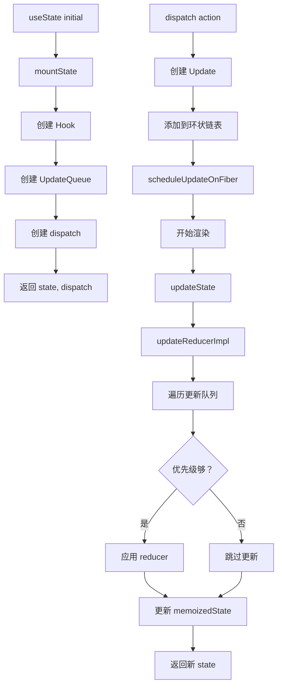

# useState / useReducer 实现

useState 和 useReducer 是 React Hooks 的基础，它们的实现机制几乎相同。

## 📦 模块位置

```
packages/react-reconciler/src/
└── ReactFiberHooks.js    # Hooks 核心实现
```

## 🔍 数据结构

### Hook 链表

```javascript
// packages/react-reconciler/src/ReactFiberHooks.js

export type Update<S, A> = {
  lane: Lane,
  revertLane: Lane,        // 新增：用于乐观更新的回滚车道
  action: A,
  hasEagerState: boolean,
  eagerState: S | null,
  next: Update<S, A>,
  gesture: null | ScheduledGesture, // enableGestureTransition
};

export type UpdateQueue<S, A> = {
  pending: Update<S, A> | null,
  lanes: Lanes,           // 新增：用于跟踪所有相关的车道
  dispatch: (A => mixed) | null,
  lastRenderedReducer: ((S, A) => S) | null,
  lastRenderedState: S | null,
};

export type Hook = {
  memoizedState: any,
  baseState: any,
  baseQueue: Update<any, any> | null,
  queue: any,
  next: Hook | null,
};
```

### 更新队列（环状链表）

```
UpdateQueue 是环状链表结构：

         ┌─────────┐
    ┌───│ Update3 │◄──┐
    │   └────┬────┘   │
    │        │        │
    ▼        ▼        │
┌─────────┐ ┌─────────┐
│ Update1 │◄│ Update2 │
└────┬────┘ └─────────┘
     │
     └─────► pending (指向最后一个)

pending.next = first (Update1)
```

## 🔬 useState 实现

### mountState（首次渲染）

```javascript
// packages/react-reconciler/src/ReactFiberHooks.js

function mountState<S>(
  initialState: (() => S) | S,
): [S, Dispatch<BasicStateAction<S>>] {
  // 1. 创建 Hook
  const hook = mountWorkInProgressHook();
  
  // 2. 处理初始状态（支持函数）
  if (typeof initialState === 'function') {
    initialState = initialState();
  }
  
  // 3. 创建更新队列
  const queue = {
    pending: null,          // 环状链表
    lanes: NoLanes,         // 新增：跟踪所有相关的车道
    dispatch: null,         // dispatch 函数
    lastRenderedReducer: basicStateReducer,
    lastRenderedState: initialState,
  };
  
  hook.queue = queue;
  hook.memoizedState = initialState;
  hook.baseState = initialState;
  
  // 4. 创建 dispatch 函数
  const dispatch = (queue.dispatch = dispatchSetState.bind(
    null,
    currentlyRenderingFiber,
    queue
  ));
  
  return [hook.memoizedState, dispatch];
}
```

### updateState（更新渲染）

```javascript
function updateState<S>(
  initialState: (() => S) | S,
): [S, Dispatch<BasicStateAction<S>>] {
  // 1. 获取当前 Hook
  const hook = updateWorkInProgressHook();
  
  // 2. 获取队列
  const queue = hook.queue;
  
  // 3. 处理更新
  return updateReducer(basicStateReducer, initialState);
}
```

### updateReducer（核心逻辑）

```javascript
function updateReducer<S, I, A>(
  reducer: (S, A) => S,
  initialArg: I,
  init?: I => S,
): [S, Dispatch<A>] {
  const hook = updateWorkInProgressHook();
  return updateReducerImpl(hook, ((currentHook: any): Hook), reducer);
}

function updateReducerImpl<S, A>(
  hook: Hook,
  current: Hook,
  reducer: (S, A) => S,
): [S, Dispatch<A>] {
  const queue = hook.queue;

  if (queue === null) {
    throw new Error(
      'Should have a queue. You are likely calling Hooks conditionally, ' +
        'which is not allowed. (https://react.dev/link/invalid-hook-call)',
    );
  }

  queue.lastRenderedReducer = reducer;

  // The last rebase update that is NOT part of the base state.
  let baseQueue = hook.baseQueue;

  // The last pending update that hasn't been processed yet.
  const pendingQueue = queue.pending;
  if (pendingQueue !== null) {
    // We have new updates that haven't been processed yet.
    // We'll add them to the base queue.
    if (baseQueue !== null) {
      // Merge the pending queue and the base queue.
      const baseFirst = baseQueue.next;
      const pendingFirst = pendingQueue.next;
      baseQueue.next = pendingFirst;
      pendingQueue.next = baseFirst;
    }
    current.baseQueue = baseQueue = pendingQueue;
    queue.pending = null;
  }

  const baseState = hook.baseState;
  if (baseQueue === null) {
    // If there are no pending updates, then the memoized state should be the
    // same as the base state.
    hook.memoizedState = baseState;
  } else {
    // We have a queue to process.
    const first = baseQueue.next;
    let newState = baseState;

    let newBaseState = null;
    let newBaseQueueFirst = null;
    let newBaseQueueLast: Update<S, A> | null = null;
    let update = first;
    let didReadFromEntangledAsyncAction = false;
    do {
      // An extra OffscreenLane bit is added to updates that were made to
      // a hidden tree, so that we can distinguish them from updates that were
      // already there when the tree was hidden.
      const updateLane = removeLanes(update.lane, OffscreenLane);
      const isHiddenUpdate = updateLane !== update.lane;

      // Check if this update was made while the tree was hidden. If so, then
      // it's not a "base" update and we should disregard the extra base lanes
      // that were added to renderLanes when we entered the Offscreen tree.
      let shouldSkipUpdate = isHiddenUpdate
        ? !isSubsetOfLanes(getWorkInProgressRootRenderLanes(), updateLane)
        : !isSubsetOfLanes(renderLanes, updateLane);

      if (enableGestureTransition && updateLane === GestureLane) {
        // This is a gesture optimistic update. It should only be considered as part of the
        // rendered state while rendering the gesture lane and if the rendering the associated
        // ScheduledGesture.
        const scheduledGesture = update.gesture;
        if (scheduledGesture !== null) {
          if (scheduledGesture.count === 0 && !scheduledGesture.committing) {
            // This gesture has already been cancelled. We can clean up this update.
            update = update.next;
            continue;
          } else if (!isGestureRender(renderLanes)) {
            shouldSkipUpdate = true;
          } else {
            const root: FiberRoot | null = getWorkInProgressRoot();
            if (root === null) {
              throw new Error(
                'Expected a work-in-progress root. This is a bug in React. Please file an issue.',
              );
            }
            // We assume that the currently rendering gesture is the one first in the queue.
            shouldSkipUpdate = root.pendingGestures !== scheduledGesture;
          }
        }
      }

      if (shouldSkipUpdate) {
        // Priority is insufficient. Skip this update.
        const clone: Update<S, A> = {
          lane: updateLane,
          revertLane: update.revertLane,
          gesture: update.gesture,
          action: update.action,
          hasEagerState: update.hasEagerState,
          eagerState: update.eagerState,
          next: (null: any),
        };
        if (newBaseQueueLast === null) {
          newBaseQueueFirst = newBaseQueueLast = clone;
          newBaseState = newState;
        } else {
          newBaseQueueLast = newBaseQueueLast.next = clone;
        }
        // Update the remaining priority in the queue.
        currentlyRenderingFiber.lanes = mergeLanes(
          currentlyRenderingFiber.lanes,
          updateLane,
        );
        markSkippedUpdateLanes(updateLane);
      } else {
        // This update does have sufficient priority.
        if (newBaseQueueLast !== null) {
          // If there were earlier updates that were skipped, we need to
          // leave this update in the queue so it can be rebased later.
          const clone: Update<S, A> = {
            lane: NoLane,
            revertLane: NoLane,
            gesture: null,
            action: update.action,
            hasEagerState: update.hasEagerState,
            eagerState: update.eagerState,
            next: (null: any),
          };
          newBaseQueueLast = newBaseQueueLast.next = clone;
        }

        // Process this update.
        const action = update.action;
        if (update.hasEagerState) {
          // If this update is a state update and was processed eagerly,
          // we can use the eagerly computed state
          newState = ((update.eagerState: any): S);
        } else {
          newState = reducer(newState, action);
        }
      }
      update = update.next;
    } while (update !== null && update !== first);

    if (newBaseQueueLast === null) {
      newBaseState = newState;
    } else {
      newBaseQueueLast.next = (newBaseQueueFirst: any);
    }

    // Mark that the fiber performed work, but only if the new state is
    // different from the current state.
    if (!is(newState, hook.memoizedState)) {
      markWorkInProgressReceivedUpdate();
    }

    hook.memoizedState = newState;
    hook.baseState = newBaseState;
    hook.baseQueue = newBaseQueueLast;

    queue.lastRenderedState = newState;
  }

  if (baseQueue === null) {
    // `queue.lanes` is used for entangling transitions. We can set it back to
    // zero once the queue is empty.
    queue.lanes = NoLanes;
  }

  const dispatch: Dispatch<A> = (queue.dispatch: any);
  return [hook.memoizedState, dispatch];
}
```

### dispatchSetState（触发更新）

```javascript
function dispatchSetState<S, A>(
  fiber: Fiber,
  queue: UpdateQueue<S, A>,
  action: A,
): void {
  if (__DEV__) {
    // using a reference to `arguments` bails out of GCC optimizations which affect function arity
    const args = arguments;
    if (typeof args[3] === 'function') {
      console.error(
        "State updates from the useState() and useReducer() Hooks don't support the " +
          'second callback argument. To execute a side effect after ' +
          'rendering, declare it in the component body with useEffect().',
      );
    }
  }

  const lane = requestUpdateLane(fiber);
  const didScheduleUpdate = dispatchSetStateInternal(
    fiber,
    queue,
    action,
    lane,
  );
  if (didScheduleUpdate) {
    startUpdateTimerByLane(lane, 'setState()', fiber);
  }
  markUpdateInDevTools(fiber, lane, action);
}

function dispatchSetStateInternal<S, A>(
  fiber: Fiber,
  queue: UpdateQueue<S, A>,
  action: A,
  lane: Lane,
): boolean {
  const update: Update<S, A> = {
    lane,
    revertLane: NoLane,
    gesture: null,
    action,
    hasEagerState: false,
    eagerState: null,
    next: (null: any),
  };

  if (isRenderPhaseUpdate(fiber)) {
    enqueueRenderPhaseUpdate(queue, update);
  } else {
    const alternate = fiber.alternate;
    if (
      fiber.lanes === NoLanes &&
      (alternate === null || alternate.lanes === NoLanes)
    ) {
      // The queue is currently empty, which means we can eagerly compute the
      // next state before entering the render phase.
      const lastRenderedReducer = queue.lastRenderedReducer;
      if (lastRenderedReducer !== null) {
        let prevDispatcher = null;
        if (__DEV__) {
          prevDispatcher = ReactSharedInternals.H;
          ReactSharedInternals.H = InvalidNestedHooksDispatcherOnUpdateInDEV;
        }
        try {
          const currentState: S = (queue.lastRenderedState: any);
          const eagerState = lastRenderedReducer(currentState, action);
          // Stash the eagerly computed state
          update.hasEagerState = true;
          update.eagerState = eagerState;
          if (is(eagerState, currentState)) {
            // Fast path. We can bail out without scheduling React to re-render.
            enqueueConcurrentHookUpdateAndEagerlyBailout(fiber, queue, update);
            return false;
          }
        } catch (error) {
          // Suppress the error. It will throw again in the render phase.
        } finally {
          if (__DEV__) {
            ReactSharedInternals.H = prevDispatcher;
          }
        }
      }
    }

    const root = enqueueConcurrentHookUpdate(fiber, queue, update, lane);
    if (root !== null) {
      scheduleUpdateOnFiber(root, fiber, lane);
      entangleTransitionUpdate(root, queue, lane);
      return true;
    }
  }
  return false;
}
```

## 🔬 useReducer 实现

### mountReducer

```javascript
function mountReducer<S, I, A>(
  reducer: (S, A) => S,
  initialArg: I,
  init?: I => S,
): [S, Dispatch<A>] {
  const hook = mountWorkInProgressHook();
  let initialState;
  if (init !== undefined) {
    initialState = init(initialArg);
    if (shouldDoubleInvokeUserFnsInHooksDEV) {
      setIsStrictModeForDevtools(true);
      try {
        init(initialArg);
      } finally {
        setIsStrictModeForDevtools(false);
      }
    }
  } else {
    initialState = ((initialArg: any): S);
  }
  hook.memoizedState = hook.baseState = initialState;
  const queue: UpdateQueue<S, A> = {
    pending: null,
    lanes: NoLanes,        // 新增：跟踪所有相关的车道
    dispatch: null,
    lastRenderedReducer: reducer,
    lastRenderedState: (initialState: any),
  };
  hook.queue = queue;
  const dispatch: Dispatch<A> = (queue.dispatch = (dispatchReducerAction.bind(
    null,
    currentlyRenderingFiber,
    queue,
  ): any));
  return [hook.memoizedState, dispatch];
}
```

### dispatchReducerAction

```javascript
function dispatchReducerAction<S, A>(
  fiber: Fiber,
  queue: UpdateQueue<S, A>,
  action: A,
): void {
  if (__DEV__) {
    // using a reference to `arguments` bails out of GCC optimizations which affect function arity
    const args = arguments;
    if (typeof args[3] === 'function') {
      console.error(
        "State updates from the useState() and useReducer() Hooks don't support the " +
          'second callback argument. To execute a side effect after ' +
          'rendering, declare it in the component body with useEffect().',
      );
    }
  }

  const lane = requestUpdateLane(fiber);

  const update: Update<S, A> = {
    lane,
    revertLane: NoLane,
    gesture: null,
    action,
    hasEagerState: false,
    eagerState: null,
    next: (null: any),
  };

  if (isRenderPhaseUpdate(fiber)) {
    enqueueRenderPhaseUpdate(queue, update);
  } else {
    const root = enqueueConcurrentHookUpdate(fiber, queue, update, lane);
    if (root !== null) {
      startUpdateTimerByLane(lane, 'dispatch()', fiber);
      scheduleUpdateOnFiber(root, fiber, lane);
      entangleTransitionUpdate(root, queue, lane);
    }
  }

  markUpdateInDevTools(fiber, lane, action);
}
```

## 📊 完整流程



## 💡 实战技巧

### 1. 函数式更新

```jsx
// ✅ 推荐：函数式更新（获取最新 state）
setCount(prev => prev + 1);

// ⚠️ 可能拿到旧值
setCount(count + 1);
```

### 2. 批量更新

```jsx
// React 18+ 自动批处理
function handleClick() {
  setCount(c => c + 1);  // 批处理
  setFlag(f => !f);      // 批处理
  // 只触发一次渲染
}
```

### 3. 惰性的初始 state

```jsx
// ✅ 推荐：惰性初始化（避免昂贵计算）
const [state, setState] = useState(() => {
  return expensiveCalculation();  // 只在首次执行
});

// ⚠️ 不推荐：每次都执行
const [state, setState] = useState(expensiveCalculation());
```

### 4. useReducer 替代复杂 useState

```jsx
// 复杂状态管理使用 useReducer
const initialState = { count: 0, step: 1 };

function reducer(state, action) {
  switch (action.type) {
    case 'increment':
      return { ...state, count: state.count + state.step };
    case 'decrement':
      return { ...state, count: state.count - state.step };
    case 'reset':
      return initialState;
    default:
      throw new Error('Unknown action');
  }
}

function Counter() {
  const [state, dispatch] = useReducer(reducer, initialState);
  
  return (
    <>
      <p>Count: {state.count}</p>
      <button onClick={() => dispatch({ type: 'increment' })}>+</button>
      <button onClick={() => dispatch({ type: 'decrement' })}>-</button>
      <button onClick={() => dispatch({ type: 'reset' })}>Reset</button>
    </>
  );
}
```

## ⚠️ 注意事项

### 1. Hook 调用顺序

```jsx
// ❌ 错误：条件调用 Hook
function MyComponent({ condition }) {
  if (condition) {
    const [a, setA] = useState(0);  // 可能不执行
  }
  const [b, setB] = useState(0);    // 顺序会乱
}

// ✅ 正确：顶层调用
function MyComponent({ condition }) {
  const [a, setA] = useState(0);
  const [b, setB] = useState(0);
  
  if (condition) {
    // 使用 state，但不改变调用顺序
  }
}
```

### 2. State 不可变

```jsx
// ❌ 错误：直接修改 state
const [obj, setObj] = useState({ count: 0 });
obj.count = 1;  // 直接修改
setObj(obj);    // React 不会检测到变化

// ✅ 正确：返回新对象
setObj(prev => ({ ...prev, count: 1 }));
```

### 3. Eager State 优化

```javascript
// React 的 eager state 优化
if (!is(newState, hook.memoizedState)) {
  // state 变化，标记更新
  markWorkInProgressReceivedUpdate();
}

// 避免不必要的渲染
const [count, setCount] = useState(0);
setCount(0);  // 相同的值，不会触发渲染
```

## 🔬 调试技巧

### 观察 Hook 链表

```javascript
// 浏览器控制台
const fiber = document.querySelector('[data-reactroot]')._reactRootContainer._internalRoot.current;

function printHooks(fiber) {
  let hook = fiber.memoizedState;
  let i = 0;
  
  while (hook) {
    console.log(`Hook ${i}:`, {
      state: hook.memoizedState,
      queue: hook.queue.pending ? '有更新' : '无更新',
    });
    hook = hook.next;
    i++;
  }
}

printHooks(fiber.child);
```

### 追踪 dispatch

```javascript
// 开发模式下添加日志
const originalDispatchSetState = dispatchSetState;
dispatchSetState = function(fiber, queue, action) {
  console.group('dispatchSetState');
  console.log('Fiber:', fiber.type);
  console.log('Action:', action);
  console.log('Lane:', requestUpdateLane(fiber));
  
  const result = originalDispatchSetState(fiber, queue, action);
  
  console.groupEnd();
  return result;
};
```

## 🐛 常见问题

### Q: 为什么 setState 是异步的？

**A**: React 批处理更新以提高性能。

```jsx
// 不是真正的异步，是批处理
setCount(1);
setCount(2);  // 会覆盖前一次
setCount(3);  // 最终是 3

// 使用函数式更新
setCount(c => c + 1);
setCount(c => c + 1);
setCount(c => c + 1);  // 累加 3 次
```

### Q: 如何在 useEffect 中获取最新 state？

```jsx
// ❌ 错误：闭包陷阱
useEffect(() => {
  const id = setInterval(() => {
    console.log(count);  // 总是初始值
  }, 1000);
  return () => clearInterval(id);
}, []);

// ✅ 正确：使用 ref
const countRef = useRef(count);
countRef.current = count;

useEffect(() => {
  const id = setInterval(() => {
    console.log(countRef.current);  // 最新值
  }, 1000);
  return () => clearInterval(id);
}, []);

// ✅ 或使用函数式更新
const [count, setCount] = useState(0);

useEffect(() => {
  const id = setInterval(() => {
    setCount(c => {
      console.log(c);  // 最新值
      return c;
    });
  }, 1000);
  return () => clearInterval(id);
}, []);
```

### Q: useState 和 useReducer 有什么区别？

| 对比项 | useState | useReducer |
|--------|----------|------------|
| 复杂度 | 简单状态 | 复杂状态 |
| 更新方式 | setState(value) | dispatch(action) |
| 状态逻辑 | 内置 | 自定义 reducer |
| 适用场景 | 独立值 | 关联状态 |

---

## 📖 下一步

- [useEffect / useLayoutEffect 实现](./use-effect)
- [useMemo / useCallback 实现](./use-memo)