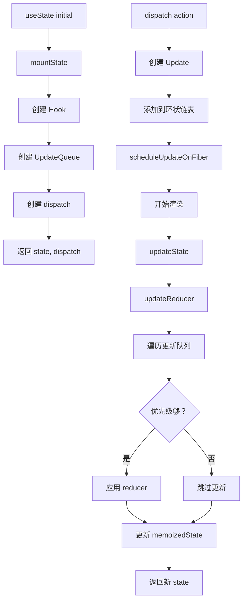

# useState / useReducer 实现

useState 和 useReducer 是 React Hooks 的基础，它们的实现机制几乎相同。

## 📦 模块位置

```
packages/react-reconciler/src/
└── ReactFiberHooks.js    # Hooks 核心实现
```

## 🔍 数据结构

### Hook 链表

```javascript
// packages/react-reconciler/src/ReactFiberHooks.js

type Hook = {
  memoizedState: any,     // 当前状态
  baseState: any,         // 基础状态（用于跳过更新）
  baseQueue: Update<any>, // 基础更新队列
  queue: UpdateQueue<any>, // 更新队列
  next: Hook | null,      // 下一个 Hook
};

type Update<S> = {
  eventTime: number,      // 事件时间
  lane: Lane,             // 优先级
  action: A,              // 更新动作（如 setState 的参数）
  hasEagerState: boolean, // 是否有 eager state
  eagerState: S | null,   // eager state（优化用）
  next: Update<S>,        // 下一个更新
};
```

### 更新队列（环状链表）

```
UpdateQueue 是环状链表结构：

         ┌─────────┐
    ┌───│ Update3 │◄──┐
    │   └────┬────┘   │
    │        │        │
    ▼        ▼        │
┌─────────┐ ┌─────────┐
│ Update1 │◄│ Update2 │
└────┬────┘ └─────────┘
     │
     └─────► pending (指向最后一个)

pending.next = first (Update1)
```

## 🔬 useState 实现

### mountState（首次渲染）

```javascript
// packages/react-reconciler/src/ReactFiberHooks.js

function mountState<S>(
  initialState: (() => S) | S,
): [S, Dispatch<BasicStateAction<S>>] {
  // 1. 创建 Hook
  const hook = mountWorkInProgressHook();
  
  // 2. 处理初始状态（支持函数）
  if (typeof initialState === 'function') {
    initialState = initialState();
  }
  
  // 3. 创建更新队列
  const queue = {
    pending: null,          // 环状链表
    lane: NoLanes,          // 优先级
    dispatch: null,         // dispatch 函数
    lastRenderedReducer: basicStateReducer,
    lastRenderedState: initialState,
  };
  
  hook.queue = queue;
  hook.memoizedState = initialState;
  hook.baseState = initialState;
  
  // 4. 创建 dispatch 函数
  const dispatch = (queue.dispatch = dispatchAction.bind(
    null,
    currentlyRenderingFiber,
    queue
  ));
  
  return [hook.memoizedState, dispatch];
}
```

### updateState（更新渲染）

```javascript
function updateState<S>(
  initialState: (() => S) | S,
): [S, Dispatch<BasicStateAction<S>>] {
  // 1. 获取当前 Hook
  const hook = updateWorkInProgressHook();
  
  // 2. 获取队列
  const queue = hook.queue;
  
  // 3. 处理更新
  return updateReducer(queue, basicStateReducer);
}
```

### updateReducer（核心逻辑）

```javascript
function updateReducer<S, I, A>(
  queue: UpdateQueue<S, I, A>,
  reducer: (S, I) => S,
): [S, Dispatch<A>] {
  // 1. 获取当前 Hook
  const hook = updateWorkInProgressHook();
  
  // 2. 获取待处理的更新
  let first = queue.pending;
  
  if (first !== null) {
    // 有 pending 更新
    const newQueue = {
      ...queue,
      pending: null,
    };
    hook.queue = newQueue;
    
    // 获取第一个更新
    first = first.next;
    
    let newState = hook.baseState;
    let newBaseState = null;
    let newBaseQueueFirst = null;
    let newBaseQueueLast = null;
    
    // 3. 遍历更新队列
    let update = first;
    do {
      const updateLane = update.lane;
      
      // 4. 检查优先级
      if (!isSubsetOfLanes(renderLanes, updateLane)) {
        // 优先级不够，跳过
        const clone = cloneUpdate(update);
        
        if (newBaseQueueLast === null) {
          newBaseQueueFirst = clone;
          newBaseQueueLast = clone;
        } else {
          newBaseQueueLast.next = clone;
          newBaseQueueLast = clone;
        }
        
        // 标记父级需要重新渲染
        markUpdateLaneFromFiberToRoot(currentlyRenderingFiber, updateLane);
      } else {
        // 5. 优先级足够，应用更新
        if (newBaseQueueLast !== null) {
          // 前面有跳过的更新，也要跳过后面的
          const clone = cloneUpdate(update);
          newBaseQueueLast.next = clone;
          newBaseQueueLast = clone;
        } else {
          // 应用更新
          const action = update.action;
          newState = reducer(newState, action);
        }
      }
      
      update = update.next;
    } while (update !== null && update !== first);
    
    // 6. 更新 baseState
    if (newBaseQueueLast === null) {
      newBaseState = newState;
    } else {
      newBaseQueueLast.next = newBaseQueueFirst;
    }
    
    hook.baseState = newBaseState;
    hook.baseQueue = newBaseQueueLast;
    
    // 7. 更新 memoizedState
    hook.memoizedState = newState;
  }
  
  // 8. 返回结果
  return [hook.memoizedState, queue.dispatch];
}
```

### dispatchAction（触发更新）

```javascript
function dispatchAction<S, I, A>(
  fiber: Fiber,
  queue: UpdateQueue<S, I, A>,
  action: A,
): void {
  // 1. 创建 Update 对象
  const update = {
    eventTime: requestEventTime(),
    lane: requestUpdateLane(fiber),
    action,
    hasEagerState: false,
    eagerState: null,
    next: null,
  };
  
  // 2. 优化：eager state（避免不必要的渲染）
  if (isRenderPhaseUpdate(fiber)) {
    // 渲染阶段的更新，特殊处理
    enqueueConcurrentHookUpdate(queue, update);
  } else {
    // 3. 添加到环状链表
    const pending = queue.pending;
    
    if (pending === null) {
      // 第一个更新
      update.next = update;  // 指向自己
    } else {
      // 插入到链表
      update.next = pending.next;
      pending.next = update;
    }
    
    queue.pending = update;  // 更新 pending 指针
    
    // 4. 调度更新
    scheduleUpdateOnFiber(fiber, update.lane);
  }
}
```

## 🔬 useReducer 实现

### mountReducer

```javascript
function mountReducer<S, I, A>(
  reducer: (S, I) => S,
  initialArg: I,
  init?: (I) => S,
): [S, Dispatch<A>] {
  // 1. 创建 Hook
  const hook = mountWorkInProgressHook();
  
  // 2. 计算初始状态
  let initialState;
  if (init !== undefined) {
    initialState = init(initialArg);
  } else {
    initialState = initialArg;
  }
  
  // 3. 创建队列
  const queue = {
    pending: null,
    lane: NoLanes,
    dispatch: null,
    lastRenderedReducer: reducer,
    lastRenderedState: initialState,
  };
  
  hook.queue = queue;
  hook.memoizedState = initialState;
  hook.baseState = initialState;
  
  // 4. 创建 dispatch
  const dispatch = (queue.dispatch = dispatchReducerAction.bind(
    null,
    currentlyRenderingFiber,
    queue
  ));
  
  return [hook.memoizedState, dispatch];
}
```

### dispatchReducerAction

```javascript
function dispatchReducerAction<S, I, A>(
  fiber: Fiber,
  queue: UpdateQueue<S, I, A>,
  action: A,
): void {
  // 调用通用的 dispatchAction
  dispatchAction(fiber, queue, action);
}
```

## 📊 完整流程



## 💡 实战技巧

### 1. 函数式更新

```jsx
// ✅ 推荐：函数式更新（获取最新 state）
setCount(prev => prev + 1);

// ⚠️ 可能拿到旧值
setCount(count + 1);
```

### 2. 批量更新

```jsx
// React 18+ 自动批处理
function handleClick() {
  setCount(c => c + 1);  // 批处理
  setFlag(f => !f);      // 批处理
  // 只触发一次渲染
}
```

### 3. 惰性的初始 state

```jsx
// ✅ 推荐：惰性初始化（避免昂贵计算）
const [state, setState] = useState(() => {
  return expensiveCalculation();  // 只在首次执行
});

// ⚠️ 不推荐：每次都执行
const [state, setState] = useState(expensiveCalculation());
```

### 4. useReducer 替代复杂 useState

```jsx
// 复杂状态管理使用 useReducer
const initialState = { count: 0, step: 1 };

function reducer(state, action) {
  switch (action.type) {
    case 'increment':
      return { ...state, count: state.count + state.step };
    case 'decrement':
      return { ...state, count: state.count - state.step };
    case 'reset':
      return initialState;
    default:
      throw new Error('Unknown action');
  }
}

function Counter() {
  const [state, dispatch] = useReducer(reducer, initialState);
  
  return (
    <>
      <p>Count: {state.count}</p>
      <button onClick={() => dispatch({ type: 'increment' })}>+</button>
      <button onClick={() => dispatch({ type: 'decrement' })}>-</button>
      <button onClick={() => dispatch({ type: 'reset' })}>Reset</button>
    </>
  );
}
```

## ⚠️ 注意事项

### 1. Hook 调用顺序

```jsx
// ❌ 错误：条件调用 Hook
function MyComponent({ condition }) {
  if (condition) {
    const [a, setA] = useState(0);  // 可能不执行
  }
  const [b, setB] = useState(0);    // 顺序会乱
}

// ✅ 正确：顶层调用
function MyComponent({ condition }) {
  const [a, setA] = useState(0);
  const [b, setB] = useState(0);
  
  if (condition) {
    // 使用 state，但不改变调用顺序
  }
}
```

### 2. State 不可变

```jsx
// ❌ 错误：直接修改 state
const [obj, setObj] = useState({ count: 0 });
obj.count = 1;  // 直接修改
setObj(obj);    // React 不会检测到变化

// ✅ 正确：返回新对象
setObj(prev => ({ ...prev, count: 1 }));
```

### 3. Eager State 优化

```javascript
// React 的 eager state 优化
if (!is(newState, hook.memoizedState)) {
  // state 变化，标记更新
  markWorkInProgressReceivedUpdate();
}

// 避免不必要的渲染
const [count, setCount] = useState(0);
setCount(0);  // 相同的值，不会触发渲染
```

## 🔬 调试技巧

### 观察 Hook 链表

```javascript
// 浏览器控制台
const fiber = document.querySelector('[data-reactroot]')._reactRootContainer._internalRoot.current;

function printHooks(fiber) {
  let hook = fiber.memoizedState;
  let i = 0;
  
  while (hook) {
    console.log(`Hook ${i}:`, {
      state: hook.memoizedState,
      queue: hook.queue.pending ? '有更新' : '无更新',
    });
    hook = hook.next;
    i++;
  }
}

printHooks(fiber.child);
```

### 追踪 dispatch

```javascript
// 开发模式下添加日志
const originalDispatchAction = dispatchAction;
dispatchAction = function(fiber, queue, action) {
  console.group('dispatchAction');
  console.log('Fiber:', fiber.type);
  console.log('Action:', action);
  console.log('Lane:', requestUpdateLane(fiber));
  
  const result = originalDispatchAction(fiber, queue, action);
  
  console.groupEnd();
  return result;
};
```

## 🐛 常见问题

### Q: 为什么 setState 是异步的？

**A**: React 批处理更新以提高性能。

```jsx
// 不是真正的异步，是批处理
setCount(1);
setCount(2);  // 会覆盖前一次
setCount(3);  // 最终是 3

// 使用函数式更新
setCount(c => c + 1);
setCount(c => c + 1);
setCount(c => c + 1);  // 累加 3 次
```

### Q: 如何在 useEffect 中获取最新 state？

```jsx
// ❌ 错误：闭包陷阱
useEffect(() => {
  const id = setInterval(() => {
    console.log(count);  // 总是初始值
  }, 1000);
  return () => clearInterval(id);
}, []);

// ✅ 正确：使用 ref
const countRef = useRef(count);
countRef.current = count;

useEffect(() => {
  const id = setInterval(() => {
    console.log(countRef.current);  // 最新值
  }, 1000);
  return () => clearInterval(id);
}, []);

// ✅ 或使用函数式更新
const [count, setCount] = useState(0);

useEffect(() => {
  const id = setInterval(() => {
    setCount(c => {
      console.log(c);  // 最新值
      return c;
    });
  }, 1000);
  return () => clearInterval(id);
}, []);
```

### Q: useState 和 useReducer 有什么区别？

| 对比项 | useState | useReducer |
|--------|----------|------------|
| 复杂度 | 简单状态 | 复杂状态 |
| 更新方式 | setState(value) | dispatch(action) |
| 状态逻辑 | 内置 | 自定义 reducer |
| 适用场景 | 独立值 | 关联状态 |

---

## 📖 下一步

- [useEffect / useLayoutEffect 实现](./use-effect)
- [useMemo / useCallback 实现](./use-memo)