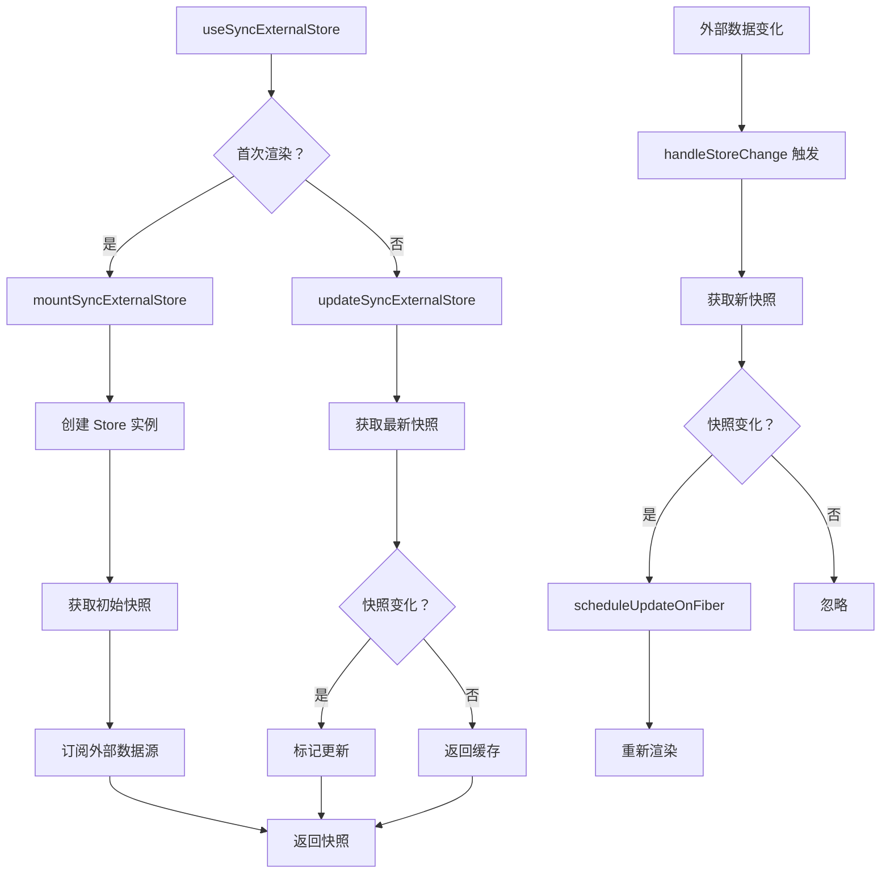

# useSyncExternalStore 实现

useSyncExternalStore 是 React 18 新增的 Hook，用于订阅外部数据源（如 Redux、Zustand 等状态管理库），确保在并发渲染中数据的一致性。

## 📦 模块位置

```
packages/react-reconciler/src/
├── ReactFiberHooks.js       # useSyncExternalStore 实现
└── ReactFiberNewContext.js  # 依赖收集
```

## 🔍 问题背景

### 并发渲染中的撕裂问题

```
并发渲染时可能出现数据撕裂：

时间线：
T1: 开始渲染（读取 store = A）
T2: 外部数据变化（store = B）
T3: 渲染被中断
T4: 恢复渲染（读取 store = B）
T5: Commit → 显示混合状态（部分 A，部分 B）❌
```

### 使用场景

```javascript
// 外部数据源示例：
// - Redux store
// - Zustand store
// - 浏览器 API（网络状态、主题）
// - localStorage
// - 第三方库状态
```

## 🔬 Hook 签名

```typescript
function useSyncExternalStore<Snapshot>(
  subscribe: (onStoreChange: () => void) => () => void,
  getSnapshot: () => Snapshot,
  getServerSnapshot?: () => Snapshot,
): Snapshot;
```

### 参数说明

| 参数 | 类型 | 说明 |
|------|------|------|
| subscribe | (callback) => unsubscribe | 订阅函数，返回取消订阅函数 |
| getSnapshot | () => Snapshot | 获取当前快照（数据） |
| getServerSnapshot | () => Snapshot | SSR 时获取快照（可选） |

## 🔬 核心实现

### Store 实例结构

```javascript
// 每个 Hook 关联的 store 实例
type StoreInstance<T> = {
  value: T,                    // 当前值
  getSnapshot: () => T,        // 获取快照
  unsubscribe?: () => void,    // 取消订阅
  subscribing: boolean,        // 是否已订阅
};
```

### mountSyncExternalStore（首次渲染）

```javascript
// packages/react-reconciler/src/ReactFiberHooks.js

function mountSyncExternalStore<T>(
  subscribe: (onStoreChange: () => void) => () => void,
  getSnapshot: () => T,
  getServerSnapshot?: () => T,
): T {
  const hook = mountWorkInProgressHook();
  
  // 1. 检查是否是服务端渲染
  const isHydrating = getIsHydrating();
  
  if (isHydrating) {
    // 2. SSR 时使用服务端快照
    if (getServerSnapshot === undefined) {
      throw new Error(
        'Missing getServerSnapshot, which is required for ' +
          'server-rendered content. Will revert to client rendering.',
      );
    }
    
    const serverSnapshot = getServerSnapshot();
    if (__DEV__) {
      if (!didWarnUncachedGetSnapshot) {
        if (serverSnapshot !== getServerSnapshot()) {
          console.error(
            'The result of getServerSnapshot should be cached to avoid an infinite loop',
          );
          didWarnUncachedGetSnapshot = true;
        }
      }
    }
    
    hook.memoizedState = serverSnapshot;
    return serverSnapshot;
  }
  
  // 3. 创建 store 实例
  const store: StoreInstance<T> = {
    value: null,
    getSnapshot,
    subscribing: false,
  };
  
  // 4. 获取初始快照
  const snapshot = getSnapshot();
  store.value = snapshot;
  
  // 5. 创建变化处理函数
  const handleStoreChange = () => {
    const nextSnapshot = getSnapshot();
    
    // 6. 检查快照是否变化
    if (!is(store.value, nextSnapshot)) {
      store.value = nextSnapshot;
      
      // 7. 触发重新渲染
      const fiber = currentlyRenderingFiber;
      const lane = requestUpdateLane(fiber);
      
      const root = enqueueConcurrentRenderForLane(fiber, lane);
      if (root !== null) {
        scheduleUpdateOnFiber(root, fiber, lane);
      }
    }
  };
  
  // 8. 订阅外部数据源
  if (!store.subscribing) {
    const unsubscribe = subscribe(handleStoreChange);
    store.unsubscribe = unsubscribe;
    store.subscribing = true;
  }
  
  hook.memoizedState = snapshot;
  return snapshot;
}
```

### updateSyncExternalStore（更新渲染）

```javascript
function updateSyncExternalStore<T>(
  subscribe: (onStoreChange: () => void) => () => void,
  getSnapshot: () => T,
  getServerSnapshot?: () => T,
): T {
  const hook = updateWorkInProgressHook();
  
  // 1. 获取当前快照
  const snapshot = getSnapshot();
  
  // 2. 获取上次的值
  const prevSnapshot = hook.memoizedState;
  
  // 3. 检查快照变化
  const hasChanged = !is(prevSnapshot, snapshot);
  
  if (hasChanged) {
    // 4. 如果快照变化，标记更新
    markWorkInProgressReceivedUpdate();
  }
  
  // 5. 返回最新快照
  hook.memoizedState = snapshot;
  return snapshot;
}
```

### rerenderSyncExternalStore（重渲染）

```javascript
function rerenderSyncExternalStore<T>(
  subscribe: (onStoreChange: () => void) => () => void,
  getSnapshot: () => T,
  getServerSnapshot?: () => T,
): T {
  // 重渲染时与更新相同
  return updateSyncExternalStore(subscribe, getSnapshot, getServerSnapshot);
}
```

## 🔄 完整流程



## 💡 实战技巧

### 1. 订阅浏览器网络状态

```jsx
function useOnlineStatus() {
  return useSyncExternalStore(
    // subscribe
    (onStoreChange) => {
      window.addEventListener('online', onStoreChange);
      window.addEventListener('offline', onStoreChange);
      
      return () => {
        window.removeEventListener('online', onStoreChange);
        window.removeEventListener('offline', onStoreChange);
      };
    },
    // getSnapshot
    () => navigator.onLine,
  );
}

// 使用
function StatusBar() {
  const isOnline = useOnlineStatus();
  return <div>{isOnline ? 'Online' : 'Offline'}</div>;
}
```

### 2. 配合 Redux 使用

```jsx
// 配合 Redux store
import { useStore } from 'react-redux';

function useSelector(selector) {
  const store = useStore();
  
  return useSyncExternalStore(
    // subscribe
    (onStoreChange) => store.subscribe(onStoreChange),
    // getSnapshot
    () => selector(store.getState()),
    // getServerSnapshot (SSR)
    () => selector(preloadedState),
  );
}

// 使用
function Counter() {
  const count = useSelector(state => state.count);
  const dispatch = useDispatch();
  
  return (
    <button onClick={() => dispatch({ type: 'increment' })}>
      Count: {count}
    </button>
  );
}
```

### 3. 配合 Zustand 使用

```jsx
// Zustand store
import { create } from 'zustand';

const useStore = create((set) => ({
  count: 0,
  increment: () => set((state) => ({ count: state.count + 1 })),
}));

// 使用 hook
function useCount() {
  return useSyncExternalStore(
    // subscribe
    (onStoreChange) => useStore.subscribe(onStoreChange),
    // getSnapshot
    () => useStore.getState().count,
  );
}

// 组件
function Counter() {
  const count = useCount();
  const increment = useStore((state) => state.increment);
  
  return (
    <button onClick={increment}>
      Count: {count}
    </button>
  );
}
```

### 4. 配合 localStorage

```jsx
function useLocalStorage(key, initialValue) {
  return useSyncExternalStore(
    // subscribe
    (onStoreChange) => {
      const handler = (e) => {
        if (e.key === key) {
          onStoreChange();
        }
      };
      
      window.addEventListener('storage', handler);
      
      return () => {
        window.removeEventListener('storage', handler);
      };
    },
    // getSnapshot
    () => {
      const item = localStorage.getItem(key);
      return item !== null ? JSON.parse(item) : initialValue;
    },
  );
}

// 使用
function ThemeToggle() {
  const [theme, setTheme] = useLocalStorage('theme', 'light');
  
  const toggleTheme = () => {
    const newTheme = theme === 'light' ? 'dark' : 'light';
    localStorage.setItem('theme', JSON.stringify(newTheme));
  };
  
  return (
    <button onClick={toggleTheme}>
      Theme: {theme}
    </button>
  );
}
```

### 5. 配合第三方库状态

```jsx
// 自定义 store
function createStore(initialState) {
  let state = initialState;
  const listeners = new Set();
  
  const subscribe = (callback) => {
    listeners.add(callback);
    return () => listeners.delete(callback);
  };
  
  const getSnapshot = () => state;
  
  const setState = (updater) => {
    const newState = typeof updater === 'function' ? updater(state) : updater;
    if (!Object.is(state, newState)) {
      state = newState;
      listeners.forEach(listener => listener());
    }
  };
  
  return { subscribe, getSnapshot, setState };
}

// 使用
const store = createStore({ count: 0 });

function useStoreState() {
  return useSyncExternalStore(
    store.subscribe,
    store.getSnapshot,
  );
}

function Counter() {
  const state = useStoreState();
  
  return (
    <button onClick={() => store.setState(s => ({ count: s.count + 1 }))}>
      Count: {state.count}
    </button>
  );
}
```

## ⚠️ 注意事项

### 1. getSnapshot 必须同步

```jsx
// ❌ 错误：异步返回
function useData() {
  return useSyncExternalStore(
    subscribe,
    async () => await fetchData(),  // 不允许异步
  );
}

// ✅ 正确：同步返回
function useData() {
  return useSyncExternalStore(
    subscribe,
    () => dataCache.get(),  // 同步返回缓存的数据
  );
}
```

### 2. getSnapshot 不能有副作用

```jsx
// ❌ 错误：getSnapshot 中有副作用
useSyncExternalStore(
  subscribe,
  () => {
    trackEvent('snapshot');  // 副作用
    return data;
  },
);

// ✅ 正确：纯函数
useSyncExternalStore(
  subscribe,
  () => data,  // 纯读取
);
```

### 3. subscribe 返回清理函数

```jsx
// ❌ 错误：忘记返回清理函数
useSyncExternalStore(
  (onStoreChange) => {
    store.addListener(onStoreChange);
    // 没有返回清理函数
  },
  getSnapshot,
);

// ✅ 正确
useSyncExternalStore(
  (onStoreChange) => {
    store.addListener(onStoreChange);
    
    return () => {
      store.removeListener(onStoreChange);
    };
  },
  getSnapshot,
);
```

### 4. getServerSnapshot 在 SSR 中的重要性

```jsx
// SSR 时如果没有 getServerSnapshot
function useTheme() {
  return useSyncExternalStore(
    subscribe,
    getSnapshot,
    // 缺少 getServerSnapshot ❌
  );
}

// 警告：Missing getServerSnapshot
// 可能导致 hydration 不匹配

// ✅ 正确
function useTheme() {
  return useSyncExternalStore(
    subscribe,
    getSnapshot,
    () => getServerSnapshot(),  // SSR 快照
  );
}
```

### 5. 性能优化

```jsx
// 缓存 getSnapshot 以避免不必要的更新
function useOptimizedSelector(selector) {
  const store = useStore();
  
  return useSyncExternalStore(
    store.subscribe,
    () => selector(store.getState()),
    () => selector(preloadedState),
  );
}

// 使用 memoization
function useSelector(selector) {
  const store = useStore();
  
  const getSnapshot = useMemo(
    () => () => selector(store.getState()),
    [store, selector],
  );
  
  const getServerSnapshot = useMemo(
    () => () => selector(preloadedState),
    [selector],
  );
  
  return useSyncExternalStore(
    store.subscribe,
    getSnapshot,
    getServerSnapshot,
  );
}
```

## 🔬 与 useState 对比

### 为什么不用 useState？

```jsx
// ❌ useState 在并发渲染中有问题
function Component() {
  const [data, setData] = useState(store.getData());
  
  useEffect(() => {
    const unsubscribe = store.subscribe((newData) => {
      setData(newData);  // 异步更新可能错过
    });
    return unsubscribe;
  }, []);
  
  return <div>{data}</div>;
}
// 问题：并发渲染时可能读取到过时的数据

// ✅ useSyncExternalStore 保证一致性
function Component() {
  const data = useSyncExternalStore(
    store.subscribe,
    () => store.getData(),  // 每次渲染都同步读取
  );
  
  return <div>{data}</div>;
}
// 优势：每次渲染都同步读取最新快照，避免撕裂
```

### 对比表

| 特性 | useState | useSyncExternalStore |
|------|----------|---------------------|
| 并发安全 | ❌ 否 | ✅ 是 |
| SSR 支持 | ❌ 有限 | ✅ 完整 |
| 外部数据源 | ❌ 需要 useEffect | ✅ 原生支持 |
| 性能 | ⚠️ 可能需要额外渲染 | ✅ 优化过 |
| 数据撕裂 | ❌ 可能发生 | ✅ 防止 |

## 🔬 调试技巧

### 追踪订阅

```javascript
// 开发模式下追踪订阅
const originalSubscribe = subscribe;
const wrappedSubscribe = (onStoreChange) => {
  console.log('Subscribing in:', currentlyRenderingFiber.type?.name);
  
  const unsubscribe = originalSubscribe(onStoreChange);
  
  return () => {
    console.log('Unsubscribing:', currentlyRenderingFiber.type?.name);
    unsubscribe();
  };
};

// 使用
const data = useSyncExternalStore(wrappedSubscribe, getSnapshot);
```

### 检查快照变化

```javascript
// 追踪快照变化
function debugGetSnapshot(getSnapshot) {
  let lastSnapshot;
  
  return () => {
    const snapshot = getSnapshot();
    
    if (!Object.is(lastSnapshot, snapshot)) {
      console.log('Snapshot changed:', {
        old: lastSnapshot,
        new: snapshot,
      });
      lastSnapshot = snapshot;
    }
    
    return snapshot;
  };
}

// 使用
const data = useSyncExternalStore(
  subscribe,
  debugGetSnapshot(getSnapshot),
);
```

## 🐛 常见问题

### Q: 为什么需要 getServerSnapshot？

**A**: SSR 时，服务端和客户端的快照可能不同。getServerSnapshot 确保 hydration 一致。

### Q: getSnapshot 可以返回对象吗？

**A**: 可以，但如果对象引用变化会导致每次渲染都触发更新。建议返回原始值或使用 memoization。

### Q: useSyncExternalStore 和 useEffect+useState 有什么区别？

**A**: useSyncExternalStore 是同步读取数据，保证并发安全；useEffect+useState 是异步的，可能在并发渲染中出现数据撕裂。

### Q: 如何处理复杂对象？

```jsx
// 对于复杂对象，使用 memoization
function useSelector(selector) {
  const store = useStore();
  
  return useSyncExternalStore(
    store.subscribe,
    () => selector(store.getState()),
    () => selector(preloadedState),
  );
}
```

---

## 📖 下一步

- [Suspense 实现](./suspense)
- [Lazy Loading](./lazy)