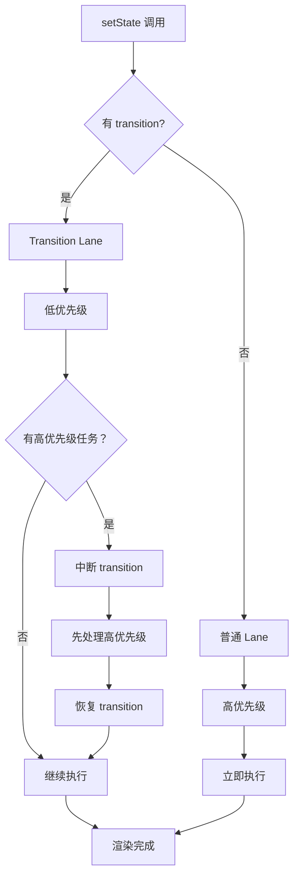

# useTransition 实现

useTransition 是 React 18 并发特性的核心 Hook，用于将更新标记为"非紧急"，实现可中断渲染。

## 📦 模块位置

```
packages/react-reconciler/src/
├── ReactFiberHooks.js       # useTransition Hook 实现
└── ReactFiberWorkLoop.js    # 调度逻辑
```

## 🔍 数据结构

### TransitionLane

```javascript
// packages/react-reconciler/src/ReactFiberLane.js

// Transition Lanes
const TransitionLanes = 0b00000000000000000000000000111100;
const TransitionLane1 = 0b00000000000000000000000000000100;
const TransitionLane2 = 0b00000000000000000000000000001000;
// ...

// 获取下一个可用的 Transition Lane
function getNextTransitionLane(): Lane {
  transitionLane = (transitionLane << 1) | (TransitionLanes & ~transitionLane);
  
  // 如果超出范围，重置
  if ((transitionLane & TransitionLanes) === 0) {
    transitionLane = TransitionLane1;
  }
  
  return transitionLane;
}
```

### useTransition Hook 结构

```javascript
type TransitionHookState = {
  pending: boolean,  // 是否有挂起的 transition
  setPending: Dispatch<boolean>,  // 更新 pending 状态的 dispatch
};
```

## 🔬 useTransition 实现

### hook 入口

```javascript
// packages/react-reconciler/src/ReactFiberHooks.js

function useTransition(): [
  (callback: () => void) => void,  // startTransition
  boolean,                          // isPending
] {
  return requestUpdateHooks(TransitionHookState);
}
```

### requestUpdateHooks

```javascript
function requestUpdateHooks(hookState: TransitionHookState) {
  // 1. 获取或创建 Hook
  const hook = updateWorkInProgressHook();
  
  // 2. 获取当前状态
  const state = hook.memoizedState;
  
  if (state !== null) {
    // 已有状态，直接返回
    return [state.start, state.pending];
  }
  
  // 3. 创建新的 transition state
  const [isPending, setPending] = useState(false);
  
  const start = (callback: () => void) => {
    // 4. 标记为 transition 更新
    startTransition(asyncCallback, callback);
  };
  
  // 5. 缓存 hook state
  hook.memoizedState = {
    start,
    pending: isPending,
  };
  
  return [start, isPending];
}
```

### startTransition

```javascript
// packages/react-reconciler/src/ReactFiberWorkLoop.js

function startTransition(
  scope: () => void,
  options?: StartTransitionOptions,
): void {
  // 1. 获取之前的 transition
  const prevTransition = ReactCurrentBatchConfig.transition;
  
  // 2. 设置当前 transition（标记为并发更新）
  ReactCurrentBatchConfig.transition = 1;
  
  // 3. 进入并发模式
  const currentTransition = ReactCurrentBatchConfig.transition;
  
  try {
    // 4. 执行回调（其中的 setState 会被标记为 transition）
    scope();
  } finally {
    // 5. 恢复之前的 transition
    ReactCurrentBatchConfig.transition = prevTransition;
  }
}
```

### dispatchAction 中的 transition 处理

```javascript
function dispatchAction(
  fiber: Fiber,
  queue: UpdateQueue,
  action: any,
): void {
  // 1. 获取当前 transition
  const currentTransition = ReactCurrentBatchConfig.transition;
  
  // 2. 创建 Update
  const update = {
    eventTime: requestEventTime(),
    lane: requestUpdateLane(fiber),  // 根据 transition 设置 lane
    action,
    hasEagerState: false,
    eagerState: null,
    next: null,
  };
  
  // 3. 如果是 transition，使用 Transition Lane
  if (currentTransition !== null) {
    // Transition 更新使用较低的优先级
    update.lane = getNextTransitionLane();
  }
  
  // ... 添加到队列并调度
}
```

## 📊 优先级模型



### Lane 优先级（从高到低）

```javascript
// packages/react-reconciler/src/ReactFiberLane.js

const SyncLane = 0b00000000000000000000000000000001;     // 同步（最高）
const InputContinuousLane = 0b00000000000000000000000000000110;  // 输入
const DefaultLane = 0b00000000000000000000000000010000;   // 默认
const TransitionLanes = 0b00000000000000000000000000111100;  // Transition
const IdleLane = 0b00000000000000000000000001000000;      // 空闲（最低）
```

## 🔬 isPending 实现

### pending 状态管理

```javascript
// packages/react-reconciler/src/ReactFiberHooks.js

function updateTransition(): [
  boolean,  // isPending
  () => void, // start
] {
  // 1. 获取当前的 pending 状态
  const [isPending] = useState(false);
  
  // 2. 检查是否有待处理的 transition
  const hasPending = checkForUpdates();
  
  // 3. 更新 pending 状态
  if (hasPending !== isPending) {
    setPending(hasPending);
  }
  
  return [isPending, startTransition];
}

function checkForUpdates(): boolean {
  // 检查 pending lanes 中是否有 transition
  return (pendingLanes & TransitionLanes) !== NoLanes;
}
```

### 清理 pending

```javascript
// 当 transition 完成后清除 pending

function finishTransition() {
  // 检查是否还有待处理的 transition
  const stillPending = (pendingLanes & TransitionLanes) !== NoLanes;
  
  if (!stillPending) {
    // 没有 pending 了，更新 isPending
    setPending(false);
  }
}
```

## 💡 实战技巧

### 1. 基本使用

```jsx
function TabContainer() {
  const [isPending, startTransition] = useTransition();
  const [tab, setTab] = useState('home');
  
  function selectTab(nextTab) {
    startTransition(() => {
      setTab(nextTab);  // 非紧急更新
    });
  }
  
  return (
    <>
      <TabBar>
        <TabButton
          isActive={tab === 'home'}
          onClick={() => selectTab('home')}
        >
          Home
        </TabButton>
        <TabButton
          isActive={tab === 'posts'}
          onClick={() => selectTab('posts')}
        >
          Posts
        </TabButton>
      </TabBar>
      
      {isPending && <LoadingSpinner />}
      
      <TabContent tab={tab} />
    </>
  );
}
```

### 2. 搜索结果

```jsx
function SearchResults() {
  const [query, setQuery] = useState('');
  const [results, setResults] = useState([]);
  const [isPending, startTransition] = useTransition();
  
  function handleChange(e) {
    const nextQuery = e.target.value;
    
    // 紧急更新：立即响应输入
    setQuery(nextQuery);
    
    // 非紧急更新：搜索可以延迟
    startTransition(() => {
      fetchResults(nextQuery).then(setResults);
    });
  }
  
  return (
    <>
      <input value={query} onChange={handleChange} />
      {isPending && <LoadingSpinner />}
      <ResultsList results={results} />
    </>
  );
}
```

### 3. 列表过滤

```jsx
function FilterableList({ items }) {
  const [filterText, setFilterText] = useState('');
  const [isPending, startTransition] = useTransition();
  
  // 过滤可能在大量数据上操作
  const filteredItems = useMemo(() => {
    return items.filter(item =>
      item.name.toLowerCase().includes(filterText.toLowerCase())
    );
  }, [items, filterText]);
  
  function handleChange(e) {
    const nextFilterText = e.target.value;
    
    // 输入框立即响应
    setFilterText(nextFilterText);
    
    // 列表过滤可以延迟
    startTransition(() => {
      // 这里不需要额外操作，因为 filteredItems 是计算属性
      // useTransition 确保了过滤在并发模式下进行
    });
  }
  
  return (
    <>
      <input value={filterText} onChange={handleChange} />
      {isPending && <LoadingSpinner />}
      <List items={filteredItems} />
    </>
  );
}
```

### 4. 多步骤表单

```jsx
function MultiStepForm() {
  const [step, setStep] = useState(0);
  const [isPending, startTransition] = useTransition();
  
  function nextStep() {
    startTransition(() => {
      setStep(s => s + 1);  // 表单切换可以延迟
    });
  }
  
  function submitForm(data) {
    // 提交是紧急的
    setStep(s => s + 1);
  }
  
  return (
    <>
      {isPending && <LoadingSpinner />}
      <FormStep step={step} onNext={nextStep} onSubmit={submitForm} />
    </>
  );
}
```

## ⚠️ 注意事项

### 1. 不要在事件处理中直接调用

```jsx
// ❌ 错误
function handleClick() {
  startTransition(() => {
    setCount(c => c + 1);
  });
}

// ✅ 正确
function handleClick() {
  setCount(c => c + 1);  // 直接调用
}

function ExpensiveComponent() {
  const [isPending, startTransition] = useTransition();
  
  // 在需要的时候调用
  const handleClick = () => {
    startTransition(() => {
      setExpensiveState(newState);
    });
  };
}
```

### 2. useTransition vs useDeferredValue

```jsx
// useTransition - 控制 setState
function ComponentA() {
  const [isPending, startTransition] = useTransition();
  
  function handleClick() {
    startTransition(() => {
      setState(newValue);
    });
  }
}

// useDeferredValue - 延迟派生值
function ComponentB() {
  const [text, setText] = useState('');
  const deferredText = useDeferredValue(text);
  
  return (
    <>
      <input value={text} onChange={e => setText(e.target.value)} />
      <ExpensiveList text={deferredText} />
    </>
  );
}
```

### 3. 配合 Suspense

```jsx
function SearchPage() {
  const [isPending, startTransition] = useTransition();
  const [query, setQuery] = useState('');
  
  function handleSearch(newQuery) {
    startTransition(() => {
      setQuery(newQuery);  // 触发 Suspense 边界
    });
  }
  
  return (
    <Suspense fallback={<LoadingSpinner />}>
      <SearchResults query={query} />
    </Suspense>
  );
}
```

### 4. transition 的优先级

```
优先级顺序：

1. Sync（同步）
   └── flushSync(() => setState())

2. Input Continuous（输入连续）
   └── 用户输入、点击

3. Default（默认）
   └── 普通 setState

4. Transition（过渡）⭐
   └── startTransition(() => setState())

5. Idle（空闲）
   └── 后台任务
```

## 🔬 调试技巧

### 追踪 transition

```javascript
// 开发模式下添加日志
const originalStartTransition = startTransition;
startTransition = function(scope) {
  console.group('startTransition');
  console.log('Previous transition:', ReactCurrentBatchConfig.transition);
  
  // 设置 transition 标志
  ReactCurrentBatchConfig.transition = 1;
  
  const result = scope();
  
  console.log('Scheduled transition updates');
  console.groupEnd();
  
  // 恢复
  ReactCurrentBatchConfig.transition = 0;
  
  return result;
};
```

### 观察 Lane 分配

```javascript
// 追踪 lane 分配
const originalRequestUpdateLane = requestUpdateLane;
requestUpdateLane = function(fiber) {
  const lane = originalRequestUpdateLane(fiber);
  
  console.log('requestUpdateLane', {
    component: fiber.type?.name,
    lane,
    isTransition: (lane & TransitionLanes) !== 0,
  });
  
  return lane;
};
```

## 🐛 常见问题

### Q: useTransition 有什么用？

**A**: 将更新标记为非紧急，允许 React 中断渲染以响应更紧急的更新。

### Q: startTransition 包裹的 setState 会怎样？

**A**:
1. 使用较低的优先级（Transition Lane）
2. 可以被高优先级更新中断
3. 完成后触发 isPending 状态变化

### Q: 什么时候应该使用 useTransition？

**A**:
- 列表过滤/排序
- Tab 切换
- 搜索建议
- 大数据渲染
- 任何可以延迟的 UI 更新

### Q: useTransition 和 React.lazy 配合使用？

```jsx
function Page() {
  const [isPending, startTransition] = useTransition();
  const [page, setPage] = useState('home');
  
  function navigate(newPage) {
    startTransition(() => {
      setPage(newPage);  // 触发 lazy 加载
    });
  }
  
  return (
    <Suspense fallback={<LoadingSpinner />}>
      {isPending && <LoadingSpinner />}
      {pages[page]}
    </Suspense>
  );
}
```

---

## 📖 下一步

- [useDeferredValue 实现](./use-deferred)
- [Automatic Batching](./batching)