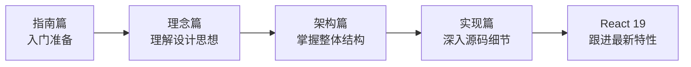

## 📖 为什么学习 React 源码？

**很多同学有这样的困惑：**

- React 代码能写，但不知道原理
- 遇到性能问题不知道怎么优化
- 新功能（Suspense、Concurrent）不敢用
- 想贡献 React 源码但无从下手

**学习源码能帮你：**

1. ✅ 理解 React 的设计理念，写出更优雅的代码
2. ✅ 掌握性能优化的本质，不再盲目优化
3. ✅ 信心满满地使用新特性
4. ✅ 甚至成为 React 贡献者

## 🗺️ 学习路线

## 📋 内容概览

### 指南篇
学习前的准备工作，包括环境搭建、调试方法等

### 理念篇
理解 React 为什么这样设计，Fiber 架构、并发模型等

### 架构篇
从宏观角度理解 React 的整体架构和各模块职责

### 实现篇
深入源码，逐行分析核心功能的实现

### React 19
React 19 新特性详解，包括 Compiler、Actions 等

## 👥 谁适合学习？

- ✅ 有 1-2 年 React 使用经验
- ✅ 熟悉 JavaScript/TypeScript
- ✅ 对原理有好奇心
- ✅ 愿意投入时间深入学习

## 📝 关于本项目

本项目参考「React 技术揭秘」的实现方式，全面更新 React 18/19 新特性与源码架构。

相比原版，本项目的特点：
- 🆕 **内容更新**：覆盖 React 18/19，而非 v17
- 📊 **图解更多**：大量可视化架构图
- 🎮 **可交互 Demo**：边学边练
- 📱 **现代化体验**：响应式设计、暗色模式

  <a href="/guide/prerequisites" class="btn-get-started">→ 开始学习</a>

