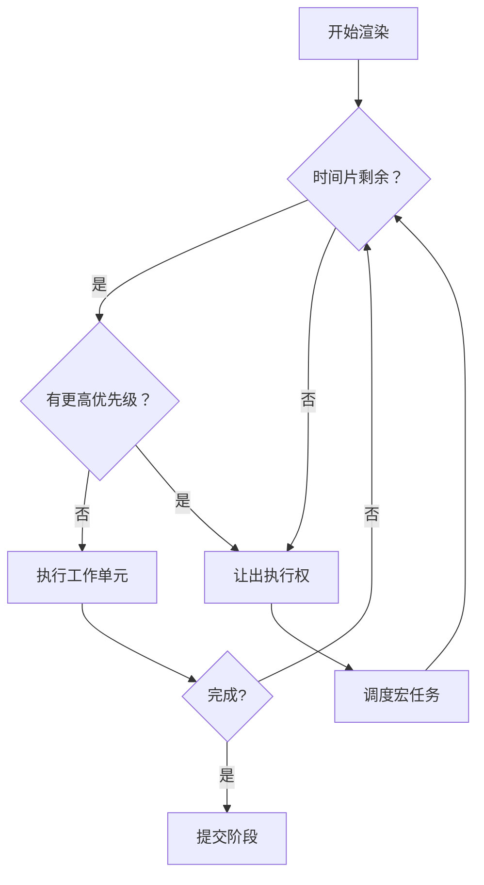

# 时间切片与中断恢复

时间切片（Time Slicing）是 Concurrent React 的核心机制，允许将长任务拆分为小片段执行。

## 🎯 核心概念

### 什么是时间切片？

```
传统渲染（无切片）
┌─────────────────────────────────────┐
│  长任务：=============> 50ms        │  阻塞主线程
└─────────────────────────────────────┘

时间切片
┌─────┬─────┬─────┬─────┬─────────────┐
│ ==5ms│ ==5ms│ ==5ms│ ==5ms│  响应输入  │  可中断
└─────┴─────┴─────┴─────┴─────────────┘
       ↑     ↑     ↑
    可暂停 可暂停 可暂停
```

### 为什么需要切片？

```javascript
// 浏览器帧率要求：60fps = 每帧 16.67ms
// 如果渲染超过 16ms，就会掉帧

// 场景：渲染 1000 个列表项
function List({ items }) {
  return (
    <ul>
      {items.map(item => (
        <ListItem key={item.id} item={item} />
      ))}
    </ul>
  );
}
// 1000 个组件 × 0.1ms = 100ms ❌ 掉帧严重
```

## 🔍 实现原理

### 1. 工作循环

```javascript
// packages/react-reconciler/src/ReactFiberWorkLoop.js
function workLoopConcurrent() {
  // 只要还有工作且有剩余时间
  while (workInProgress !== null && !shouldYield()) {
    performUnitOfWork(workInProgress);
  }
  
  // 工作未完成，让出执行权
  if (workInProgress !== null) {
    // 调度下一个时间片继续
    scheduleCallback(NormalPriority, workLoopConcurrent);
  }
}
```

### 2. 检查超时

```javascript
// packages/scheduler/src/Scheduler.js
function shouldYield() {
  const currentTime = getCurrentTime();
  
  // 检查是否超过时间片（默认 5ms）
  if (currentTime >= deadline) {
    return true;  // 时间到，让出
  }
  
  // 检查是否有高优先级任务
  if (hasHigherPriorityInput()) {
    return true;  // 有输入，让出
  }
  
  return false;  // 继续工作
}
```

### 3.  deadline 计算

```javascript
// 动态计算 deadline
function ensureTimeSlice(root, startTime) {
  let timeout;
  
  switch (currentPriorityLevel) {
    case ImmediatePriority:
      timeout = IMMEDIATE_PRIORITY_TIMEOUT;  // -1 (立即)
      break;
    case UserBlockingPriority:
      timeout = USER_BLOCKING_PRIORITY;      // 250ms
      break;
    case NormalPriority:
      timeout = NORMAL_PRIORITY_TIMEOUT;     // 5000ms
      break;
    case LowPriority:
      timeout = LOW_PRIORITY_TIMEOUT;        // 10000ms
      break;
    case IdlePriority:
      timeout = IDLE_PRIORITY_TIMEOUT;       // max
      break;
  }
  
  deadline = startTime + timeout;
}
```

## 📊 切片过程



## 💡 实战示例

### 1. 大型列表

```jsx
// 使用 useTransition 自动切片
function LargeList({ items }) {
  const [displayedItems, setDisplayedItems] = useState([]);
  
  useEffect(() => {
    // 分批渲染
    const batchSize = 100;
    let index = 0;
    
    function renderBatch() {
      const nextBatch = items.slice(index, index + batchSize);
      setDisplayedItems(prev => [...prev, ...nextBatch]);
      
      index += batchSize;
      
      if (index < items.length) {
        // 使用 requestIdleCallback 在空闲时渲染
        requestIdleCallback(renderBatch);
      }
    }
    
    renderBatch();
    
  }, [items]);
  
  return (
    <ul>
      {displayedItems.map(item => (
        <li key={item.id}>{item.name}</li>
      ))}
    </ul>
  );
}
```

### 2. 复杂计算

```jsx
function DataTable({ data }) {
  const [processed, setProcessed] = useState(null);
  const [isPending, startTransition] = useTransition();
  
  useEffect(() => {
    // 大计算切片执行
    const chunkSize = 100;
    let index = 0;
    let result = [];
    
    function processChunk() {
      const end = Math.min(index + chunkSize, data.length);
      
      for (let i = index; i < end; i++) {
        result.push(expensiveOperation(data[i]));
      }
      
      index = end;
      
      if (index < data.length) {
        // 让出主线程
        startTransition(() => {
          requestAnimationFrame(processChunk);
        });
      } else {
        setProcessed(result);
      }
    }
    
    processChunk();
  }, [data]);
  
  return (
    <>
      {isPending && <Loading />}
      <Table data={processed} />
    </>
  );
}
```

### 3. 图像处理

```jsx
function ImageEditor({ image }) {
  const [processed, setProcessed] = useState(null);
  const [progress, setProgress] = useState(0);
  
  async function processImage() {
    const imageData = await loadImage(image);
    const pixels = imageData.data;
    const totalPixels = pixels.length / 4;
    
    let pixelIndex = 0;
    
    function processChunk() {
      const chunkSize = 10000;  // 每次处理 1 万像素
      const end = Math.min(pixelIndex + chunkSize, totalPixels);
      
      for (let i = pixelIndex; i < end; i++) {
        // 应用滤镜
        const r = pixels[i * 4];
        const g = pixels[i * 4 + 1];
        const b = pixels[i * 4 + 2];
        
        // 灰度处理
        const gray = 0.299 * r + 0.587 * g + 0.114 * b;
        pixels[i * 4] = pixels[i * 4 + 1] = pixels[i * 4 + 2] = gray;
      }
      
      pixelIndex = end;
      setProgress(Math.round((pixelIndex / totalPixels) * 100));
      
      if (pixelIndex < totalPixels) {
        // 让出主线程，使用 requestIdleCallback
        requestIdleCallback(processChunk, { timeout: 50 });
      } else {
        setProcessed(new ImageData(pixels, imageData.width, imageData.height));
      }
    }
    
    processChunk();
  }
  
  return (
    <>
      <progress value={progress} max="100" />
      {processed && <canvas imageData={processed} />}
    </>
  );
}
```

## 🔬 源码解读

### Scheduler 的时间切片

```javascript
// packages/scheduler/src/Scheduler.js
function performWorkUntilDeadline() {
  if (isMessagePending) {
    const currentTime = getCurrentTime();
    
    // 检查是否超过 deadline
    if (currentTime >= deadline) {
      // 时间到，让出执行权
      isMessagePending = true;
      port.postMessage(null);  // 调度下一个宏任务
      return;
    }
    
    // 继续工作
    if (currentTask !== null) {
      const hasTimeRemaining = true;
      
      try {
        const continuationCallback = currentTask.callback(hasTimeRemaining);
        
        if (typeof continuationCallback === 'function') {
          // 任务未完成，需要继续
          currentTask.callback = continuationCallback;
          performWorkUntilDeadline();
        } else {
          // 任务完成
          pop(taskQueue);
          currentTask = peek(taskQueue);
          
          if (currentTask !== null) {
            performWorkUntilDeadline();
          }
        }
      } catch (error) {
        // 错误处理
        currentTask = peek(taskQueue);
        throw error;
      }
    }
  }
}
```

### MessageChannel 机制

```javascript
// 使用 MessageChannel 实现宏任务
const channel = new MessageChannel();
const port = channel.port2;

channel.port1.onmessage = function() {
  if (isHostCallbackScheduled) {
    performWorkUntilDeadline();
  }
};

function requestHostCallback(callback) {
  isMessagePending = true;
  port.postMessage(null);  // 触发下一个宏任务
}
```

## ⚙️ 配置与优化

### 1. deadline 配置

```javascript
// 可通过配置调整时间片大小
const schedulerConfig = {
  timeout: 5,  // 默认 5ms 时间片
  
  // 不同优先级的超时
  ImmediatePriority: -1,    // 立即
  UserBlockingPriority: 250,  // 250ms
  NormalPriority: 5000,     // 5000ms
  LowPriority: 10000,       // 10000ms
  IdlePriority: Infinity,   // 无限
};
```

### 2. requestIdleCallback 降级

```javascript
// React 内部使用
let schedulePerformWorkUntilDeadline;

if (typeof setTimeout === 'function') {
  // 降级方案
  schedulePerformWorkUntilDeadline = () => {
    setTimeout(performWorkUntilDeadline, 0);
  };
} else if (typeof MessageChannel !== 'undefined') {
  // 优先使用 MessageChannel
  const channel = new MessageChannel();
  const port = channel.port2;
  channel.port1.onmessage = performWorkUntilDeadline;
  schedulePerformWorkUntilDeadline = () => {
    port.postMessage(null);
  };
}
```

### 3. 帧率优化

```javascript
// 计算下一个帧的空闲时间
function getNextFrameTime() {
  const frameInterval = 1000 / 60;  // 60fps = 16.67ms
  const currentTime = performance.now();
  
  // 对齐到帧边界
  return Math.ceil(currentTime / frameInterval) * frameInterval;
}

// 在帧内工作
function workInFrame() {
  const deadline = getNextFrameTime() - 2;  // 留 2ms 余量
  performWorkUntil(deadline);
}
```

## 🐛 常见问题

### Q: 时间切片会影响性能吗？

**A**: 正确使用时，时间切片会提升性能（避免掉帧）。但过度切片会增加调度开销。

### Q: 如何避免过度切片？

```jsx
// ✅ 合理设置批次大小
const batchSize = Math.floor(remainingTime / operationCost);

// ❌ 批次太小会增加调度开销
```

### Q: 如何观察切片效果？

```javascript
// Performance API
performance.mark('slice-start');
// ... 工作
performance.mark('slice-end');
performance.measure('work-slice', 'slice-start', 'slice-end');

// Chrome DevTools → Performance → 查看切片
```

---

## 📖 下一步

- [并发设计理念](./concurrent-design)
- [workLoop 源码详解](../architecture/scheduler)